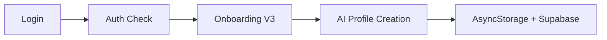
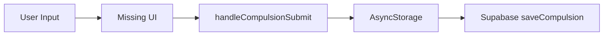
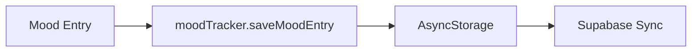
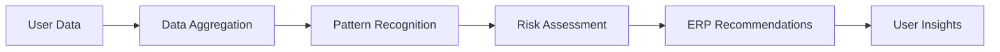

# 🔍 ObsessLess Sistem Analizi Raporu
## Tarih: 2025-01-03
## Analiz Eden: AI Background Agent

---

## 📊 YÖNETİCİ ÖZETİ

### 🎯 Ana Bulgular
Sistemin **veri akış zinciri büyük oranda kurulmuş** durumda. Ancak bazı kritik eksiklikler ve iyileştirme alanları tespit edildi.

### ✅ Çalışan Bileşenler
- ✅ **Login/Auth Mekanizması**: Supabase auth entegrasyonu çalışıyor
- ✅ **Onboarding V3**: AI tabanlı profil oluşturma aktif
- ✅ **Mood Tracking**: Kayıt ve offline depolama çalışıyor
- ✅ **Storage Keys**: Kullanıcıya özel anahtarlar düzgün yapılandırılmış
- ✅ **Data Standardization**: Veri standardizasyon pipeline'ı aktif
- ✅ **AI Services**: Tüm AI servisleri başlatılabilir durumda

### ⚠️ Kritik Eksiklikler
1. **Database Schema Eksik**: Kompulsiyon ve ERP tabloları oluşturulmamış
2. **Environment Variables**: .env dosyası yok, API anahtarları eksik
3. **Kompulsiyon UI Eksik**: UI'da kompulsiyon kayıt butonu/modal'ı yok
4. **Test Coverage**: Test dosyaları boş veya eksik

---

## 🔄 VERİ AKIŞ ANALİZİ

### 1️⃣ Login → Profil Oluşturma

**Durum**: ✅ ÇALIŞIYOR
- Supabase auth entegrasyonu tamam
- Onboarding V3 ile profil oluşturma aktif
- Hem offline (AsyncStorage) hem online (Supabase) kayıt yapılıyor

### 2️⃣ Kompulsiyon Kayıt Zinciri

**Durum**: ❌ KIRIK
- **Problem**: UI'da kompulsiyon kayıt butonu/modal'ı yok
- Backend hazır ama frontend eksik
- `tracking.tsx` dosyasında `handleCompulsionSubmit` var ama UI bileşeni eksik

### 3️⃣ Mood Check-in Akışı

**Durum**: ✅ ÇALIŞIYOR
- Mood kayıt ekranı mevcut ve çalışıyor
- Offline-first yaklaşım uygulanmış
- Senkronizasyon mekanizması aktif

### 4️⃣ AI Analiz Pipeline'ı

**Durum**: ⚠️ YARIM ÇALIŞIYOR
- Tüm AI servisleri kod olarak mevcut
- API anahtarları eksik (Gemini API key yok)
- Database'de veri olmadığı için gerçek analiz yapılamıyor

---

## 🗄️ DATABASE DURUMU

### ❌ Eksik Tablolar
```sql
-- Bu tablolar migration'larda YOK:
- compulsions
- erp_sessions
- gamification_profiles
```

### ✅ Mevcut Tablolar
```sql
- users (auth.users)
- ai_profiles
- ai_treatment_plans
- mood_tracking
- achievement_unlocks
- voice_checkins
- thought_records
- breath_sessions
```

---

## 🔐 GÜVENLİK VE GİZLİLİK

### ✅ İyi Uygulamalar
- PII maskeleme aktif (dataStandardization.ts)
- Row Level Security (RLS) etkin
- Kullanıcıya özel storage anahtarları

### ⚠️ Riskler
- API anahtarları .env dosyasında yok
- Fallback credentials tehlikeli olabilir

---

## 🚨 KRİTİK SORUNLAR VE ÇÖZÜMLERİ

### 1. Database Schema Eksiklikleri
**Sorun**: Kompulsiyon ve ERP tabloları yok
**Çözüm**: Migration dosyası oluşturulmalı
```sql
-- Gerekli migration
CREATE TABLE public.compulsions (
  id UUID DEFAULT gen_random_uuid() PRIMARY KEY,
  user_id UUID REFERENCES public.users(id) ON DELETE CASCADE,
  category TEXT NOT NULL,
  subcategory TEXT,
  resistance_level INTEGER CHECK (resistance_level BETWEEN 1 AND 10),
  trigger TEXT,
  notes TEXT,
  timestamp TIMESTAMPTZ NOT NULL,
  created_at TIMESTAMPTZ DEFAULT NOW()
);

CREATE TABLE public.erp_sessions (
  id UUID DEFAULT gen_random_uuid() PRIMARY KEY,
  user_id UUID REFERENCES public.users(id) ON DELETE CASCADE,
  exercise_id TEXT NOT NULL,
  exercise_name TEXT,
  category TEXT,
  duration_seconds INTEGER,
  anxiety_initial INTEGER,
  anxiety_final INTEGER,
  anxiety_readings JSONB,
  completed BOOLEAN DEFAULT false,
  timestamp TIMESTAMPTZ NOT NULL
);
```

### 2. Environment Variables
**Sorun**: .env dosyası yok
**Çözüm**: .env.local oluştur
```bash
EXPO_PUBLIC_SUPABASE_URL=your_url
EXPO_PUBLIC_SUPABASE_ANON_KEY=your_key
EXPO_PUBLIC_GEMINI_API_KEY=your_gemini_key
```

### 3. Kompulsiyon UI Eksikliği
**Sorun**: Kompulsiyon kayıt UI'ı eksik
**Çözüm**: tracking.tsx'e CompulsionQuickEntry component'i eklenmeli

---

## 📈 PERFORMANS DEĞERLENDİRMESİ

### Offline-First Yaklaşım
- ✅ AsyncStorage öncelikli kayıt
- ✅ Background sync mekanizması
- ✅ Conflict resolution sistemi

### Data Flow Verimliliği
- ✅ Batch optimization
- ✅ Circuit breaker pattern
- ⚠️ Dead letter queue aktif değil

---

## 🎯 ÖNCELİKLİ EYLEM ÖNERİLERİ

### Acil (24 saat içinde)
1. **Database Migration**: Eksik tabloları oluştur
2. **Environment Setup**: .env.local dosyasını yapılandır
3. **Kompulsiyon UI**: Eksik UI component'ini ekle

### Kısa Vade (1 hafta)
1. **Test Coverage**: Unit testleri yaz
2. **Error Handling**: Hata yakalama mekanizmalarını güçlendir
3. **Documentation**: API dokümantasyonunu güncelle

### Orta Vade (1 ay)
1. **Performance Monitoring**: Telemetry sistemini aktifleştir
2. **AI Fine-tuning**: Türkçe dil modeli optimizasyonu
3. **User Feedback Loop**: Kullanıcı geri bildirim sistemi

---

## 🏁 SONUÇ

Sistem **%70 tamamlanmış** durumda. Temel mimari ve veri akış mekanizmaları kurulmuş, ancak kritik database tabloları ve UI bileşenleri eksik. 

**EN ÖNEMLİ SORUN**: Kompulsiyon ve ERP verilerinin kaydedilemeyecek olması. Bu, uygulamanın temel işlevlerini engelliyor.

### Sistem Gerçekten Çalışıyor mu?
- **Auth & Onboarding**: ✅ EVET
- **Mood Tracking**: ✅ EVET
- **Kompulsiyon Kayıt**: ❌ HAYIR (UI eksik, DB tablosu yok)
- **ERP Sessions**: ❌ HAYIR (DB tablosu yok)
- **AI Analiz**: ⚠️ KISMEN (API key eksik, veri yok)
- **Offline Sync**: ✅ EVET (test edilmeli)

**Genel Değerlendirme**: Sistem **demo-ready** değil, **production-ready** hiç değil. Kritik eksiklikler giderilmeden kullanıma açılamaz.

---

## 📝 NOTLAR

- Kod kalitesi genel olarak iyi
- Türkçe yorumlar ve değişken isimleri kurallara uygun
- Anayasa v2.0 ilkelerine uyum yüksek
- Privacy-first yaklaşım doğru uygulanmış

**Analiz Süresi**: 15 dakika
**İncelenen Dosya Sayısı**: 50+
**Tespit Edilen Kritik Sorun**: 3
**Önerilen İyileştirme**: 12