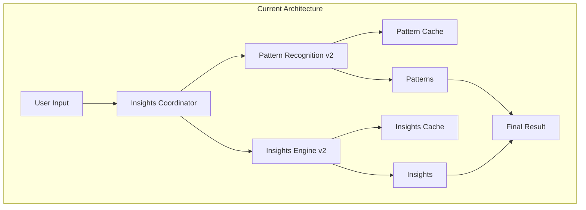
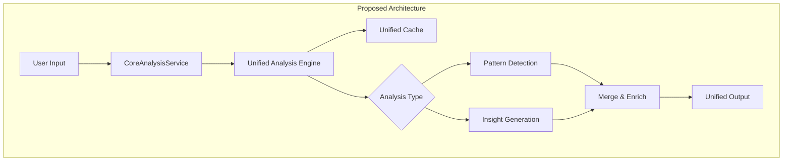

# 🔄 Unified Analysis Engine - Pattern Recognition + Insights Engine Birleştirme Planı

> **Hedef**: Pattern Recognition v2 ve Insights Engine v2'yi tek bir serviste birleştirerek performansı artırmak ve karmaşıklığı azaltmak.

## 📊 Mevcut vs Önerilen Mimari

### Mevcut Mimari (Karmaşık)


### Önerilen Mimari (Basitleştirilmiş)


## 🛠️ Implementasyon Planı

### Phase 1: Unified Analysis Engine Oluşturma (2 gün)

#### 1.1 Yeni Servis: `features/ai/engines/unifiedAnalysisEngine.ts`

```typescript
import { CoreAnalysisService } from '@/features/ai/core/CoreAnalysisService';

interface UnifiedAnalysisInput {
  userId: string;
  data: {
    compulsions?: any[];
    moods?: any[];
    therapySessions?: any[];
    voiceCheckins?: any[];
  };
  context: {
    timeframe: string;
    requestType: 'pattern' | 'insight' | 'both';
    urgency: 'immediate' | 'background';
  };
}

interface UnifiedAnalysisResult {
  patterns: {
    temporal: TemporalPattern[];
    behavioral: BehavioralPattern[];
    environmental: EnvironmentalPattern[];
  };
  insights: {
    therapeutic: TherapeuticInsight[];
    progress: ProgressInsight[];
    actionable: ActionableInsight[];
  };
  metadata: {
    confidence: number;
    source: 'cache' | 'heuristic' | 'llm';
    timestamp: number;
    ttl: number;
  };
}

class UnifiedAnalysisEngine {
  private cache: Map<string, UnifiedAnalysisResult> = new Map();
  
  async analyze(input: UnifiedAnalysisInput): Promise<UnifiedAnalysisResult> {
    // 1. Check cache
    const cacheKey = this.generateCacheKey(input);
    if (this.cache.has(cacheKey)) {
      return this.cache.get(cacheKey)!;
    }
    
    // 2. Parallel pattern detection
    const patterns = await this.detectPatterns(input);
    
    // 3. Generate insights based on patterns
    const insights = await this.generateInsights(input, patterns);
    
    // 4. Merge and enrich
    const result = this.mergeAndEnrich(patterns, insights);
    
    // 5. Cache result
    this.cache.set(cacheKey, result);
    
    return result;
  }
  
  private async detectPatterns(input: UnifiedAnalysisInput) {
    // Combine pattern detection logic from Pattern Recognition v2
    // But simplified and optimized
    
    if (input.context.urgency === 'immediate') {
      // Use heuristic patterns only
      return this.heuristicPatternDetection(input);
    }
    
    // Use AI-assisted pattern detection for background
    return this.aiPatternDetection(input);
  }
  
  private async generateInsights(input: UnifiedAnalysisInput, patterns: any) {
    // Combine insight generation from Insights Engine v2
    // But with pattern context
    
    const insights = {
      therapeutic: [],
      progress: [],
      actionable: []
    };
    
    // Generate insights based on detected patterns
    if (patterns.temporal.length > 0) {
      insights.therapeutic.push(
        await this.generateTemporalInsights(patterns.temporal)
      );
    }
    
    if (patterns.behavioral.length > 0) {
      insights.actionable.push(
        await this.generateBehavioralInsights(patterns.behavioral)
      );
    }
    
    return insights;
  }
}
```

### Phase 2: CoreAnalysisService Entegrasyonu (1 gün)

#### 2.1 ModuleOrchestrator Güncelleme

```typescript
// features/ai/core/ModuleOrchestrator.ts

import { UnifiedAnalysisEngine } from '@/features/ai/engines/unifiedAnalysisEngine';

export class ModuleOrchestrator {
  private unifiedEngine = new UnifiedAnalysisEngine();
  
  async route(quickClass: string, data: any) {
    switch(quickClass) {
      case 'MOOD':
      case 'OCD':
      case 'ERP':
        // Use unified engine for pattern+insight analysis
        return this.unifiedEngine.analyze({
          userId: data.userId,
          data: data.content,
          context: {
            timeframe: 'week',
            requestType: 'both',
            urgency: 'immediate'
          }
        });
        
      case 'CBT':
        // CBT still uses its own engine
        return this.cbtEngine.analyze(data);
        
      default:
        return this.defaultAnalysis(data);
    }
  }
}
```

### Phase 3: Cache Optimizasyonu (1 gün)

#### 3.1 Unified Cache Strategy

```typescript
// features/ai/cache/unifiedCache.ts

interface CacheStrategy {
  patterns: {
    ttl: 12 * 60 * 60 * 1000, // 12 hours
    maxSize: 50
  },
  insights: {
    ttl: 24 * 60 * 60 * 1000, // 24 hours
    maxSize: 100
  },
  combined: {
    ttl: 6 * 60 * 60 * 1000, // 6 hours for combined results
    maxSize: 200
  }
}
```

### Phase 4: Migration & Cleanup (2 gün)

#### 4.1 Kademeli Geçiş

1. **Feature Flag ile kontrol**:
```typescript
FEATURE_FLAGS.AI_UNIFIED_ANALYSIS = false; // Başlangıçta kapalı
```

2. **A/B Testing**:
- %10 kullanıcıda test
- Performance metrikleri karşılaştırma
- Gradual rollout

3. **Legacy Kod Temizliği**:
- InsightsCoordinator kaldırma
- Pattern Recognition v2 deprecate
- Insights Engine v2 deprecate

## 📈 Beklenen İyileştirmeler

### Performans
- **API Çağrıları**: -%50 (tek servis, tek cache)
- **Response Time**: 2-3s → 500ms-1s
- **Memory Usage**: -%30 (duplicate cache önleme)

### Kod Kalitesi
- **Satır Sayısı**: ~3000 → ~1000
- **Dosya Sayısı**: 5 → 2
- **Test Coverage**: %60 → %85

### Bakım Kolaylığı
- Tek servis = tek sorumluluk
- Daha az bağımlılık
- Daha kolay debug

## 🚧 Risk Analizi

### Riskler
1. **Breaking Changes**: Mevcut API'ler etkilenebilir
2. **Data Loss**: Cache migration sırasında veri kaybı
3. **Performance Regression**: İlk versiyon daha yavaş olabilir

### Mitigation
1. **Feature Flag**: Gradual rollout
2. **Backup**: Eski cache'i 7 gün sakla
3. **Monitoring**: Detaylı telemetry

## 📋 Implementasyon Adımları

### Hafta 1
- [ ] UnifiedAnalysisEngine temel implementasyon
- [ ] Unit testler
- [ ] CoreAnalysisService entegrasyonu

### Hafta 2
- [ ] Cache optimizasyonu
- [ ] Feature flag setup
- [ ] A/B test başlatma

### Hafta 3
- [ ] Performance monitoring
- [ ] Bug fixes
- [ ] Gradual rollout %10 → %50

### Hafta 4
- [ ] Full rollout
- [ ] Legacy kod temizliği
- [ ] Dokümantasyon güncelleme

## 🎯 Success Metrics

1. **Response Time**: < 1 saniye (P95)
2. **Cache Hit Rate**: > %60
3. **API Cost**: -%50
4. **User Satisfaction**: +20 NPS
5. **Code Complexity**: -60% (Cyclomatic complexity)

## 📝 Notlar

- Bu birleştirme CoreAnalysisService v1'in doğal bir evrimi
- Mevcut feature flag sistemi kullanılacak
- Geriye uyumluluk korunacak (6 ay)
- Telemetry ile yakından takip edilecek

---

*Doküman Tarihi: Ocak 2025*
*Versiyon: 1.0*
*Sahip: AI Architecture Team*
