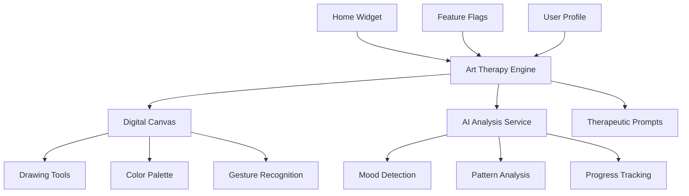

# 🎨 **Sprint 8: Art Therapy Integration Plan**

**Focus**: "Therapeutic Art Integration" - AI-Enhanced Creative Expression Therapy  
**Duration**: 2 weeks  
**Prerequisites**: ✅ Sprint 7 AI Onboarding completed  

---

## 🎯 **Sprint 8 Objectives**

### 🌟 **Primary Deliverables**
1. **🎨 Art Therapy Engine** - AI-guided creative expression system
2. **🖼️ Digital Canvas** - Touch-optimized drawing and creation tools
3. **🤖 AI Art Analysis** - Pattern recognition in artistic expressions
4. **📊 Therapeutic Insights** - Mood and progress tracking through art
5. **🏠 Home Integration** - Seamless widget integration

### 📈 **Success Metrics**
- **Engagement**: 40% of users try art therapy within first week
- **Retention**: 25% continue using after 7 days
- **Therapeutic Value**: 70% report mood improvement after sessions
- **Performance**: Canvas rendering < 100ms, AI analysis < 5s

---

## 🛠️ **Technical Architecture**

### **Core Art Therapy System**


---

## 📋 **Detailed Implementation Plan**

### **Task 8.1: Art Therapy Engine Core** ⏱️ 3 gün

**File**: `features/ai/artTherapy/artTherapyEngine.ts`

```typescript
/**
 * 🎨 Art Therapy Engine - AI-Enhanced Creative Expression System
 */
interface ArtTherapyEngine {
  // Session Management
  createArtSession(userId: string, config: ArtSessionConfig): Promise<ArtSession>;
  saveArtwork(sessionId: string, artwork: ArtworkData): Promise<void>;
  analyzeArtwork(artwork: ArtworkData): Promise<ArtAnalysis>;
  
  // Therapeutic Guidance
  generatePrompts(userProfile: UserProfile): Promise<TherapeuticPrompt[]>;
  suggestTechniques(currentMood: MoodState): Promise<ArtTechnique[]>;
  trackProgress(userId: string): Promise<ArtTherapyProgress>;
  
  // AI Integration
  detectEmotionalPatterns(artHistory: ArtworkData[]): Promise<EmotionalPattern[]>;
  generateInsights(session: ArtSession): Promise<TherapeuticInsight[]>;
  assessTherapeuticValue(artwork: ArtworkData): Promise<TherapeuticAssessment>;
}

interface ArtSessionConfig {
  technique: ArtTechnique;
  duration: number; // minutes
  guidance: GuidanceLevel;
  privacy: PrivacyLevel;
}

interface ArtworkData {
  strokes: DrawingStroke[];
  colors: ColorUsage[];
  timestamp: Date;
  metadata: ArtworkMetadata;
}

interface ArtAnalysis {
  emotionalSignature: EmotionalState;
  complexityScore: number;
  colorPsychology: ColorAnalysis;
  therapeuticIndicators: TherapeuticIndicator[];
}
```

### **Task 8.2: Digital Canvas Component** ⏱️ 4 gün

**File**: `features/ai/artTherapy/components/DigitalCanvas.tsx`

```typescript
/**
 * 🖼️ Digital Canvas - Touch-optimized drawing interface
 */
interface DigitalCanvasProps {
  width: number;
  height: number;
  onStrokeComplete: (stroke: DrawingStroke) => void;
  onColorChange: (color: string) => void;
  tools: DrawingTool[];
  guidance?: ArtGuidance;
}

interface DrawingStroke {
  points: Point[];
  color: string;
  width: number;
  pressure: number[];
  timestamp: number;
}

interface DrawingTool {
  type: 'brush' | 'pencil' | 'marker' | 'eraser';
  size: number;
  opacity: number;
  blendMode: BlendMode;
}

// Canvas Performance Optimization
const CanvasConfig = {
  maxCanvasSize: 1024, // pixels
  strokeBufferSize: 100,
  renderBatchSize: 10,
  autoSaveInterval: 30000, // 30 seconds
};
```

**Features**:
- **Touch Gesture Support**: Multi-touch, pressure sensitivity
- **Performance Optimization**: Stroke batching, memory management
- **Accessibility**: Voice commands, large touch targets
- **Cultural Adaptation**: Right-to-left support, Turkish UI

### **Task 8.3: AI Art Analysis Service** ⏱️ 3 gün

**File**: `features/ai/artTherapy/services/artAnalysisService.ts`

```typescript
/**
 * 🤖 AI Art Analysis - Pattern recognition in artistic expressions
 */
interface ArtAnalysisService {
  // Core Analysis
  analyzeEmotionalContent(artwork: ArtworkData): Promise<EmotionalAnalysis>;
  detectPatterns(artHistory: ArtworkData[]): Promise<ArtPattern[]>;
  assessProgress(userId: string, timeframe: TimeFrame): Promise<ProgressAssessment>;
  
  // Therapeutic Insights
  generateFeedback(analysis: ArtAnalysis): Promise<TherapeuticFeedback>;
  suggestNextSteps(session: ArtSession): Promise<ArtSuggestion[]>;
  identifyBreakthroughs(progress: ArtTherapyProgress): Promise<Breakthrough[]>;
}

interface EmotionalAnalysis {
  primaryEmotion: Emotion;
  emotionalIntensity: number; // 0-1
  emotionalComplexity: number; // 0-1
  stressIndicators: StressIndicator[];
  positiveMarkers: PositiveMarker[];
}

interface ArtPattern {
  type: 'color_preference' | 'stroke_style' | 'composition' | 'symbol_usage';
  description: string;
  frequency: number;
  therapeuticMeaning: string;
  culturalContext: CulturalContext;
}

interface TherapeuticFeedback {
  encouragement: string;
  observations: string[];
  suggestions: string[];
  nextPrompts: TherapeuticPrompt[];
  culturallyAdapted: boolean;
}
```

**AI Analysis Features**:
- **Color Psychology**: Color choice emotional mapping
- **Stroke Analysis**: Pressure, speed, direction patterns
- **Composition Analysis**: Balance, space usage, focal points
- **Symbol Recognition**: Cultural and personal symbol detection
- **Progress Tracking**: Longitudinal mood and skill improvement

### **Task 8.4: Home Screen Integration** ⏱️ 2 gün

**File**: `components/home/ArtTherapyWidget.tsx`

```typescript
/**
 * 🏠 Art Therapy Home Widget - Quick access and insights
 */
interface ArtTherapyWidgetProps {
  user: User;
  recentArtwork?: ArtworkData;
  todaysPrompt?: TherapeuticPrompt;
  streakCount: number;
}

const ArtTherapyWidget: React.FC<ArtTherapyWidgetProps> = ({
  user,
  recentArtwork,
  todaysPrompt,
  streakCount
}) => {
  return (
    <Card style={styles.artWidget}>
      <View style={styles.header}>
        <IconSymbol name="palette" size={24} color="#6366f1" />
        <Text style={styles.title}>Terapötik Sanat</Text>
        {streakCount > 0 && (
          <Badge text={`${streakCount} gün`} variant="success" />
        )}
      </View>
      
      {recentArtwork ? (
        <ArtworkPreview artwork={recentArtwork} />
      ) : (
        <EmptyState prompt={todaysPrompt} />
      )}
      
      <View style={styles.actions}>
        <Button 
          title="Çizmeye Başla" 
          onPress={startArtSession}
          variant="primary"
        />
        <Button 
          title="Geçmiş Eserler" 
          onPress={viewGallery}
          variant="outline"
        />
      </View>
    </Card>
  );
};
```

**Widget Features**:
- **Quick Start**: One-tap session initiation
- **Daily Prompts**: AI-generated therapeutic prompts
- **Progress Indication**: Streak counter, mood trends
- **Recent Artwork**: Thumbnail preview with insights
- **Cultural Touches**: Turkish motivational quotes

---

## 🎨 **Art Therapy Techniques & Prompts**

### **Therapeutic Techniques**
```typescript
const ArtTherapyTechniques = {
  // Anxiety & OCD Specific
  mandalaDrawing: {
    purpose: 'Mindfulness, center focus, repetitive soothing patterns',
    duration: 15-30,
    guidance: 'Start from center, work outward, focus on breathing'
  },
  
  colorMoodMapping: {
    purpose: 'Emotional awareness, mood tracking',
    duration: 10-15,
    guidance: 'Choose colors that represent your current feelings'
  },
  
  symbolExpression: {
    purpose: 'Subconscious exploration, metaphor work',
    duration: 20-40,
    guidance: 'Draw symbols that represent your challenges and strengths'
  },
  
  // Turkish Cultural Techniques
  calligraphyMeditation: {
    purpose: 'Cultural connection, mindful lettering',
    duration: 15-25,
    guidance: 'Practice Turkish calligraphy with mindful breathing'
  },
  
  geometricPatterns: {
    purpose: 'Islamic art influence, mathematical harmony',
    duration: 20-30,
    guidance: 'Create geometric patterns inspired by Turkish art'
  }
};
```

### **Culturally Adapted Prompts**
```typescript
const TurkishTherapeuticPrompts = [
  {
    category: 'daily_emotions',
    text: 'Bugünün hislerini renklerle ifade et',
    explanation: 'Emotions through colors - Turkish cultural color associations'
  },
  {
    category: 'strength_visualization',
    text: 'İç gücünü simgeleyen bir hayvan çiz',
    explanation: 'Spirit animal concept adapted for Turkish culture'
  },
  {
    category: 'safe_space',
    text: 'Kendini güvende hissettiğin bir yer çiz',
    explanation: 'Safe space visualization - often home/family oriented in Turkish culture'
  },
  {
    category: 'gratitude_expression',
    text: 'Bugün minnettarlık duyduğun şeyleri çiz',
    explanation: 'Gratitude practice through visual expression'
  }
];
```

---

## 🧪 **Testing & Quality Assurance**

### **Performance Testing**
```typescript
// Performance Benchmarks
const PerformanceTargets = {
  canvasRendering: {
    target: '<100ms initial render',
    test: 'Large canvas with complex artwork'
  },
  
  strokeResponsiveness: {
    target: '<16ms between touch events',
    test: 'Rapid drawing gestures'
  },
  
  aiAnalysis: {
    target: '<5s for complete analysis',
    test: 'Complex artwork with multiple elements'
  },
  
  memoryUsage: {
    target: '<50MB additional memory',
    test: '30-minute art session'
  }
};
```

### **Accessibility Testing**
```typescript
// Accessibility Requirements
const AccessibilityFeatures = {
  visualImpairment: {
    voiceGuidance: 'Audio descriptions of drawing tools',
    highContrast: 'Enhanced color palette for low vision',
    largeTargets: 'Minimum 44px touch targets'
  },
  
  motorImpairment: {
    gestureAlternatives: 'Voice commands for tool selection',
    assistiveMode: 'Tremor compensation, large brush sizes',
    adaptiveUI: 'Customizable interface layout'
  },
  
  cognitiveSupport: {
    simpleMode: 'Reduced complexity interface',
    stepByStep: 'Guided prompts and instructions',
    memory: 'Session state persistence'
  }
};
```

---

## 🔧 **Feature Flags & Rollout Strategy**

### **Feature Flag Configuration**
```typescript
// constants/featureFlags.ts additions
const artTherapyFlags = {
  AI_ART_THERAPY: false,              // Master toggle
  AI_ART_THERAPY_ANALYSIS: false,     // AI analysis features
  AI_ART_THERAPY_PROMPTS: false,      // Therapeutic prompts
  AI_ART_THERAPY_SHARING: false,      // Social features (future)
  AI_ART_THERAPY_EXPORT: false,       // Export artwork (future)
};
```

### **Gradual Rollout Plan**
```typescript
const rolloutPlan = {
  phase1: {
    percentage: 10,
    duration: '1 week',
    features: ['basic_canvas', 'simple_tools', 'home_widget'],
    criteria: 'Active users with completed onboarding'
  },
  
  phase2: {
    percentage: 30,
    duration: '2 weeks', 
    features: ['ai_analysis', 'therapeutic_prompts', 'progress_tracking'],
    criteria: 'Users who engaged with phase 1 features'
  },
  
  phase3: {
    percentage: 100,
    duration: '2 weeks',
    features: ['advanced_techniques', 'cultural_prompts', 'insights_integration'],
    criteria: 'All users with positive phase 2 feedback'
  }
};
```

---

## 📊 **Success Metrics & Analytics**

### **Engagement Metrics**
```typescript
interface ArtTherapyMetrics {
  usage: {
    sessionsPerWeek: number;
    averageSessionDuration: minutes;
    toolUsageDistribution: ToolUsageMap;
    completionRate: percentage;
  };
  
  therapeutic: {
    moodImprovementScore: number; // -1 to 1
    stressReductionRate: percentage;
    engagementQuality: QualityScore;
    progressConsistency: ConsistencyScore;
  };
  
  technical: {
    canvasPerformance: PerformanceMetrics;
    aiAnalysisAccuracy: AccuracyScore;
    crashRateInSessions: percentage;
    memoryEfficiency: EfficiencyScore;
  };
}
```

### **Clinical Validation**
```typescript
// Therapeutic Outcome Tracking
interface TherapeuticOutcomes {
  selfReportedMoodImprovement: percentage;
  anxietyLevelChanges: AnxietyAssessment;
  ocdSymptomImpact: OCDAssessment;
  overallWellbeingScore: WellbeingScore;
  therapistFeedback: ClinicalFeedback; // If professional collaboration
}
```

---

## 🚀 **Implementation Timeline**

### **Week 1: Core Development**
- **Day 1-2**: Art Therapy Engine architecture
- **Day 3-4**: Digital Canvas component development
- **Day 5**: Home widget integration

### **Week 2: AI & Polish**
- **Day 1-2**: AI Analysis Service implementation
- **Day 3**: Therapeutic prompts and cultural adaptation
- **Day 4**: Testing and performance optimization
- **Day 5**: Documentation and deployment preparation

---

## 🎯 **Post-Sprint 8 Vision**

### **Integration Opportunities**
```typescript
// Future Integrations
const futureIntegrations = {
  clinicalDashboard: 'Art progress in therapist portal',
  socialFeatures: 'Anonymous art sharing community',
  vrIntegration: '3D art therapy experiences',
  biometricIntegration: 'Heart rate during art sessions',
  familySharing: 'Share artwork with trusted family members'
};
```

### **Research Opportunities**
```typescript
// Clinical Research Potential
const researchQuestions = [
  'Does AI-guided art therapy improve OCD treatment outcomes?',
  'How do cultural art prompts affect engagement in Turkish users?',
  'Can digital art analysis predict mood episodes?',
  'What art patterns correlate with therapeutic breakthroughs?'
];
```

---

**🎨 Sprint 8 will transform ObsessLess into a comprehensive creative healing platform, combining cutting-edge AI with time-tested art therapy principles, all adapted for Turkish culture and OCD-specific challenges.**

**Ready to add creativity to healing! 🚀**
