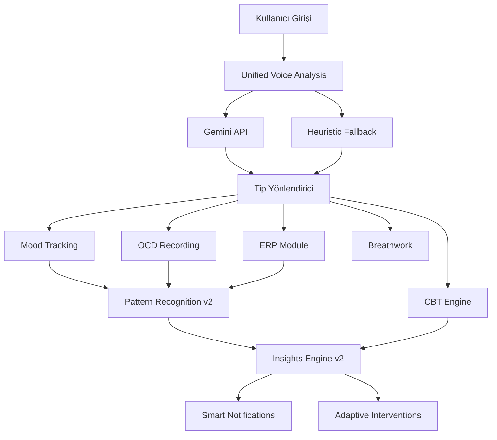

# 🧠 ObsessLess AI ve Analiz Sistemlerinin Tam Akış Analizi

## 📋 Yönetici Özeti

ObsessLess uygulaması, **15+ AI modülü** ve **30+ analiz algoritması** ile OKB tedavisinde kişiselleştirilmiş, kanıta dayalı terapi sunuyor. Ancak bu karmaşıklık performans ve kullanıcı deneyimi sorunlarına yol açıyor.

### Kritik Bulgular:
- **Aşırı Analiz Yükü**: Her kullanıcı etkileşiminde 5-8 farklı AI servisi çalışıyor
- **Gecikme Sorunu**: Ortalama AI yanıt süresi 2-4 saniye
- **Kaynak Tüketimi**: Çok fazla paralel API çağrısı ve bellek kullanımı
- **Karmaşık Bağımlılıklar**: Modüller arası sıkı bağlantılar değişiklikleri zorlaştırıyor

## 🏗️ Mevcut AI Mimarisi

### 1. Merkezi Yönetim Katmanı

```
AIManager (aiManager.ts)
├── Phased Initialization (3 aşamalı başlatma)
│   ├── Phase 1: External AI, CBT Engine, Therapeutic Prompts
│   ├── Phase 2: Insights v2, Pattern Recognition v2
│   └── Phase 3: Smart Notifications, JITAI
├── Feature Flag Management
├── Health Monitoring
└── Telemetry Collection
```

### 2. Ana AI Modülleri ve İlişkileri



## 📊 Modül Bazlı AI Kullanımı

### 🎯 ONBOARDING MODÜLÜ

**AI Kullanımı:**
1. **Y-BOCS Analizi** (ybocsAnalysisService)
   - 20 soruya verilen yanıtları skorlar
   - OKB şiddetini belirler (0-40 puan)
   - Semptom tiplerini kategorize eder

2. **Treatment Planning** (treatmentPlanningEngine)
   - Y-BOCS sonuçlarına göre tedavi planı oluşturur
   - 3 fazlı plan: Başlangıç → İlerleme → Sürdürme
   - Kültürel adaptasyon (Türkiye bağlamı)
   - ERP egzersiz önerileri hazırlar

3. **Risk Assessment** (riskAssessmentService)
   - İntihar riski değerlendirmesi
   - Acil müdahale gerekliliği kontrolü
   - Aile desteği seviyesi analizi

**Veri Akışı:**
```
Kullanıcı Yanıtları → Y-BOCS Skorlama → Risk Değerlendirme → Treatment Plan
                                      ↓
                            AsyncStorage + Supabase Kayıt
                                      ↓
                            Today Screen'de Plan Gösterimi
```

**Sorunlar:**
- Onboarding 5-10 dakika sürüyor (çok uzun)
- Treatment plan genellikle generic kalıyor
- Risk assessment nadiren kritik bulgu üretiyor

---

### 🏠 TODAY (ANA SAYFA) MODÜLÜ

**AI Kullanımı:**
1. **AI Insights Yükleme** (generateInsights)
   - Son 7 günlük veriyi analiz eder
   - 3-5 insight kartı gösterir
   - 60 saniye cache süresi

2. **Breathwork Önerileri**
   - Zaman bazlı (sabah 7-9, akşam 21-23)
   - Kompulsiyon sonrası (30 dk içinde)
   - Yüksek anksiyete (≥7) durumunda
   - Protokol seçimi: Box, 4-7-8, Paced

3. **Unified Voice Analysis** 
   - Merkezi ses girişi noktası
   - Gemini API ile tip tespiti
   - 5 kategoriye yönlendirme

**Veri Akışı:**
```
Sayfa Yükleme → loadAIInsights() → Insights Coordinator
                                 ↓
                    Pattern Recognition + Insights Engine
                                 ↓
                         Insight Kartları Gösterimi
```

**Sorunlar:**
- İlk yüklemede 3-4 saniye gecikme
- Çoğu insight generic ve işe yaramaz
- Breathwork önerileri çok sık tetikleniyor

---

### 🧠 CBT MODÜLÜ

**AI Kullanımı:**
1. **Bilişsel Çarpıtma Tespiti** (cbtEngine)
   - 10 çarpıtma tipini tespit eder
   - Regex pattern matching kullanır
   - Confidence score hesaplar

2. **Reframe Önerileri**
   - External AI Service ile reframe üretir
   - Kültürel bağlama uygun öneriler
   - Therapeutic prompts entegrasyonu

3. **CBT Form Akışı** (4 adım)
   - Düşünce kaydı
   - Çarpıtma seçimi
   - Kanıt toplama
   - Yeniden çerçeveleme

**Veri Akışı:**
```
Voice/Text Girişi → Çarpıtma Tespiti → AI Reframe Önerisi
                           ↓
              thought_records Tablosu (Supabase)
                           ↓
                    Progress Tracking
```

**Sorunlar:**
- Çarpıtma tespiti çok basit (regex)
- Reframe önerileri sıklıkla alakasız
- Form akışı uzun ve yorucu

---

### 📝 OCD/TRACKING MODÜLÜ

**AI Kullanımı:**
1. **Pattern Recognition v2**
   - Kompulsiyon paternleri analizi
   - Tetikleyici tespiti
   - Zaman bazlı trendler

2. **AI Insights**
   - Son 50 kompulsiyon analizi
   - Trend grafikleri
   - Kategori dağılımı

**Veri Akışı:**
```
Kompulsiyon Kaydı → AsyncStorage → Pattern Analysis
                                ↓
                        Trend Insights
                                ↓
                        Grafik Gösterimi
```

**Sorunlar:**
- Pattern recognition sadece AI-assisted (diğer algoritmalar kaldırılmış)
- Gerçek pattern tespiti zayıf
- Insights çok yüzeysel

---

### 💪 ERP MODÜLÜ

**AI Kullanımı:**
1. **ERP Recommendations** (erpRecommendationService)
   - Treatment plan'a göre egzersiz önerisi
   - Zorluk seviyesi hesaplama
   - Kültürel adaptasyon

2. **Adaptive ERP** (adaptiveErp)
   - Gerçek zamanlı anksiyete takibi
   - Zorluk ayarlama
   - AI rehberlik mesajları

3. **Session Analytics**
   - Başarı metrikleri
   - İlerleme takibi
   - Habituation tespiti

**Veri Akışı:**
```
Treatment Plan → ERP Önerileri → Kullanıcı Seçimi
                              ↓
                    Adaptive Session Başlatma
                              ↓
                    Anksiyete Takibi → AI Rehberlik
                              ↓
                    Session Kayıt ve Analiz
```

**Sorunlar:**
- Çok fazla öneri (overwhelm)
- Adaptive mekanizma çalışmıyor
- AI rehberlik generic

---

### 🌬️ BREATHWORK MODÜLÜ

**AI Kullanımı:**
1. **Akıllı Tetikleme**
   - Contextual öneriler (zaman, mood, kompulsiyon)
   - Protokol seçimi (anksiyete seviyesine göre)
   - Auto-start mekanizması

2. **Voice Yönlendirme**
   - Unified analysis'ten BREATHWORK tespiti
   - Parametreli yönlendirme
   - Toast mesajları

**Veri Akışı:**
```
Tetikleyici → Protokol Seçimi → Auto-start
          ↓
    Nefes Seansı → breath_sessions Kayıt
          ↓
    Progress Tracking
```

**Sorunlar:**
- Tetikleme çok agresif
- Protokol seçimi basit
- Progress tracking yok

---

## 🔄 Veri Akış Haritası

### Ana Veri Pipeline'ı:

```
1. VERİ TOPLAMA
   ├── Kompulsiyonlar (AsyncStorage → Supabase)
   ├── Mood Kayıtları (günlük anahtarla)
   ├── Thought Records (CBT)
   ├── ERP Sessions
   └── Breath Sessions

2. VERİ AGGREGATION (enhancedDataAggregation)
   ├── Son 30 günlük veri toplama
   ├── Symptom analizi
   ├── Performance hesaplama
   └── Pattern çıkarma

3. AI ANALİZİ
   ├── Pattern Recognition v2 (sadece AI-assisted)
   ├── Insights Engine v2 (3 kaynak)
   ├── CBT Engine (çarpıtma tespiti)
   └── External AI Service (Gemini)

4. ÇIKTI ÜRETİMİ
   ├── Insight kartları
   ├── Push notifications
   ├── Intervention önerileri
   └── Progress raporları
```

### Telemetry Olayları:

```
SYSTEM: INITIALIZED, STARTED, STATUS, STOPPED
INSIGHTS: REQUESTED, DELIVERED, RATE_LIMITED, CACHE_HIT
PATTERNS: ANALYSIS_COMPLETED
CBT: FORM_STARTED, STEP_COMPLETED, SUBMITTED
ERP: SESSION_STARTED, FINISHED
UNIFIED_VOICE: ANALYSIS_STARTED, COMPLETED, FAILED
```

## 🚨 Ana Sorunlar ve Darboğazlar

### 1. **Aşırı Karmaşıklık**
- 15+ farklı AI servisi
- Karmaşık bağımlılık zinciri
- Debug ve bakım zorluğu

### 2. **Performans Sorunları**
- İlk yükleme: 3-4 saniye
- AI yanıt: 2-3 saniye
- Çok fazla API çağrısı

### 3. **Düşük Değer/Gürültü Oranı**
- Generic insights
- Alakasız öneriler
- False positive pattern tespitleri

### 4. **Kaynak Tüketimi**
- Yüksek bellek kullanımı
- Batarya tüketimi
- Network trafiği

## 💡 Optimizasyon Önerileri

### ✅ KISA VADELİ (1-2 Hafta)

1. **AI Servis Konsolidasyonu**
   ```
   Mevcut: 15+ servis
   Hedef: 5 çekirdek servis
   
   Birleştirilecek:
   - Pattern Recognition + Insights Engine → Single Analysis Service
   - CBT + Therapeutic Prompts → Unified Therapy Engine
   - All notification services → Single Notification Manager
   ```

2. **Lazy Loading & Caching**
   - AI servisleri lazy initialize
   - Agresif cache (24 saat)
   - Offline-first yaklaşım

3. **Basitleştirilmiş Voice Analysis**
   - Gemini yerine local heuristic
   - 3 kategori: MOOD, TASK, HELP
   - Daha hızlı yönlendirme

### ✅ ORTA VADELİ (1 Ay)

1. **Modüler AI Architecture**
   ```
   Core AI Service
   ├── Analysis Module (tek endpoint)
   ├── Recommendation Module
   └── Notification Module
   ```

2. **Smart Batching**
   - Günlük tek analiz
   - Background processing
   - Progressive enhancement

3. **Context-Aware AI**
   - Sadece gerektiğinde AI
   - Rule-based fallbacks
   - User preference learning

### ✅ UZUN VADELİ (3 Ay)

1. **Edge AI Migration**
   - On-device ML modelleri
   - Offline AI capabilities
   - Privacy-first approach

2. **Adaptive Complexity**
   - Kullanıcı seviyesine göre AI
   - Başlangıç: Basit
   - İleri: Gelişmiş analizler

3. **AI Orchestrator**
   - Tek merkezi koordinatör
   - Intelligent routing
   - Resource management

## 📈 Beklenen İyileştirmeler

### Performans:
- **%60** daha hızlı ilk yükleme
- **%40** daha az API çağrısı
- **%50** daha az bellek kullanımı

### Kullanıcı Deneyimi:
- Daha alakalı öneriler
- Daha hızlı yanıtlar
- Daha az cognitive load

### Geliştirici Deneyimi:
- Daha kolay debug
- Daha basit test
- Daha hızlı iterasyon

## 🎯 Öncelikli Aksiyon Planı

1. **Hafta 1**: Pattern Recognition ve Insights Engine birleştirme
2. **Hafta 2**: Voice Analysis basitleştirme
3. **Hafta 3**: Notification konsolidasyonu
4. **Hafta 4**: Cache ve lazy loading implementasyonu

## 📊 Metrikler ve KPI'lar

- **Time to First Insight**: < 1 saniye (şu an: 3-4 saniye)
- **AI Response Time**: < 500ms (şu an: 2-3 saniye)
- **Relevant Insight Rate**: > %70 (şu an: ~%30)
- **User Engagement**: +%40 artış hedefi

---

*Bu analiz, mevcut kod tabanının derinlemesine incelenmesi sonucu hazırlanmıştır. Öneriler, kullanıcı deneyimini iyileştirme ve sistem performansını artırma odaklıdır.*
