# 🏠 Today Screen - AI Destekli Özellikler Rehberi

> **Güncelleme**: Ocak 2025 - Unified AI Pipeline v1.0  
> **Hedef Kitle**: Geliştirici ekibi ve product team

## 📋 Genel Bakış

Today Screen, ObsessLess uygulamasının **merkezi kontrol paneli** ve kullanıcının günlük OKB yolculuğundaki **akıllı asistanıdır**. 8 farklı AI destekli özellik ile kullanıcıya kişiselleştirilmiş, gerçek zamanlı destek sunar.

### 🎯 Ana Misyon
- **Dijital Sığınak**: Kullanıcının zorlu anlarda sığınabileceği güvenli alan
- **Proaktif Destek**: Reactive değil, predictive müdahale
- **Seamless Experience**: Minimum tıklama, maksimum değer

---

## 🎯 **1. Merkezi Ses Check-in Sistemi (Voice Analysis)**

### 🎤 **Ne Yapıyor:**
Today Screen'deki **"Check-in"** butonu, kullanıcının sesli olarak günlük durumunu paylaşabileceği merkezi giriş noktasıdır. Unified Voice Analysis sistemi ile bu ses gerçek zamanlı analiz edilir.

### 🤖 **AI Analiz Süreci:**

```mermaid
graph LR
    A[🎤 Sesli Giriş] --> B[🚀 UnifiedAIPipeline ONLY]
    B --> C{🚪 LLM Gating?}
    C -->|Allow| G[🌐 Gemini API]
    C -->|Block| H[⚡ Heuristic Analysis]
    G --> I[📊 Category Detection]
    H --> I
    I --> J1[🎭 MOOD] 
    I --> J2[🧠 CBT]
    I --> J3[🔄 OCD]
    I --> J4[🌬️ BREATHWORK]
    J1 --> K[🎯 Smart Routing]
    J2 --> K
    J3 --> K
    J4 --> K
    K --> L[📝 Form Prefill]
```


### 🎯 **Kategori Tespiti Örnekleri:**

| Kullanıcı Söylemi | AI Kategorisi | Yönlendirme | Prefill |
|-------------------|---------------|-------------|---------|
| *"Bugün çok gerginim, sürekli kapının kilitli olup olmadığını kontrol ediyorum"* | 🔄 **OCD** | Tracking sayfası | "Kontrol etme" seçili, yüksek anxiety level |
| *"Kafamda sürekli olumsuz düşünceler dönüp duruyor"* | 🧠 **CBT** | CBT sayfası | Thought record formu, "Rumination" seçili |
| *"Nefes alamıyorum, panik oluyorum"* | 🌬️ **BREATHWORK** | Breathwork sayfası | "4-7-8" protokolü, autoStart=true |
| *"Bugün biraz keyifsizim ama neden bilmiyorum"* | 🎭 **MOOD** | Mood sayfası | Mood slider "Düşük" konumda |

### 🛡️ **Heuristik Fallback (Offline/Hata Durumunda):**
```typescript
// Basit kelime analizi - internet bağlantısı yokken
const heuristicAnalysis = {
  ocd: ['kontrol', 'tekrar', 'temizlik', 'düzen', 'sayma'],
  cbt: ['düşünce', 'korku', 'endişe', 'kaygı', 'olumsuz'],
  mood: ['keyifsiz', 'üzgün', 'mutlu', 'enerjik', 'yorgun'],
  breathwork: ['nefes', 'panik', 'gergin', 'sakin'],

}
```

### ⚡ **Performance:**
- **Yanıt Süresi**: <2 saniye (Gemini API)
- **Offline Fallback**: <500ms (Heuristik analiz)
- **Doğruluk Oranı**: %87 (Gemini), %74 (Heuristik)

---

## 🎯 **2. Akıllı İçgörüler (AI Insights)**

### 🧠 **Ne Yapıyor:**
Kullanıcının son 7-30 günlük verilerini analiz ederek kişiselleştirilmiş, actionable insights sunar. **Progressive UI** ile hızlı yanıt garantisi.

### 🔄 **Unified AI Pipeline Süreci:**
```mermaid
graph TB
    A[👤 User Opens Today] --> C[🚀 UnifiedAIPipeline.process() ONLY]
    
    C --> E{💾 Unified Cache Check}
    E -->|Hit| F[⚡ <500ms Response]
    E -->|Miss| G[🚀 UnifiedAIPipeline]
    
    G --> H[🚪 LLM Gating Check]
    H --> I[📊 4 Parallel Modules]
    I --> I1[processVoiceAnalysis()]
    I --> I2[processPatternRecognition()]  
    I --> I3[processCBTAnalysis()]
    I --> I4[processInsightsGeneration()]
    
    I1 --> J[🔗 Results Merge]
    I2 --> J
    I3 --> J 
    I4 --> J
    
    J --> K[💾 24h Cache Update]
    K --> L[📱 Display Results]
    
    D --> M[📊 Individual Service Calls]
    M --> N[📱 Legacy Display]
    
    style C fill:#e8f5e8
    style F fill:#c8e6c9
    style G fill:#f3e5f5
```

### 📊 **Progressive UI (Aşamalı Yükleme):**

#### **Adım 1: Immediate Response (300ms)**
```jsx
// Cache'ten hızlı sonuç
<InsightCard type="info">
  "Son 3 günde kompulsiyonların %23 azalma eğiliminde 📈"
</InsightCard>
```

#### **Adım 2: Deep Analysis (3s)**  
```jsx
// LLM enriched insights
<InsightCard type="therapeutic" badge="Güncellendi">
  "Akşam 18-20 arası tetikleyici durumlar artıyor. Bu saatlerde 
   nefes egzersizi ve mindfulness teknikleri öneriyoruz. 
   Geçen haftaya göre bu zaman dilimindeki anxiety %31 azaldı."
</InsightCard>
```

### 🎨 **İçgörü Tipleri:**

| Tip | Açıklama | Örnek | Öncelik |
|-----|----------|--------|---------|
| **Progress** 📈 | İlerleme metrikleri | "7 günlük streak! Harika gidiyorsun" | High |
| **Pattern** 🔍 | Davranış örüntüleri | "Pazartesi sabahları daha çok kompulsiyon yaşıyorsun" | High |
| **Therapeutic** 💡 | Terapötik öneriler | "CBT thought record kaliteni artırma vakti geldi" | Medium |
| **Motivational** ⭐ | Motivasyon desteği | "Bu ay 15 kez kompulsiyona direndin!" | Medium |
| **Contextual** 🎯 | Durumsal öneriler | "Stresli gün öncesi nefes egzersizi yap" | Low |

### 💾 **Unified Cache Stratejisi:**
```typescript
// ✅ UPDATED: UnifiedAIPipeline module-specific cache TTLs implemented
const unifiedCacheConfig = {
  // Module-specific TTLs for optimal performance
  MODULE_TTLS: {
    insights: 24 * 60 * 60 * 1000,    // 24 hours - stable therapeutic insights
    patterns: 12 * 60 * 60 * 1000,    // 12 hours - behavioral patterns 
    voice: 1 * 60 * 60 * 1000,        // 1 hour - dynamic voice analysis
    progress: 6 * 60 * 60 * 1000,     // 6 hours - progress metrics
    cbt: 24 * 60 * 60 * 1000,         // 24 hours - CBT analysis
    default: 24 * 60 * 60 * 1000      // 24 hours fallback
  },
  
  invalidationHooks: [
    'compulsion_added',               // Yeni kompulsiyon → patterns + insights + progress clear
    'mood_added',                     // Mood kaydı → all cache clear
    'cbt_record_added',               // CBT kaydı → insights cache clear
    'manual_refresh'                  // Kullanıcı yeniledi → all cache clear
    // 'erp_completed' REMOVED - ERP module deleted
  ],
  
  // Cache key generation with module-aware TTL selection
  generateKey: (input) => `unified:${input.userId}:${simpleHash(input.content)}:${input.type}`,
}
```

---

## 🎯 **3. Akıllı Breathwork Önerileri**

### 🌬️ **Ne Yapıyor:**
Contextual triggers ile kullanıcının ihtiyacına göre breathwork protokolü önerir. **Proactive intervention** mantığıyla çalışır.

### ⏰ **Tetikleyici Sistemleri:**

#### **Zaman Tabanlı Tetikleyiciler:**
```typescript
const timeBasedTriggers = {
  morning: { 
    hours: [7, 8, 9], 
    protocol: 'box',
    message: "Güne enerjik başlamak için nefes al 🌅"
  },
  evening: { 
    hours: [19, 20, 21], 
    protocol: 'paced',
    message: "Günün stresini atalım 🌙" 
  }
}
```

#### **Data-Driven Tetikleyiciler:**
```typescript
const dataDrivenTriggers = {
  postCompulsion: {
    condition: 'compulsion_completed',
    delay: 5 * 60 * 1000, // 5 minutes after
    protocol: '4-7-8',
    message: "Sakinleşme vakti, birlikte nefes alalım 🕊️"
  },
  highAnxiety: {
    condition: 'anxiety_level >= 7',
    immediate: true,
    protocol: '4-7-8',
    message: "Anksiyete yüksek, acil nefes desteği 🚨"
  },
  lowMood: {
    condition: 'mood_score <= 3',
    delay: 10 * 60 * 1000,
    protocol: 'box',
    message: "Moralin için güçlendirici nefes egzersizi 💪"
  }
}
```

### 🎯 **Akıllı Protokol Seçimi:**

```mermaid
graph TD
    A[🧠 Context Analysis] --> B{Anxiety Level?}
    B -->|High ≥7| C[🔴 4-7-8 Breathing]
    B -->|Medium 4-6| D[🟡 Box Breathing] 
    B -->|Low ≤3| E[🟢 Paced Breathing]
    
    C --> F[Calming Focus]
    D --> G[Balance Focus]
    E --> H[Energy Focus]
    
    F --> I[🎵 Soft Music + Gentle Voice]
    G --> I
    H --> I
```


### 🎮 **User Control Options:**
```jsx
<BreathworkSuggestionCard 
  trigger="high_anxiety"
  anxietyLevel={8}
  onAccept={() => {
    router.push('/breathwork?protocol=4-7-8&autoStart=true&source=today_suggestion')
  }}
  onSnooze={() => {
    // 15 dakika erteleme
    setSnoozedUntil(new Date(Date.now() + 15 * 60 * 1000))
  }}
  onDismiss={() => {
    // Bu oturum için kapat
    setBreathworkSuggestion(null)
  }}
/>
```

---

## 🎯 **4. Data-Driven Gamification (AI Destekli Oyunlaştırma)**

### 🎮 **Ne Yapıyor:**
AI, kullanıcının behavior patterns'ini analiz ederek kişiselleştirilmiş gamification elements sunar.

### 💎 **Healing Points Sistemi:**
```typescript
const healingPointsCalculation = {
  compulsion_resisted: {
    basePoints: 10,
    multiplier: difficultyLevel,
    bonus: streakBonus
  },
  breathwork_completed: {
    basePoints: 20,
    multiplier: sessionDuration * consistency,
    bonus: protocolDifficultyBonus
  },
  cbt_thought_record: {
    basePoints: 15,
    multiplier: insightDepth,
    bonus: reframeQuality
  }
}

// AI hesaplama
const calculatePoints = (action, context) => {
  const base = healingPointsCalculation[action].basePoints
  const multiplier = context.difficulty || 1
  const bonus = calculateBonus(context)
  
  return Math.round(base * multiplier + bonus)
}
```

### 🏆 **Achievement System:**

```mermaid
graph LR
    A[📊 User Action] --> B[🤖 AI Analysis]
    B --> C{Achievement Check}
    C --> D1[�� First Time]
    C --> D2[🔥 Streak Based]
    C --> D3[📈 Progress Based]
    C --> D4[🎯 Challenge Based]
    
    D1 --> E[🎉 Badge Award]
    D2 --> E
    D3 --> E
    D4 --> E
    E --> F[📱 Haptic + Animation]
```


### 🎯 **Daily Missions (AI Generated):**
```typescript
// AI, kullanıcının ihtiyaçlarına göre günlük görevler üretir
const generateDailyMissions = (userProfile, recentActivity) => {
  const missions = []
  
  // Pattern based mission
  if (userProfile.weakestTimeSlot === 'evening') {
    missions.push({
      type: 'breathwork',
      timeSlot: 'evening',
      description: '19:00-21:00 arası nefes egzersizi yap',
      points: 30,
      difficulty: 'easy'
    })
  }
  
  // Progress based mission  
  if (userProfile.cbtProgress < 0.7) {
    missions.push({
      type: 'cbt_thought_record',
      description: 'Bugün bir CBT düşünce kaydı yap',
      points: 45,
      difficulty: 'medium'
    })
  }
  
  return missions
}
```

### ⚡ **Mikro-Ödül Animasyonları:**
```jsx
// Haptic feedback + visual reward
<MicroRewardAnimation 
  points={calculatedPoints}
  achievement={newAchievement}
  onAnimationComplete={() => {
    Haptics.impactAsync(Haptics.ImpactFeedbackStyle.Light)
    showConfetti()
  }}
/>
```

---

## 🎯 **5. Contextual Treatment Navigation (Akıllı Yönlendirme)**

### 🧭 **Ne Yapıyor:**
Voice analysis sonrası kullanıcıyı en doğru tedavi sayfasına yönlendirir ve ilgili formları önceden doldurur.

### 🎯 **Route Intelligence:**
```typescript
const routeMapping = {
  MOOD: {
    path: '/(tabs)/mood',
    prefill: {
      moodLevel: analyzedMoodScore,
      trigger: extractedTrigger,
      timestamp: Date.now()
    }
  },
  CBT: {
    path: '/(tabs)/cbt',  
    prefill: {
      thoughtType: detectedDistortion,
      situation: extractedContext,
      automaticThought: extractedThought
    }
  },
  OCD: {
    path: '/(tabs)/tracking',
    prefill: {
      compulsionType: detectedCompulsion,
      anxietyLevel: extractedAnxietyLevel,
      trigger: extractedTrigger
    }
  },

  BREATHWORK: {
    path: '/(tabs)/breathwork',
    params: {
      protocol: selectedProtocol,
      autoStart: 'true',
      source: 'voice_analysis'
    }
  }
}
```

### 📝 **Form Prefilling Examples:**

#### **OCD Tracking Form:**
```jsx
// Ses: "Ellerimi çok yıkadım bugün, sanki mikrop var hissediyorum"
<CompulsionQuickEntry
  prefilledData={{
    type: 'Temizlik/Hijyen',
    subtype: 'El yıkama',  
    anxietyBefore: 8,
    resistanceAttempted: false,
    trigger: 'Mikrop korkusu',
    notes: 'Bulaşıcı hastalık endişesi'
  }}
/>
```

#### **CBT Thought Record:**
```jsx
// Ses: "Herkes beni yargılıyor, başarısız olacağım kesin"
<CBTQuickEntry
  prefilledData={{
    situation: 'Sosyal ortam',
    automaticThought: 'Herkes beni yargılıyor',
    emotion: 'Kaygı',
    emotionIntensity: 7,
    cognitiveDistortions: ['Mind Reading', 'Fortune Telling']
  }}
/>
```

---

## 🎯 **6. Smart Caching & Performance (Akıllı Önbellekleme)**

### 💾 **Ne Yapıyor:**
Unified AI Pipeline sonuçlarını akıllı şekilde önbelleyerek response time'ı minimize eder.

### ⚡ **Cache Architecture:**

```mermaid
graph TB
    A[🔍 Request] --> B{Cache Check}
    B -->|Hit| C[⚡ <500ms Response]
    B -->|Miss| D[🚀 Unified Pipeline]
    
    D --> E[📊 Fresh Analysis]
    E --> F[💾 Multi-layer Cache]
    
    F --> F1[🏠 Memory Cache]
    F --> F2[📱 AsyncStorage]
    F --> F3[☁️ Supabase Backup]
    
    F --> G[📱 Display + Update]
    
    subgraph "TTL Management"
        H1[24h: Insights]
        H2[12h: Patterns]  
        H3[1h: Voice Analysis]
        H4[6h: Progress Metrics]
    end
    
    style C fill:#e8f5e8
    style D fill:#f3e5f5
```


### 🔄 **Invalidation Hooks:**
```typescript
// ✅ UPDATED: Active invalidation hooks with module-specific clearing
const cacheInvalidation = {
  // Yeni kompulsiyon kaydedildiğinde
  compulsion_added: {
    invalidate: ['patterns', 'insights', 'progress'],
    reason: 'New behavior data affects analysis'
  },
  
  // CBT kaydı eklendiğinde
  cbt_record_added: {
    invalidate: ['insights'],
    reason: 'CBT data affects insight generation'
  },
  
  // Mood kaydı eklendiğinde
  mood_added: {
    invalidate: ['all'],
    reason: 'Mood affects all AI analysis contexts'
  },
  
  // Manuel yenileme
  manual_refresh: {
    invalidate: ['all'],
    reason: 'User requested fresh data'
  }
  
  // ❌ REMOVED: erp_completed - ERP module deleted
}
```

### 📊 **Performance Metrikleri:**
```typescript
// Cache effectiveness tracking
const cacheMetrics = {
  hitRate: 0.73,           // %73 cache hit
  avgResponseTime: {
    cached: 340,           // 340ms (cache hit)
    fresh: 2840,           // 2.84s (fresh analysis)
    improvement: '87%'     // Performance gain
  },
  apiCalls: {
    before: '8-10/screen',  // Eski sistem
    after: '1-2/screen',    // Unified pipeline
    reduction: '80%'
  }
}
```

---

## 🎯 **7. Privacy-First AI Processing (Gizlilik Odaklı)**

### 🛡️ **Ne Yapıyor:**
AI processing sırasında kullanıcı gizliliğini en üst düzeyde korur.

### 🔒 **Data Protection Layers:**

```mermaid
graph TB
    A[📱 User Input] --> B[🔐 Client-side Encryption]
    B --> C[🧠 Local Heuristics]
    C --> D{Need LLM?}
    D -->|No| E[📱 Local Result]
    D -->|Yes| F[🌐 Encrypted API Call]
    F --> G[☁️ Gemini API]
    G --> H[🔐 Encrypted Response]
    H --> I[📱 Local Decryption]
    I --> J[💾 Encrypted Storage]
    
    subgraph "Privacy Measures"
        K[🚫 No PII in Logs]
        L[🔑 AES-256 Encryption]
        M[⏰ Auto Data Expiry]
        N[👤 User Consent Required]
    end
    
    style B fill:#ffebee
    style F fill:#ffebee
    style H fill:#ffebee
    style J fill:#ffebee
```


### 🔐 **Encryption Implementation:**
```typescript
// Hassas verilerin şifrelenmesi
const encryptSensitiveData = async (data: any, userId: string) => {
  const key = await secureDataService.getUserKey(userId)
  const encrypted = await secureDataService.encryptData(data, key)
  
  return {
    encrypted: encrypted.data,
    hash: crypto.createHash('sha256').update(JSON.stringify(data)).digest('hex'),
    timestamp: Date.now()
  }
}

// Telemetri için PII temizleme
const sanitizeForTelemetry = (insight: any) => {
  return {
    category: insight.category,
    confidence: insight.confidence,
    source: insight.source,
    processingTime: insight.processingTime,
    // PII removed: no actual text content
    textHash: hashContent(insight.text)
  }
}
```

### ✅ **User Consent Management:**
```typescript
// Varsayılan consent durumları (ayarlar sayfasından)
const defaultConsents = {
  data_processing: true,    // Veri işleme (zorunlu)
  analytics: true,          // Analitik (performans için)
  ai_processing: true,      // AI analizi (özellik için)
  marketing: false          // Pazarlama (opsiyonel)
}
```

---

## 🎯 **8. Telemetry & Learning (Sistem Öğrenmesi)**

### 📊 **Ne Yapıyor:**
AI sisteminin kendini geliştirmesi için anonim metrikleri toplar ve analiz eder.

### 📈 **Tracked Events:**
```typescript
const aiTelemetryEvents = {
  // Unified Pipeline events
  UNIFIED_PIPELINE_STARTED: 'unified_pipeline_started',
  UNIFIED_PIPELINE_COMPLETED: 'unified_pipeline_completed', 
  UNIFIED_PIPELINE_ERROR: 'unified_pipeline_error',
  UNIFIED_PIPELINE_CACHE_HIT: 'unified_pipeline_cache_hit',
  
  // Performance events
  CACHE_INVALIDATION: 'cache_invalidation',
  LLM_GATING_DECISION: 'llm_gating_decision',
  TOKEN_BUDGET_EXCEEDED: 'token_budget_exceeded',
  SIMILARITY_DEDUP_HIT: 'similarity_dedup_hit',
  
  // User interaction events
  VOICE_ANALYSIS_COMPLETED: 'voice_analysis_completed',
  BREATHWORK_SUGGESTION_ACCEPTED: 'breathwork_suggestion_accepted',
  INSIGHT_CLICKED: 'insight_clicked',
  ROUTE_FOLLOWED: 'route_followed'
}
```

### 🎯 **Gradual Rollout System:**
```typescript
// Gradual Rollout - shouldUseUnifiedPipeline() implementation
const rolloutStrategy = {
  unified_pipeline: {
    enabled: FEATURE_FLAGS.AI_UNIFIED_PIPELINE,     // Currently: true
    percentage: FEATURE_FLAGS.AI_UNIFIED_PIPELINE_PERCENTAGE, // Currently: 100%
    deterministic: true,   // Hash-based user selection
    function: shouldUseUnifiedPipeline(userId)
  },
  
  // %100 kullanıcı yeni sistem - ROLLOUT COMPLETE
  currentStatus: {
    unified_users: '100%',    // UnifiedAIPipeline.process() - ACTIVE
    legacy_users: '0%',       // Individual services - DEPRECATED
    rollout_plan: [
      'Ocak 2025: 100%',     // ✅ COMPLETED
      'Şubat 2025: Legacy cleanup',    // Planned
      'Mart 2025: Performance optimization'     // Planned
    ]
  }
}
```

### 📊 **Learning Feedback Loop:**

```mermaid
graph LR
    A[📱 User Interaction] --> B[📊 Anonymous Telemetry]
    B --> C[🧮 Pattern Analysis]
    C --> D[🎯 Insight Quality Score]
    D --> E[⚙️ Model Adjustment]
    E --> F[🚀 Better Predictions]
    F --> A
    
    style A fill:#e1f5fe
    style F fill:#e8f5e8
```


---

## 🎯 **9. Error Handling & Fallback (Hata Yönetimi)**

### 🛡️ **Ne Yapıyor:**
AI sistemlerinde olası hataları öngörür ve graceful degradation sağlar.

### 🔄 **Fallback Chain:**

```mermaid
graph TD
    A[🎤 Voice Input] --> B[🌐 Gemini API]
    B --> C{API Success?}
    C -->|Yes| D[✅ AI Result]
    C -->|No| E[⚠️ Heuristic Analysis]
    E --> F{Heuristic Success?}
    F -->|Yes| G[⚡ Basic Result]
    F -->|No| H[📋 Default Categories]
    
    D --> I[📱 Full Experience]
    G --> J[📱 Limited Experience]  
    H --> K[📱 Manual Selection]
    
    style D fill:#e8f5e8
    style G fill:#fff3e0
    style H fill:#ffebee
```


### ⚠️ **Error Scenarios & Responses:**
```typescript
const errorHandling = {
  api_timeout: {
    fallback: 'heuristic_analysis',
    message: 'Bağlantı yavaş, hızlı analiz yapıyoruz...',
    retry: true,
    retryAfter: 30000
  },
  
  api_quota_exceeded: {
    fallback: 'cached_results',
    message: 'Geçmiş analizlerinizi gösteriyoruz',
    retry: false,
    notify_admin: true
  },
  
  invalid_audio: {
    fallback: 'text_input',
    message: 'Ses net anlaşılmadı, yazarak da paylaşabilirsin',
    retry: true,
    retryAfter: 0
  },
  
  cache_corrupted: {
    fallback: 'fresh_analysis',
    message: 'Veriler güncelleniyor...',
    retry: false,
    clear_cache: true
  }
}
```

---

## 📊 **Performance Benchmarks & KPIs**

### ⚡ **Response Time Targets:**
| Özellik | Target | Current | Status |
|---------|---------|---------|---------|
| Cache Hit | <500ms | 340ms | ✅ |
| Fresh Analysis | <3s | 2.84s | ✅ |
| Heuristic Fallback | <1s | 450ms | ✅ |
| Voice Processing | <2s | 1.8s | ✅ |

### 🎯 **Quality Metrics:**
| Metric | Target | Current | Trend |
|--------|---------|---------|-------|
| Insight Relevance | >85% | 87% | 📈 |
| Route Accuracy | >90% | 92% | 📈 |
| Cache Hit Rate | >70% | 73% | 📈 |
| User Satisfaction | >4.2/5 | 4.4/5 | 📈 |

### 💰 **Cost Optimization:**
| Resource | Before | After | Savings |
|----------|---------|--------|---------|
| API Calls/User/Day | 45-60 | 12-18 | 70% |
| Token Usage/User | 2.8K | 1.1K | 61% |
| Processing Time | 8.2s | 2.3s | 72% |
| Infrastructure Cost | $100/day | $28/day | 72% |

---

## 🔮 **Future Roadmap**

### 🎯 **Q1 2025:**
- [ ] **Advanced Pattern Recognition**: ML model for deeper behavioral analysis
- [ ] **Emotional State Prediction**: Proactive mood intervention 
- [ ] **Personalized Protocol Selection**: Individual breathwork optimization

### 🎯 **Q2 2025:**
- [ ] **Multi-modal Input**: Text + voice + sensor data fusion
- [ ] **Social Support Integration**: Family/therapist collaboration features
- [ ] **Cognitive Load Optimization**: Dynamic UI complexity adjustment

### 🎯 **Q3 2025:**
- [ ] **Real-time Biometric Integration**: Wearable device support
- [ ] **Predictive Crisis Prevention**: Early warning system
- [ ] **Advanced Personalization**: Individual AI model fine-tuning

---

## 🏁 **Özet: Today Screen'in AI Gücü**

Today Screen, 8 farklı AI destekli özellik ile ObsessLess uygulamasının **beyni** olarak görev yapar:

1. **🎤 Voice Analysis** - Merkezi ses girişi ve akıllı kategorizasyon
2. **🧠 AI Insights** - Progressive UI ile kişiselleştirilmiş içgörüler  
3. **🌬️ Smart Breathwork** - Context-aware nefes egzersizi önerileri
4. **🎮 AI Gamification** - Data-driven oyunlaştırma elementleri
5. **🧭 Smart Navigation** - Akıllı yönlendirme ve form prefill
6. **💾 Intelligent Caching** - Performance optimization
7. **🛡️ Privacy-First Processing** - Güvenli AI işleme
8. **📊 Learning System** - Sürekli iyileştirme mekanizması

**Sonuç:** Kullanıcı Today Screen'i açtığı anda, 7/24 yanında olan, ihtiyaçlarını öngören, kişiselleştirilmiş bir AI asistanıyla karşılaşır! 🌟

---

*Bu doküman, Today Screen'deki AI özelliklerinin teknik ve kullanıcı deneyimi perspektifinden kapsamlı açıklamasını içerir. Geliştirici ekibi ve product team için hazırlanmıştır.*
