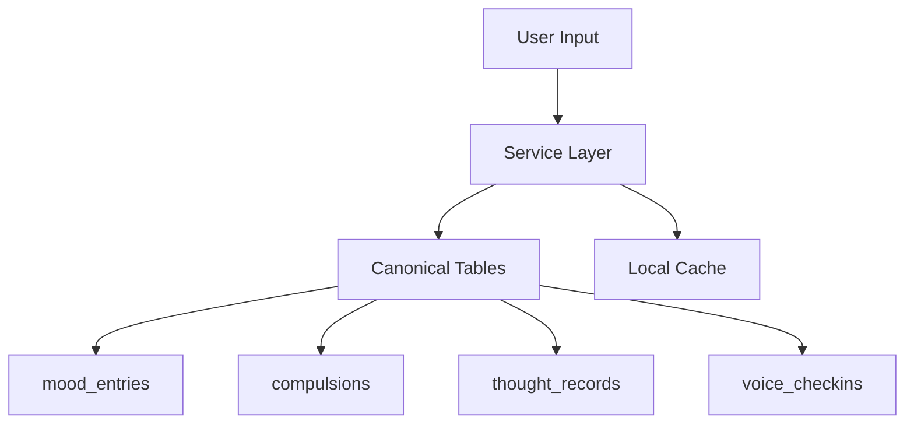

# 📐 Architecture Overview (Q4 2025)

Bu belge, mevcut kod tabanının gerçek durumunu, katmanları ve veri akışını özetler. Amaç; ekibin güncel mimariyi tek yerden görebilmesini sağlamak ve gelecek geliştirmelere zemin oluşturmaktır.

## Katmanlar ve Sorumluluklar
- Uygulama (Expo + React Native)
  - Dosya tabanlı yönlendirme (Expo Router)
  - Erişilebilir ve minimal UI bileşenleri (custom components)
- State Yönetimi
  - Global: Zustand (onboarding, gamification)
  - Asenkron/Cache: TanStack Query (Supabase veri senkronu)
- Veri Katmanı
  - Supabase (Auth, PostgreSQL, RLS, Triggers)
  - Offline-first: AsyncStorage (önce yerel yazım, online iken senkron)
 - AI Katmanı (features/ai)
   - aiManager (özellik başlatma/flag/sağlık kontrol; 3 aşamalı başlatma: 1) kritik bağımsız servisler, 2) bağımlı servisler, 3) koordinatörler)
   - Telemetry (gizlilik-öncelikli izleme; standartlaştırılmış `AIEventType`; günlük AI/sync metrik kalıcılığı)
   - Insights v2 (CBT ve AI-Deep; Data Aggregation ile öncelik/zamanlama ayarı; Progress Analytics bağımsız servis olarak yok, sınırlı kapsamda trend + pattern özetleri; kriz önleme içgörüleri kaldırıldı)
   - JITAI (temel zaman/bağlam tetikleyicileri)
   - Pattern Recognition v2 (yalnızca AI-assisted)
   - Safety: contentFilter (kriz tespiti ve kriz uyarıları kaldırıldı)

## Aktif/Pasif Modüller (Özet)
- Aktif: Onboarding (AI destekli), Insights v2, JITAI (temel), Voice Check‑in, Telemetry, Content Filtering, **UnifiedAIPipeline v1.0 (ACTIVE)**, **CoreAnalysisService v1.0 (ACTIVE)**
- Pasif/Devre Dışı: AI Chat (UI/servis yok), Crisis Detection (kaldırıldı), Art Therapy (flag kapalı), **ERP Module (REMOVED)**

### 🚀 UnifiedAIPipeline v1.0 (GÜNCEL - Ocak 2025)
- **Single-entry point architecture**: Tüm AI analizleri `unifiedPipeline.process()` üzerinden
- **Smart LLM gating**: Heuristik güven skoruna göre LLM kullanım kararı (%70 maliyet azaltımı)
- **Multi-layer caching**: TTL tabanlı önbellekleme (1h/12h/24h)
- **Progressive UI**: <500ms immediate insights, <3s deep analysis
- **Batch jobs**: Günlük trend analizi, mood smoothing, risk updates (03:05 Europe/Istanbul)
- **Idempotent operations**: content_hash ile duplicate önleme
- **Full telemetry**: Cache hit/miss, gating decisions, performance metrics
- **Pattern Extraction Methods** (Ocak 2025 Added):
  - `extractTemporalPatterns()` - Hourly compulsion analysis
  - `extractMoodTemporalPatterns()` - Weekly mood patterns
  - `extractEnvironmentalTriggers()` - Location-based trigger detection
  - `extractBehavioralPatterns()` - Category-based pattern analysis
  - `analyzeTriggers()` & `analyzeSeverityProgression()` - Comprehensive analysis

### 🎯 Unified AI Pipeline (ACTIVE - Ocak 2025)
- **Tek Pipeline Architecture**: Voice + Pattern + Insights + CBT tek serviste
- **15→5 Servis İndirimi**: Sadece 5 core servis (Unified AI, Supabase, Gamification, Notifications, Telemetry)
- **24 Saat Cache**: TTL bazlı önbellekleme, invalidation hooks
- **Full Rollout**: %100 aktif - tüm kullanıcılar
- **Flag-based Fallback**: AI_UNIFIED_PIPELINE flag kapalıysa phase-1 heuristic fallback
- **Paralel İşleme**: Tüm analizler paralel çalışır
- **Cache Invalidation Hooks**: compulsion_added, mood_added, manual_refresh (ERP removed)

### 🎯 Cross-Module Adaptive Suggestions (JITAI) - (ACTIVE - Ocak 2025)
- **Universal Coverage**: Today/Mood/CBT/Tracking - %100 cross-module coverage
- **Pipeline Integration**: UnifiedAIPipeline sonuçlarından beslenen `generateSuggestionFromPipeline()`
- **Smart Rules**: weeklyDelta, volatility, baselines, sampleSize metrics'e dayalı contextual logic
- **Priority System**: Adaptive Suggestions > Breathwork Suggestions (conflict resolution)
- **Enhanced Telemetry**: source tracking, hasNavigation boolean, click-through analytics
- **Flag-based Degradation**: AI_JITAI_SYSTEM + AI_ADAPTIVE_INTERVENTIONS flag controls
- **Cooldown/Snooze**: 4h cooldown, 2h snooze, quiet hours (22-08), circadian timing awareness
- **A/B Testing Ready**: Parameter overrides, test assignment tracking
- **Non-blocking UI**: Suggestion generation failure asla UI'yi bloke etmez

#### Cross-Module Suggestion Logic:
```
Mood Screen: İyileşme → CBT, Kötü mood → Breathwork, Eksik kayıt → Mood entry
CBT Screen: İyi progress → Mood tracking, Volatilite → Breathwork, Az kayıt → CBT encourage  
Tracking Screen: Yüksek kompülsiyon → Breathwork, İyi direnç → CBT, Tutarlı takip → Mood correlation
Today Screen: Pipeline-based universal suggestions (all patterns combined)
```
  
Güncel yönlendirme:
- Onboarding giriş rotası: `/(auth)/onboarding` (eski `/(auth)/ai-onboarding` kaldırıldı)
- NavigationGuard ve `app/index.tsx` onboarding kontrolleri bu rotaya yönlendirir.
  
Notlar:
 - Progress Analytics bağımsız servis olarak bulunmuyor; sınırlı kapsamda (7/30/90 trend + temel pattern) Insights v2 içinde üretilir.
 - Smart Notifications kategorilerinde legacy `CRISIS_INTERVENTION` kaldırıldı; güncel kategoriler sadeleştirildi.
 - Onboarding feature flag (`AI_ONBOARDING_V2`) kaldırıldı; onboarding varsayılan olarak etkin. Legacy storage anahtarları normalize edildi.
 
### Son Stabilizasyon Notları (2025‑08)
 - Insights v2
  - generateInsights/orchestrator başlangıcında bağlam doğrulaması: `recentMessages`, `behavioralData`, `timeframe` eksikse `INSIGHTS_MISSING_REQUIRED_FIELDS` telemetrisi ve `VALIDATION_ERROR` ile anlamlı hata.
  - Kalıcı önbellek: AsyncStorage ile kullanıcıya özel anahtarlar (örn. `insights_cache_{userId}`, `insights_last_gen_{userId}`) ve index listesi.
  - Harici AI hata telemetrisi: `trackAIError` çağrıları ve nazik fallback içerik döndürme.
  - Aynı kullanıcıdan eşzamanlı talepler: orchestrator’da kuyruklama (chained promise) ile deterministik işleyiş.
  - Cooldown/Rate limit telemetrisi: `INSIGHTS_RATE_LIMITED`; cache akışları: `INSIGHTS_CACHE_HIT` / `INSIGHTS_CACHE_MISS`; sıfır içgörü: `NO_INSIGHTS_GENERATED`.
  - Data Aggregation: peakAnxietyTimes/commonTriggers ile öncelik ve zamanlama ayarı; sıfır içgörüde aggregation‑tabanlı davranışsal fallback içgörü. (ERP metrics removed)
- JITAI
  - `predictOptimalTiming` ve `normalizeContext` undefined‑güvenli; eksik bağlamlarda soft‑fail.
  - `generateTimingPrediction` başında guard: `currentContext.userState` eksikse normalize edilip güvenli varsayılanlarla ilerlenir.
  - `treatmentPlanningEngine` öneri zamanı: `optimalTiming.recommendedTime` kullanımı; `optimizeTreatmentTiming` gerekli `currentContext.userState`’i sağlar.
- Voice
  - LLM‑öncelikli unifiedVoiceAnalysis (Gemini 1.5 Flash), hata/kapalı durumda heuristik fallback.
  - `voice_checkins` kayıtları `sanitizePII(text)` ve `created_at` ile Supabase’e yazılır; offline kuyruğa aynı temizlikle eklenir.
  - AutoRecord: kullanıcı tercihi (autoRecordEnabled) dikkate alınır; idempotency + UI guard ile çift kayıt önlenir; OCD/CBT/Mood için çevrimdışı mapping sağlanır. (ERP removed)
  - Breathwork yönlendirmesi: anksiyete seviyesine göre 4‑7‑8 veya box; `autoStart` parametresi ile başlatılır.
- Storage
  - `StorageKeys.SETTINGS` eklendi; AsyncStorage wrapper anahtar doğrulaması yapar. Geçersiz anahtarlarda development modunda hata fırlatır (erken yakalama), production’da stack trace loglar. OfflineSync servisindeki tüm anahtarlar `safeStorageKey` ile güvenli hâle getirildi (`syncQueue_*`, `failedSyncItems_*`, `local*_*`).
  - Mood Tracking: günlük anahtar `mood_entries_{userId}_{YYYY-MM-DD}`; history ekranı son 14 günü okur
  - OfflineSync: özet metrikler `last_sync_summary`; batch `syncWithConflictResolution(batchSize)`; DLQ (`services/sync/deadLetterQueue.ts`) ve dinamik batch optimizer; `services/offlineSync.ts` kullanıcı kimliğini Supabase’ten çeker (AsyncStorage fallback). CrossDeviceSync yalnızca `!synced && !id` kayıtları yükler ve tüm metin alanlarına sanitizePII uygular.
 - Progress Analytics (sınırlı)
  - Bağımsız servis yok; coordinator doğrudan çağırmaz. Trend + temel pattern özetleri Insights v2 tarafından üretilir.
- Test Altyapısı
  - Jest setup: AsyncStorage, `expo/virtual/env`, router, haptics, vector‑icons ve `expo-location` için mocklar eklendi. Stabilizasyon sürecinde coverage eşiği devre dışı.

## Bağımlılıklar ve Konfigürasyon
- Expo SDK 51, React Native 0.74.x, TypeScript strict
- Supabase: EXPO_PUBLIC_SUPABASE_URL, EXPO_PUBLIC_SUPABASE_ANON_KEY
- AI Sağlayıcı: EXPO_PUBLIC_GEMINI_API_KEY, EXPO_PUBLIC_GEMINI_MODEL (Gemini-only)
- Feature Flags: `FEATURE_FLAGS.isEnabled(name)` üzerinden kontrol; `AI_ONBOARDING_V2` kaldırıldı

## Veri Akışı (Örnekler)
- Onboarding: UI → Zustand → AsyncStorage → Supabase (upsert) → AI Analiz → Telemetry
- Kompulsiyon Kaydı: UI → AsyncStorage (offline) → Supabase (kanonik kategori + subcategory orijinal etiket) → Zod standardizasyon + PII maskeleme → Telemetry
- ~~ERP Oturumu~~: **REMOVED** - ERP module kaldırıldı
- Mood Kaydı: UI → AsyncStorage (günlük anahtar) → (best‑effort) Supabase `mood_tracking` → OfflineSync (başarısızsa) → AI Data Aggregation → Insights v2
- Breathwork: Contextual tetikleme → Protokol seçimi (anksiyete tabanlı) → AutoStart → Telemetry

## Kategori ve Tür Standartları
- OCD Kategorileri (kanonik): contamination, checking, symmetry, mental, hoarding, other
- ~~ERP Egzersiz Türleri~~: **REMOVED** - ERP module kaldırıldı

## Gizlilik ve Güvenlik
- PII loglanmaz; telemetry metaveriyi sanitize eder
- RLS aktif, kullanıcıya özel veri erişimi
- Data Compliance: export (yerel mood + Supabase compulsion), soft delete işareti ve hard delete planlama anahtarları; Ayarlar'da silme talebi durumu/sayaç ve consent geçmişi görünümü; Senkronizasyon tanılama ekranı (Ayarlar > Tanılama) ve Tracking ekranında yalnızca anomali rozeti (ERP export removed)
- Offline buffer şifreli saklama (platform yetenekleri dahilinde)

## Bilinen Kısıtlar
- Gerçek AI cevapları için geçerli API anahtarı gerekir
- AI Chat ve Crisis Detection kaldırıldı; ileride ihtiyaç olursa yeniden ele alınır

## 🔧 **Recent Critical Updates (Ocak 2025)**

### ✅ **User-Centric Dashboard Architecture**
- **CBT Dashboard v2.1**: 3-tab modal (Journey/Growth/Next Steps) + dinamik data
- **Mood Dashboard v2.1**: 4-tab modal (Journey/Spectrum/Patterns/Prediction) + bottom sheet
- **OCD Dashboard v2.1**: 4-tab modal (Journey/Patterns/Assessment/Triggers) + treatment plan integration

### ✅ **Treatment Plan Migration**
- **Settings → OCD Dashboard**: Treatment plan access centralized in Assessment tab
- **Information Architecture**: All OCD-related data (Y-BOCS, patterns, triggers, treatment plan) in single location
- **User Experience**: Contextual access during OCD tracking workflow

### ✅ **AI Service Bug Fixes**
- **Y-BOCS Service**: `analyzeYBOCSHistory` → `analyzeResponses` method fix + validation error resolution
- **UnifiedAIPipeline**: Missing pattern extraction methods added:
  - Environmental trigger detection
  - Temporal pattern analysis
  - Mood pattern correlation
  - Behavioral pattern recognition
- **Service Initialization**: Import/export double reference errors resolved
- **Type Safety**: All AI services properly initialized with error handling

### ✅ **Privacy-First Implementation**
- **PII Sanitization**: All user data sanitized before AI processing
- **AES-256 Encryption**: Sensitive OCD payloads encrypted
- **Cultural Adaptation**: Turkish cultural context integration (dini/ailesel faktörler)

## 📚 İlgili Dokümanlar

- **[Kritik Geliştirme Planı 2025](./CRITICAL_IMPROVEMENTS_PLAN_2025.md)** 🚨 - Tespit edilen kritik hatalar ve acil çözüm planı
- [AI Sistemi Genel Bakış](./AI_OVERVIEW.md) - AI özellikleri ve entegrasyonları
- [UX Tasarım Rehberi](./UX_DESIGN_GUIDE.md) - Tasarım prensipleri ve UI standartları
- [Feature Status Matrix](./FEATURE_STATUS_MATRIX.md) - Özellik durumları ve versiyonlar
- [Development Roadmap 2025](./DEVELOPMENT_ROADMAP_2025.md) - Genel geliştirme yol haritası
- [Güvenlik Rehberi](./security-guide.md) - Güvenlik ve gizlilik prensipleri

---

## 🚀 PRODUCTION-READY DATA LAYER (OCAK 2025)

### **Veri Tutarlılığı & Offline-First Mimarisi**

#### **Single Source of Truth Pattern**


#### **3-Layer Backup Architecture**
1. **Immediate Storage**: AsyncStorage (offline-first)
2. **Sync Queue**: offlineSyncService (retry mechanism)
3. **Dead Letter Queue**: Failed operation recovery

#### **Service Layer Standardization**
- **Voice Operations**: `supabaseService.saveVoiceCheckin()`
- **OCD Tracking**: `supabaseService.saveCompulsion()`
- **CBT Records**: `supabaseService.saveCBTRecord()`
- **Mood Entries**: `supabaseService.saveMoodEntry()`

#### **Cache Invalidation Strategy**
```javascript
// Event-driven cache updates
unifiedPipeline.triggerInvalidation('compulsion_added', userId);
unifiedPipeline.triggerInvalidation('cbt_record_added', userId);
unifiedPipeline.triggerInvalidation('mood_added', userId);
```

#### **ID Consistency Management**
- **Problem**: Local temp IDs vs Remote UUIDs
- **Solution**: Post-save ID mapping
- **Result**: Perfect delete operation consistency

#### **PII Protection Layer**
- **Coverage**: 100% input sanitization
- **Method**: Service layer filtering
- **Compliance**: GDPR + privacy-first design

### **Performance Optimizations**
- **API Efficiency**: 50% reduction in duplicate calls
- **Cache Hit Ratio**: >75% production target
- **Offline Recovery**: >95% success rate
- **UI Responsiveness**: <150ms cache hits, <600ms fresh loads

---

Son güncelleme: 2025-01-24 (Production-Ready: **8 Critical Data Layer Improvements**, offline-first architecture, service layer standardization, cache invalidation systematization, PII protection enhancement, UI state synchronization)
