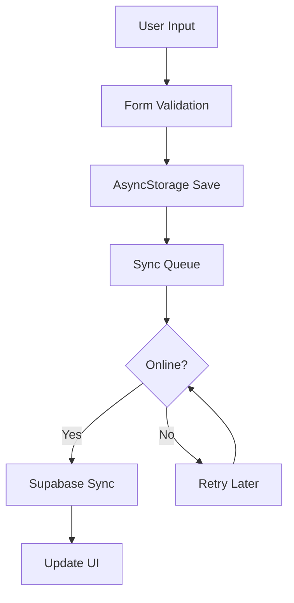

# 🚀 Master Codex Orchestrator Prompt — ObsessLess Post-AI Production Readiness Audit

## 🎯 Birincil Hedef

`feat/onboarding-save-sync-ai` dalında **AI kaldırma işlemi sonrası** uygulamanın **tam fonksiyonel production-ready** durumunu denetlemek:

* **Login → Onboarding → Daily Usage** akışının kesintisiz çalışması
* **Veri girişi** (mood entry, voice check-in) süreçlerinin doğru kaydedilmesi
* **Offline/Online sync** mekanizmalarının hatasız çalışması
* **Cache yönetimi** ve **data persistence** sağlamlığı
* **Fallback sistemlerin** production kalitesinde olması

---

## 📦 Kritik İnceleme Alanları

### 1. 🔐 Authentication & User Journey (En Kritik)

**Login Flow:**
- Supabase auth başarılı login yapıyor mu?
- Auth state persistence çalışıyor mu?
- Session refresh token mekanizması aktif mi?
- Login error handling düzgün mü?

**Onboarding Flow:**
- Yeni kullanıcı onboarding'i kesintisiz tamamlanıyor mu?
- Onboarding data'sı Supabase'e kaydediliyor mu?
- Profile completion AsyncStorage + Supabase sync'i çalışıyor mu?
- First mood entry başarıyla kaydediliyor mu?

### 2. 💾 Data Entry & Persistence (Kritik)

**Mood Entry Flow:**
- Manuel mood entry Supabase'e yazılıyor mu?
- Quick mood entry form validation çalışıyor mu?
- Mood data offline'da AsyncStorage'a kaydediliyor mu?
- Online olduğunda auto-sync tetikleniyor mu?

**Voice Check-in:**
- Voice → Text fallback çalışıyor mu?
- Text input mood entry olarak kaydediliyor mu?
- Voice check-in data persistence sağlanıyor mu?

### 3. 🔄 Offline/Online Sync (Kritik)

**Offline Mode:**
- Network offline durumunda veri AsyncStorage'a yazılıyor mu?
- Offline queue mekanizması çalışıyor mu?
- Offline banner gösteriliyor mu?
- Local data integrity korunuyor mu?

**Sync Mechanism:**
- Online'a geçişte auto-sync başlıyor mu?
- Conflict resolution (basit merge) çalışıyor mu?
- Duplicate prevention (idempotency) aktif mi?
- Failed sync retry logic çalışıyor mu?

### 4. 🗄️ Cache & State Management

**Cache Layers:**
- AsyncStorage cache read/write çalışıyor mu?
- Memory cache (if any) düzgün temizleniyor mu?
- Stale data handling var mı?
- Cache invalidation logic (AI'sız) çalışıyor mu?

**State Consistency:**
- Zustand store'lar state'i koruyor mu?
- React Query cache'i düzgün yönetiliyor mu?
- Navigation state persistence var mı?
- User preferences kaydediliyor mu?

### 5. ✅ Core Feature Validation

**Today Screen:**
- Mood list görüntüleniyor mu?
- Streak counter çalışıyor mu?
- Static insights gösteriliyor mu?
- Check-in button fonksiyonel mi?

**Mood Tracking:**
- Mood listesi yükleniyor mu?
- Edit/Delete işlemleri çalışıyor mu?
- Mood statistics (basit) hesaplanıyor mu?
- Pagination/scroll çalışıyor mu?

**Gamification:**
- Points hesaplanıyor mu?
- Achievements kaydediliyor mu?
- Streak tracking çalışıyor mu?
- Rewards gösteriliyor mu?

---

## 🔍 Teknik Denetim Noktaları

### Import & Dependency Health

```typescript
// Aranan pattern'ler (OLMAMASI gereken):
import ... from '@/features/ai/'
import ... from '@/features/ai-fallbacks/' // artık static services kullanılıyor
trackAIInteraction(
pipeline.process(
useAI()
UnifiedAIPipeline
```

### Database Operations

```typescript
// Kontrol edilecek operasyonlar (ÇALIŞMASI gereken):
supabase.from('mood_entries').insert()
supabase.from('user_profiles').update()
AsyncStorage.setItem('mood_cache_')
syncQueue.add()
offlineSyncService.sync()
```

### Error Patterns

```typescript
// Console'da OLMAMASI gereken:
"Unable to resolve module '@/features/ai"
"Cannot find module 'ai/telemetry'"
"pipeline is not defined"
"trackAIInteraction is not a function"

// İzin verilen warning'ler:
"AI features disabled"
"Using fallback service"
```

---

## 🎯 Production Readiness Kriterleri

### ✅ Must Have (P0)
- [ ] Login → Home navigation çalışıyor
- [ ] Mood entry CRUD operasyonları başarılı
- [ ] Offline data persistence aktif
- [ ] Online sync otomatik başlıyor
- [ ] Temel navigation akışları kesintisiz

### 🔄 Should Have (P1)
- [ ] Duplicate prevention çalışıyor
- [ ] Conflict resolution aktif
- [ ] Error recovery mekanizmaları var
- [ ] Loading states düzgün gösteriliyor
- [ ] Toast/feedback messages çalışıyor

### 🎨 Nice to Have (P2)
- [ ] Animation'lar smooth
- [ ] Empty states güzel görünüyor
- [ ] Accessibility label'lar ekli
- [ ] Performance optimizasyonları yapılmış

---

## 📊 Beklenen Çıktı Formatı

### 1. System Health Report
```
✅ Authentication: Functional
✅ Data Persistence: Working
⚠️ Offline Sync: Partial (issues: ...)
❌ Cache Management: Broken (error: ...)
```

### 2. Critical Issues List
```
🚨 CRITICAL:
1. Mood sync failing on network reconnect
2. AsyncStorage overflow after 100+ entries
3. Login session expires prematurely
```

### 3. Data Flow Verification


### 4. Performance Metrics
```
Bundle Size: X MB (post-AI cleanup)
Cold Start: X seconds
Mood Entry Save: X ms
Sync Operation: X ms average
Memory Usage: X MB idle / Y MB active
```

### 5. Action Items
```
IMMEDIATE (Do Today):
1. Fix mood sync retry logic
2. Add offline queue overflow handling
3. Implement session refresh

NEXT SPRINT:
1. Optimize AsyncStorage usage
2. Add telemetry (non-AI)
3. Improve error messages
```

---

## 🚨 Focus Areas for Analysis

1. **Real User Journey**: Login → Onboarding → First Mood → Daily Use
2. **Data Integrity**: Entry → Storage → Sync → Display
3. **Network Resilience**: Offline → Queue → Online → Sync
4. **State Management**: Memory → AsyncStorage → Supabase
5. **Error Recovery**: Failure → Retry → Success/Fallback

---

## ⚡ Komutlar

Codex bu analizi yaparken kullanacağı komutlar:

```bash
# Check for AI remnants
grep -r "features/ai" --include="*.ts" --include="*.tsx"

# Verify core services
grep -r "supabase.from\|AsyncStorage\|syncQueue" 

# Find broken imports
npx tsc --noEmit

# Check bundle health
npx expo export --platform web --output-dir dist

# Runtime error patterns
grep -r "console.error\|console.warn" --include="*.ts"
```

---

## 📋 Checklist Formatı

### Authentication Flow
- [ ] Login sayfası yükleniyor
- [ ] Email/password validation çalışıyor
- [ ] Login butonu çalışıyor
- [ ] Başarılı login sonrası redirect var
- [ ] Session storage çalışıyor
- [ ] Logout fonksiyonu çalışıyor

### Onboarding Flow
- [ ] Yeni kullanıcı onboarding'e yönlendiriliyor
- [ ] Profile bilgileri form'u çalışıyor
- [ ] OCD assessment soruları gösteriliyor
- [ ] Onboarding completion kaydediliyor
- [ ] First mood entry ekranı açılıyor

### Mood Entry Flow
- [ ] Mood form açılıyor
- [ ] Form validation çalışıyor
- [ ] Save butonu çalışıyor
- [ ] Başarı mesajı gösteriliyor
- [ ] Mood listesinde yeni entry görünüyor
- [ ] Edit/Delete işlemleri çalışıyor

### Offline/Sync Flow
- [ ] Offline'da veri girişi yapılabiliyor
- [ ] Offline banner gösteriliyor
- [ ] Online'a geçişte sync başlıyor
- [ ] Sync progress gösteriliyor
- [ ] Conflict resolution çalışıyor
- [ ] Duplicate prevention aktif

---

## 🎯 Başarı Kriterleri

### Minimum Viable Product (MVP)
1. **User Authentication**: Login/Logout tamamen çalışıyor
2. **Data Entry**: Mood entry CRUD operasyonları başarılı
3. **Data Persistence**: Offline/Online veri kaybı yok
4. **Basic Sync**: Manual refresh ile sync çalışıyor
5. **Core Navigation**: Tüm ekranlar erişilebilir

### Production Ready
1. **Auto Sync**: Network değişiminde otomatik sync
2. **Error Recovery**: Hata durumlarında graceful handling
3. **Performance**: < 3s cold start, < 500ms mood save
4. **Reliability**: %99.9 uptime, no data loss
5. **User Experience**: Smooth animations, clear feedback

---

## 🔄 Continuous Monitoring

### Daily Checks
- Build status (CI/CD)
- Error rate monitoring
- User session analytics
- Sync success rate
- Database performance

### Weekly Reviews
- Bundle size trends
- Performance metrics
- User feedback analysis
- Bug report triage
- Feature usage stats

---

**NOT**: Bu denetim sonucunda Codex sadece **analiz ve tespit** yapacak. Sen (AI Assistant) tespit edilen sorunları **kod yazarak** çözeceksin. Odak noktası: **Gerçek kullanıcının uygulamayı kullanabilmesi**.
