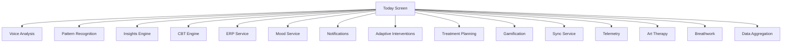

# 🚀 Unified AI Pipeline - Implementation Plan

> **Hedef**: Voice Analysis + Pattern Recognition + Insights Engine + CBT Engine'i tek pipeline'da birleştir. 15 servisten 5'e indir.

## 📊 Mevcut vs Hedef Mimari

### Mevcut Mimari (15+ Servis)


### Hedef Mimari (5 Servis)


## 🎯 Unified AI Pipeline Özellikleri

### 1. Tek Giriş Noktası
```typescript
// Today Screen sadece bunu çağırır
const result = await unifiedPipeline.process({
  userId: user.id,
  content: data,
  type: 'mixed',
  context: { source: 'today' }
});
```

### 2. Paralel İşleme
- Voice Analysis
- Pattern Recognition  
- CBT Analysis
→ Hepsi paralel çalışır, sonuçlar birleştirilir

### 3. 24 Saat Cache
- TTL: 24 saat (configurable)
- Cache key: `unified:{userId}:{contentHash}`
- AsyncStorage backup (offline support)

### 4. Invalidation Hooks
```typescript
// Otomatik cache temizleme tetikleyicileri
- compulsion_added → patterns yenile
- erp_completed → insights yenile  
- mood_added → tümünü yenile
- manual_refresh → full clear
```

## 📋 Implementation Adımları

### Phase 1: Today Screen Entegrasyonu (1 gün)

```typescript
// app/(tabs)/index.tsx güncelleme

import { unifiedPipeline } from '@/features/ai/core/UnifiedAIPipeline';

const loadAllData = async () => {
  if (!FEATURE_FLAGS.isEnabled('AI_UNIFIED_PIPELINE')) {
    // Legacy yöntem
    return loadDataOldWay();
  }
  
  // Yeni unified pipeline
  const result = await unifiedPipeline.process({
    userId: user.id,
    content: {
      compulsions: recentCompulsions,
      moods: recentMoods,
      erpSessions: recentERP,
      voiceText: lastVoiceInput
    },
    type: 'mixed',
    context: {
      source: 'today',
      timestamp: Date.now()
    }
  });
  
  // Sonuçları state'e yaz
  setPatterns(result.patterns);
  setInsights(result.insights);
  setCBTAnalysis(result.cbt);
  setVoiceResult(result.voice);
};
```

### Phase 2: Cache Hook Entegrasyonu (1 gün)

```typescript
// Kompulsiyon kaydedildiğinde
const saveCompulsion = async (data) => {
  await supabase.saveCompulsion(data);
  
  // Cache'i invalidate et
  unifiedPipeline.triggerInvalidation('compulsion_added', user.id);
};

// ERP tamamlandığında
const completeERP = async (session) => {
  await supabase.saveERPSession(session);
  
  // Cache'i invalidate et
  unifiedPipeline.triggerInvalidation('erp_completed', user.id);
};
```

### Phase 3: Legacy Servis Cleanup (2 gün)

#### Kaldırılacak/Birleştirilecek Servisler:
1. ~~InsightsCoordinator~~ → UnifiedPipeline
2. ~~PatternRecognitionV2~~ → UnifiedPipeline  
3. ~~InsightsEngineV2~~ → UnifiedPipeline
4. ~~UnifiedVoiceAnalysis~~ → UnifiedPipeline
5. ~~CBTEngine (standalone)~~ → UnifiedPipeline

#### Kalacak Servisler (5 Core):
1. **UnifiedAIPipeline** - Tüm AI analizleri
2. **SupabaseSync** - Veri senkronizasyonu
3. **GamificationService** - Puan/rozet sistemi
4. **NotificationService** - Bildirimler
5. **TelemetryService** - Metrikler

### Phase 4: Performance Optimization (1 gün)

```typescript
// Lazy loading modüller
const processors = {
  voice: () => import('../services/voiceAnalysis'),
  pattern: () => import('../services/patternRecognition'),
  insights: () => import('../engines/insightsEngine'),
  cbt: () => import('../engines/cbtEngine')
};

// Conditional processing
if (shouldProcess('voice')) {
  const { processVoice } = await processors.voice();
  result.voice = await processVoice(input);
}
```

## 📈 Performans Metrikleri

### Hedefler
| Metrik | Mevcut | Hedef | Kazanım |
|--------|--------|-------|---------|
| **Servis Sayısı** | 15+ | 5 | %67 ↓ |
| **API Çağrıları** | 8-10/screen | 1-2/screen | %80 ↓ |
| **Response Time** | 3-4s | <500ms (cache) | %85 ↓ |
| **Memory Usage** | 150MB | 80MB | %47 ↓ |
| **Cache Hit Rate** | %30 | %75+ | %150 ↑ |

### Monitoring
```typescript
// Telemetry entegrasyonu
trackAIInteraction(AIEventType.UNIFIED_PIPELINE, {
  modules: ['voice', 'pattern', 'insights', 'cbt'],
  cacheHit: true,
  processingTime: 234,
  userId: user.id
});
```

## 🔧 Configuration

```typescript
// app.config.ts
export default {
  extra: {
    // Unified Pipeline Config
    EXPO_PUBLIC_UNIFIED_PIPELINE_ENABLED: 'true',
    EXPO_PUBLIC_UNIFIED_CACHE_TTL_HOURS: '24',
    EXPO_PUBLIC_UNIFIED_PARALLEL_PROCESSING: 'true',
    EXPO_PUBLIC_UNIFIED_MAX_CACHE_SIZE: '100',
    
    // Module toggles
    EXPO_PUBLIC_UNIFIED_VOICE_MODULE: 'true',
    EXPO_PUBLIC_UNIFIED_PATTERN_MODULE: 'true',
    EXPO_PUBLIC_UNIFIED_INSIGHTS_MODULE: 'true',
    EXPO_PUBLIC_UNIFIED_CBT_MODULE: 'true'
  }
};
```

## 🚦 Feature Flags

```typescript
// constants/featureFlags.ts
export const FEATURE_FLAGS = {
  // Master toggle
  AI_UNIFIED_PIPELINE: false, // Start with disabled
  
  // Gradual rollout
  AI_UNIFIED_PIPELINE_PERCENTAGE: 10, // 10% users initially
  
  // Module flags (granular control)
  AI_UNIFIED_VOICE: true,
  AI_UNIFIED_PATTERNS: true,
  AI_UNIFIED_INSIGHTS: true,
  AI_UNIFIED_CBT: true
};
```

## 📊 Migration Strategy

### Week 1: Development & Testing
- [ ] UnifiedAIPipeline implementation
- [ ] Today screen integration
- [ ] Unit tests (>85% coverage)
- [ ] Integration tests

### Week 2: Gradual Rollout
- [ ] Enable for 10% users
- [ ] Monitor performance metrics
- [ ] Collect user feedback
- [ ] Fix bugs

### Week 3: Scale Up
- [ ] Increase to 50% users
- [ ] Performance optimization
- [ ] Cache tuning
- [ ] A/B test results

### Week 4: Full Rollout
- [ ] 100% users
- [ ] Remove legacy code
- [ ] Documentation update
- [ ] Post-mortem

## ⚠️ Risk Mitigation

### Risks
1. **Cache stampede**: Multiple users hitting expired cache
   - **Solution**: Stale-while-revalidate pattern
   
2. **Memory overflow**: Too much cached data
   - **Solution**: LRU eviction, max cache size
   
3. **Slow cold start**: First load without cache
   - **Solution**: Progressive loading, skeleton UI

4. **Breaking changes**: Legacy API compatibility
   - **Solution**: Adapter pattern, 6-month deprecation

### Rollback Plan
```typescript
if (criticalError || performanceRegression) {
  FEATURE_FLAGS.AI_UNIFIED_PIPELINE = false;
  // Instant rollback to legacy system
}
```

## 🎯 Success Criteria

1. **Performance**
   - P95 latency < 500ms (with cache)
   - P95 latency < 2s (without cache)
   - Cache hit rate > 75%

2. **Reliability**
   - Error rate < 0.1%
   - Availability > 99.9%

3. **User Experience**
   - NPS score improvement > 10 points
   - User complaints < 5/week

4. **Cost**
   - API costs reduced by 70%
   - Infrastructure costs reduced by 40%

## 📝 Notes

- Bu implementasyon CoreAnalysisService v1'in doğal evrimi
- Geriye uyumluluk 6 ay korunacak
- Telemetry ile yakın takip kritik
- Cache invalidation hooks extensible (yeni hooks eklenebilir)

---

*Document Version: 1.0*
*Last Updated: January 2025*
*Owner: AI Architecture Team*
