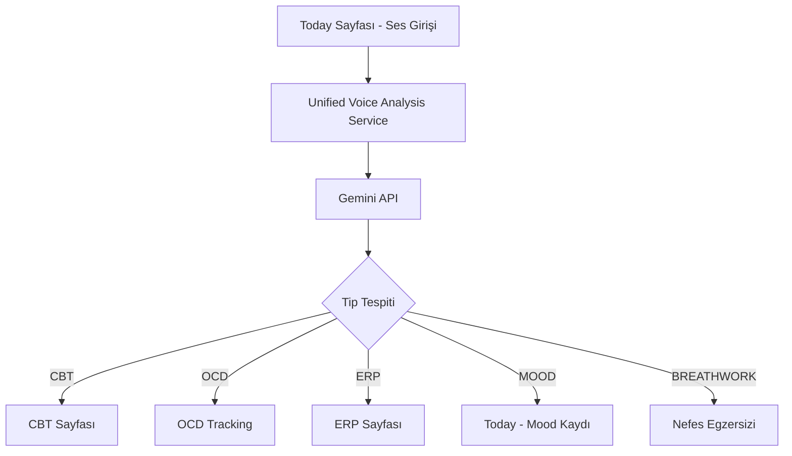

# 🎯 Merkezi Ses Analizi Sistemi - Geliştirme Planı

## 📋 Özet
Tüm ses girişlerini Today sayfasından alıp, Gemini API ile analiz ederek otomatik olarak ilgili sayfaya (CBT/OCD/ERP/Mood) yönlendiren merkezi bir sistem.

## 🏗️ Mimari Tasarım



## 📝 Uygulama Adımları

### Faz 1: Merkezi Analiz Servisi (Sprint 1 - 3 gün)

#### 1.1 Gemini API Entegrasyonu
**Dosya:** `features/ai/services/unifiedVoiceAnalysis.ts`

```typescript
import { externalAIService } from './externalAIService';

export interface VoiceAnalysisRequest {
  text: string;
  duration?: number;
  language: 'tr' | 'en';
  userId: string;
}

export interface VoiceAnalysisResponse {
  type: 'MOOD' | 'CBT' | 'OCD' | 'ERP' | 'BREATHWORK';
  confidence: number;
  reasoning: string;
  extractedData: {
    // Mood
    moodScore?: number;
    energyLevel?: number;
    anxietyLevel?: number;
    
    // CBT
    cognitiveDistortions?: string[];
    thoughtPattern?: string;
    
    // OCD
    compulsionType?: string;
    resistanceLevel?: number;
    trigger?: string;
    frequency?: number;
    
    // ERP
    exposureCategory?: string;
    anxietyBefore?: number;
    targetBehavior?: string;
  };
  suggestedAction: {
    page: string;
    params: Record<string, any>;
    message: string;
  };
}

class UnifiedVoiceAnalysisService {
  private static instance: UnifiedVoiceAnalysisService;
  
  async analyzeWithGemini(request: VoiceAnalysisRequest): Promise<VoiceAnalysisResponse> {
    const prompt = this.buildAnalysisPrompt(request);
    
    const response = await externalAIService.getAIResponse(
      [{ 
        content: prompt, 
        role: 'user',
        timestamp: new Date().toISOString(),
        id: `analysis_${Date.now()}`
      }],
      {
        conversationId: `voice_analysis_${Date.now()}`,
        userId: request.userId,
        sessionStartTime: new Date().toISOString(),
        messages: [],
        currentPhase: 'analysis'
      },
      {
        temperature: 0.3, // Düşük temperature, tutarlı analiz için
        maxTokens: 500,
        systemPrompt: this.getSystemPrompt()
      }
    );
    
    return this.parseGeminiResponse(response);
  }
  
  private buildAnalysisPrompt(request: VoiceAnalysisRequest): string {
    return `
    Kullanıcının ses kaydı metni: "${request.text}"
    Kayıt süresi: ${request.duration ? Math.round(request.duration / 1000) : 'bilinmiyor'} saniye
    Dil: ${request.language === 'tr' ? 'Türkçe' : 'İngilizce'}
    
    Bu metni analiz et ve şu kategorilerden birine sınıflandır:
    
    1. MOOD - Genel duygu durumu ifadesi
       Örnekler: "Bugün kendimi iyi hissediyorum", "Çok yorgunum"
    
    2. CBT - Bilişsel çarpıtma içeren düşünceler
       Örnekler: "Kesin başıma kötü bir şey gelecek", "Herkes benden nefret ediyor"
       Çarpıtma tipleri: Felaketleştirme, Ya hep ya hiç, Aşırı genelleme, Zihin okuma, Falcılık
    
    3. OCD - Obsesif kompulsif davranış kayıtları
       Örnekler: "Ellerimi 5 kez yıkadım", "Kapıyı 3 kez kontrol ettim"
       Kategoriler: Temizlik, Kontrol, Sayma, Düzen/Simetri, Zihinsel
    
    4. ERP - Maruz bırakma egzersizi niyeti
       Örnekler: "Bugün kapıyı kontrol etmemeye çalışacağım", "Kirli yüzeye dokunma egzersizi yapacağım"
    
    5. BREATHWORK - Nefes/rahatlama ihtiyacı
       Örnekler: "Nefes alamıyorum", "Panik atak geçiriyorum", "Sakinleşmem lazım"
    
    JSON formatında yanıt ver:
    {
      "type": "MOOD|CBT|OCD|ERP|BREATHWORK",
      "confidence": 0.0-1.0,
      "reasoning": "Neden bu kategori seçildi",
      "extractedData": {
        // Tip'e göre ilgili veriler
      },
      "suggestedAction": {
        "page": "Yönlendirilecek sayfa",
        "message": "Kullanıcıya gösterilecek mesaj"
      }
    }
    `;
  }
  
  private getSystemPrompt(): string {
    return `Sen, OKB (Obsesif Kompulsif Bozukluk) tedavisinde uzmanlaşmış bir AI asistanısın.
    Görevin, kullanıcıların ses kayıtlarını analiz edip doğru terapötik müdahaleye yönlendirmek.
    
    Analiz kriterlerin:
    - Bilişsel çarpıtmaları tespit et (CBT)
    - Kompulsif davranışları tanımla (OCD)
    - ERP egzersiz niyetlerini anla
    - Panik/anksiyete durumlarını fark et (Breathwork)
    - Genel mood ifadelerini ayırt et
    
    Her zaman empatik, yargılamayan ve destekleyici ol.
    Türkçe konuş ve kültürel bağlama duyarlı ol.`;
  }
}

export const unifiedVoiceAnalysis = UnifiedVoiceAnalysisService.getInstance();
```

#### 1.2 Today Sayfası Entegrasyonu
**Dosya:** `app/(tabs)/index.tsx`

```typescript
import { unifiedVoiceAnalysis } from '@/features/ai/services/unifiedVoiceAnalysis';

const handleVoiceTranscription = async (res: TranscriptionResult) => {
  if (!user?.id) return;
  
  setAnalyzing(true);
  try {
    // Gemini ile analiz
    const analysis = await unifiedVoiceAnalysis.analyzeWithGemini({
      text: res.text,
      duration: res.duration,
      language: res.language || 'tr',
      userId: user.id
    });
    
    // Tip'e göre yönlendirme
    switch (analysis.type) {
      case 'MOOD':
        await saveMoodEntry(analysis.extractedData);
        setToastMessage(analysis.suggestedAction.message);
        break;
        
      case 'CBT':
        router.push({
          pathname: '/(tabs)/cbt',
          params: {
            autoOpen: true,
            thoughtText: res.text,
            distortions: JSON.stringify(analysis.extractedData.cognitiveDistortions)
          }
        });
        break;
        
      case 'OCD':
        router.push({
          pathname: '/(tabs)/tracking',
          params: {
            autoOpenOCD: true,
            prefillType: analysis.extractedData.compulsionType,
            prefillResistance: analysis.extractedData.resistanceLevel,
            prefillNotes: res.text
          }
        });
        break;
        
      case 'ERP':
        router.push({
          pathname: '/(tabs)/erp',
          params: {
            autoSelectCategory: analysis.extractedData.exposureCategory,
            prefillAnxiety: analysis.extractedData.anxietyBefore
          }
        });
        break;
        
      case 'BREATHWORK':
        router.push({
          pathname: '/(tabs)/breathwork',
          params: {
            autoStart: true,
            technique: analysis.extractedData.anxietyLevel > 7 ? '4-7-8' : 'box'
          }
        });
        break;
    }
    
    // Telemetry
    await trackAIInteraction(AIEventType.VOICE_ANALYSIS_COMPLETED, {
      type: analysis.type,
      confidence: analysis.confidence,
      userId: user.id
    });
    
  } catch (error) {
    console.error('Voice analysis failed:', error);
    setToastMessage('Ses analizi başarısız, lütfen tekrar deneyin');
  } finally {
    setAnalyzing(false);
  }
};
```

### Faz 2: CBT Sayfası Yeniden Tasarımı (Sprint 2 - 2 gün)

#### 2.1 CBT Sayfası (FAB Butonlu)
**Dosya:** `app/(tabs)/cbt.tsx`

```typescript
import React, { useState, useEffect } from 'react';
import { View, Text, StyleSheet, ScrollView, RefreshControl } from 'react-native';
import ScreenLayout from '@/components/layout/ScreenLayout';
import FAB from '@/components/ui/FAB';
import { useLocalSearchParams } from 'expo-router';
import CBTFormSheet from '@/components/forms/CBTFormSheet';
import CBTRecordCard from '@/components/cbt/CBTRecordCard';

export default function CBTScreen() {
  const params = useLocalSearchParams();
  const [showForm, setShowForm] = useState(false);
  const [records, setRecords] = useState<CBTRecord[]>([]);
  const [refreshing, setRefreshing] = useState(false);
  
  // Auto-open if triggered from voice
  useEffect(() => {
    if (params.autoOpen === 'true') {
      setShowForm(true);
    }
  }, [params.autoOpen]);
  
  const loadRecords = async () => {
    // Load from AsyncStorage + Supabase
    const localRecords = await loadLocalCBTRecords();
    const cloudRecords = await loadCloudCBTRecords();
    setRecords(mergeRecords(localRecords, cloudRecords));
  };
  
  useEffect(() => {
    loadRecords();
  }, []);
  
  return (
    <ScreenLayout>
      <View style={styles.header}>
        <Text style={styles.title}>Düşünce Kayıtları</Text>
        <Text style={styles.subtitle}>Bilişsel çarpıtmalarını keşfet ve yeniden çerçevele</Text>
      </View>
      
      <ScrollView 
        style={styles.container}
        refreshControl={
          <RefreshControl refreshing={refreshing} onRefresh={loadRecords} />
        }
      >
        {records.length === 0 ? (
          <View style={styles.emptyState}>
            <Text style={styles.emptyText}>Henüz düşünce kaydın yok</Text>
            <Text style={styles.emptySubtext}>
              + butonu ile ilk kaydını oluştur veya ana sayfadan sesli giriş yap
            </Text>
          </View>
        ) : (
          records.map(record => (
            <CBTRecordCard 
              key={record.id}
              record={record}
              onPress={() => openRecordDetail(record)}
            />
          ))
        )}
      </ScrollView>
      
      <FAB 
        icon="plus" 
        onPress={() => setShowForm(true)}
        position="fixed"
      />
      
      <CBTFormSheet
        visible={showForm}
        onClose={() => setShowForm(false)}
        prefillData={{
          thought: params.thoughtText,
          distortions: params.distortions ? JSON.parse(params.distortions) : []
        }}
        onSave={async (data) => {
          await saveCBTRecord(data);
          await loadRecords();
          setShowForm(false);
        }}
      />
    </ScreenLayout>
  );
}
```

### Faz 3: Diğer Sayfalardan Ses Check-in Kaldırma (Sprint 3 - 1 gün)

#### 3.1 OCD Tracking Sayfası
- `VoiceMoodCheckin` component'ini kaldır
- Sadece FAB butonu ile manuel giriş bırak

#### 3.2 ERP Sayfası  
- Ses check-in bölümünü kaldır
- Otomatik yönlendirme parametrelerini ekle

### Faz 4: Test ve İyileştirme (Sprint 4 - 2 gün)

#### 4.1 Test Senaryoları
```typescript
const testCases = [
  {
    input: "Kesin başıma kötü bir şey gelecek",
    expectedType: "CBT",
    expectedDistortion: "Felaketleştirme"
  },
  {
    input: "Ellerimi 5 kez yıkadım ama hala kirli hissediyorum",
    expectedType: "OCD",
    expectedCategory: "cleaning"
  },
  {
    input: "Bugün kapıyı kontrol etmeme egzersizi yapacağım",
    expectedType: "ERP",
    expectedCategory: "checking"
  },
  {
    input: "Nefes alamıyorum panik oluyorum",
    expectedType: "BREATHWORK"
  },
  {
    input: "Bugün kendimi iyi hissediyorum",
    expectedType: "MOOD",
    expectedScore: 7
  }
];
```

## 📊 Başarı Metrikleri

1. **Doğru Sınıflandırma Oranı**: %85+ doğruluk
2. **Yönlendirme Süresi**: < 3 saniye
3. **Kullanıcı Memnuniyeti**: 4.5+ yıldız
4. **Günlük Kullanım**: %40 artış
5. **Form Tamamlama Oranı**: %70+

## 🚀 Deployment Planı

### Hafta 1
- [ ] Gemini API entegrasyonu
- [ ] UnifiedVoiceAnalysis servisi
- [ ] Today sayfası güncelleme

### Hafta 2  
- [ ] CBT sayfası yeniden tasarım
- [ ] OCD/ERP sayfalarından ses kaldırma
- [ ] Test senaryoları

### Hafta 3
- [ ] Beta test (10 kullanıcı)
- [ ] Bug fix ve iyileştirmeler
- [ ] Production deployment

## 🔒 Güvenlik ve Gizlilik

- Ses metinleri Gemini'ye gönderilmeden önce PII sanitizasyonu
- Analiz sonuçları lokal cache'leme
- GDPR uyumlu veri saklama
- Kullanıcı onayı ile cloud sync

## 📱 UI/UX İlkeleri

### Master Prompt Uyumu
- **Sakinlik**: Yumuşak animasyonlar, pastel renkler
- **Güç Kullanıcıda**: Her zaman manuel giriş seçeneği
- **Zahmetsizlik**: Tek yerden tüm girişler

### Tasarım Tutarlılığı
- Tüm sayfalar FAB butonlu
- Bottom sheet formlar
- Consistent card designs
- Haptic feedback

## 🔄 Rollback Planı

Eğer sistem başarısız olursa:
1. Feature flag ile devre dışı bırak
2. Eski individual ses girişlerine dön
3. Kullanıcı verilerini koru
4. Hotfix deploy et

## 📈 Gelecek İyileştirmeler

### V2.0 (Q2 2025)
- Multi-modal analiz (ses tonu + metin)
- Contextual öneriler
- Trend analizi
- Predictive interventions

### V3.0 (Q3 2025)
- Real-time coaching
- Group therapy support
- Therapist dashboard
- Advanced analytics

---

**Doküman Versiyonu:** 1.0  
**Oluşturma Tarihi:** 2025-01-19  
**Son Güncelleme:** 2025-01-19  
**Sahip:** AI & Product Team  
**Durum:** 🟢 Onaylandı - Geliştirmeye Hazır
