# 🎨 UX & Design Guide (Q4 2025)

Bu belge, ObsessLess uygulamasının kullanıcı akışlarını ve görsel tasarım ilkelerini tek bir kaynakta birleştirir. Master Prompt ilkelerine uyum, ekran akışları, bileşen spesifikasyonları, layout/spacing kuralları ve animasyon prensiplerini içerir.

## 🌿 Master Prompt Tasarım İlkeleri
- Sakinlik: Minimalist arayüzler, yumuşak geçişler, pastel tonlar, cömert beyaz alanlar
- Güç: Kullanıcı kontrolü, kişiselleştirme, şeffaflık, seçenek sunumu
- Zahmetsizlik: Minimum tıklama, sezgisel akışlar, akıllı varsayılanlar, büyük dokunma alanları

## 🎨 Tasarım Sistemi
- Renkler: Primary #10B981, Light #F0FDF4, Text #374151, Secondary #6B7280, Border #E5E7EB, Error #EF4444, Warning #F59E0B, Success #059669, Google #4285F4
- Tipografi: Inter (Heading XL 32/700, L 28/700, M 24/600, S 20/600, Body 18/16/14, Caption 12)
- Tema: Light (default), Dark (gelecek)

### 🎯 Tab Navigation Renkleri
- **Bugün**: #10B981 (Yeşil)
- **Mood**: #F472B6 (Pembe)
- **CBT**: #A78BFA (Mor)
- **OCD**: #34D399 (Yeşil)
- **Terapi**: #67E8F9 (Cyan)
- **Ayarlar**: #9CA3AF (Gri)
- **Pasif**: #9CA3AF (Açık gri)

## 📐 Spacing & Layout
- Screen padding: 24, Card padding: 16, Section gap: 24, Element gap: 16, Small gap: 8
- Touch target: 48x48, Button height: 48, Input height: 50
- FAB: bottom 90, right 24, zIndex 999, elevation 8
- Card radius: 12, Button radius: 8, Input radius: 16

## 🧭 Ana Kullanıcı Akışları
- Uygulama Açılışı → Auth Check → Onboarding (Hızlı Başlangıç + opsiyonel profil adımları) → Today
- Quick Entry (Kompulsiyon) → AsyncStorage yaz → Supabase senkron → Gamification
- Terapi Sihirbazı: Kategori (6 ana kategori) → Egzersiz seçimi + Ayarlar → Oturum

## 🧭 Bottom Tab Navigation
- **Bugün** → **Mood** → **CBT** → **OCD** → **ERP** → **Ayarlar**
- Her tab için özel renk ve boyut tanımları
- Master Prompt ilkelerine uygun sakin renkler
- Aktif/pasif durumlar arasında net kontrast

### 🔐 Authentication (Login/Signup)
- Login: Logo, email, şifre, “Giriş Yap”, “Google ile Giriş”
- Signup: Ad/Soyad, e‑posta, şifre, “Kayıt Ol”
- Google OAuth: native browser; geri dönüş URL scheme

### 🧩 Onboarding (Hızlı Başlangıç + Opsiyonel Adımlar)
1) Karşılama  2) Y‑BOCS Kısa Değerlendirme  3) (Opsiyonel) İsim/Demografi/Geçmiş  4) (Opsiyonel) Belirtiler  5) (Opsiyonel) Hedefler  → Tedavi Planı Önizlemesi

### 🏠 Today
- Healing Points ana kartı, Quick Stats (Today/Streak/ERP), Öneriler kartları, Başarımlar bölümü

### 🌈 Mood Tracking
- Lindsay Braman tarzı spektrum tabanlı mood tracker
- Günlük (saatlik), Haftalık (günlük), Aylık (takvim) görünümleri
- Renk spektrumu ile duygu yoğunluğu gösterimi
- Çoklu duygu kaydı ve interaktif detaylar
- **Voice Entry**: Today screen'den ses ile mood kaydı (CoreAnalysisService)

### 📊 OKB Takip (Compulsions)
- Zaman aralığı sekmeleri (Bugün/Hafta/Ay)
- Günlük kayıt listesi kartları, “Daha Fazla Göster”
- FAB ile hızlı giriş: kategori grid, direnç slider, not alanı, Kaydet
- Kanonik kategori seti: contamination, checking, symmetry, mental, hoarding, other

### 🛡️ ERP Takip ve Sihirbaz
- Zaman aralığı sekmeleri ve özet istatistikler
- Sihirbaz Akışı: 1) Kategori Grid → 2) Egzersiz Grid + Ayarlar → 3) Süre & Hedef → 4) Özet & Güvenlik → Başlat
- Egzersiz tipleri (kanonik): in_vivo, imaginal, interoceptive, response_prevention
- **Ayarlardan Kontrol**: ERP Modülü ayarlardan enable/disable edilebilir
- **Default State**: Varsayılan olarak kapalı gelir
- **Dynamic Navigation**: Kapalıyken alt menüde görünmez
- **Disabled State**: Modül kapalıyken kullanıcıya bilgilendirici mesaj gösterilir

## 🧱 Bileşen Spesifikasyonları

### 🔘 FAB
- Absolute; bottom: 90; right: 24; 56x56; radius 28; BG #10B981; icon plus 24px; haptic: light

### 📋 BottomSheet
- BG #FFF; top radius 16; soft elevation; semi‑transparent backdrop; içerik: kategori grid, slider, not, Kaydet

### 📈 Stat Card
- BG #FFF; radius 12; padding 16; soft shadow; border #E5E7EB; başlık + metrikler

### 🕐 Zaman Aralığı Butonları
- Default: BG #F9FAFB, border #E5E7EB, text #6B7280
- Active: BG #10B981, border #10B981, text #FFF; radius 8; padding 8x16

### 📝 Entry/Session Card
- Zaman (sol üst), kategori ikonu, tip metni, direnç/süre bilgisi, notlar, sağda sil ikon (#EF4444)

### 🎛️ Slider
- MinimumTrack: #10B981, MaximumTrack: #E5E7EB, Thumb: #10B981; merkezde değer metni (18/600/#10B981)

## 🧭 ERP Wizard UI Özeti
- Exercise Type renkleri: in_vivo #10B981, imaginal #8B5CF6, interoceptive #F59E0B, response_prevention #EF4444
- Exercise Item: Row layout, duration ve yıldızlar; seçili durumda BG #F0FDF4 border #10B981
- Summary Card: BG #F0FDF4, border #D1FAE5; satır bazlı özet
- Safety Section: BG #FEF3C7, border #FDE68A; uyarı metinleri ve checklist
- Start Button: BG #10B981, radius 12, shadow, pressed state scale 0.98

## 🎞️ Animasyon ve Haptics
- Geçişler: FadeInDown; Sihirbaz adımları: spring (damping:20/stiffness:300/250ms)
- Kart seçimi: timing 150ms; buton basış: spring (damping:15/stiffness:400/100ms)
- Haptic: cardSelect Light, stepComplete Medium, complete Success, hata Error

## 📏 Responsive Kurallar
- Küçük ekran: padding/spacing −20%  Büyük ekran: max içerik genişliği 400px, merkezleme
- Safe Area saygısı; alt buton güvenli alan üstünde

## 🧠 UX‑Teknik Köprü (Özet)
- Offline‑first: Önce AsyncStorage, sonra Supabase senkron; user‑specific storage keys
- Auto‑refresh: sayfa odaklanınca istatistik yükleme; hiyerarşik state reset
- Gamification: ERP tamamlama, anksiyete azalması, urge resistance tetikleyicileri

## 🧭 Akış Diyagramları (Seçki)

```mermaid
flowchart TD
    Start([Uygulama Açılışı]) --> Auth{Authenticated?}
    Auth -->|Hayır| Login[Login/Signup]
    Auth -->|Evet| Onb{Onboarding Completed?}
    Login --> Onboarding
    Onb -->|Hayır| Onboarding[Quick Start + Optional Profile]
    Onb -->|Evet| Today[Today Screen]
    Today --> QuickEntry[Quick Compulsion Entry]
    QuickEntry --> SaveLocal[AsyncStorage]
    SaveLocal --> Sync[Supabase Sync]
```

## 📚 Notlar
- Kanonik kategori/egzersiz tipleri uygulama genelinde tek kaynak olarak kullanılır
- UI metinleri Türkçe ve empatik; erişilebilirlik propları zorunlu

