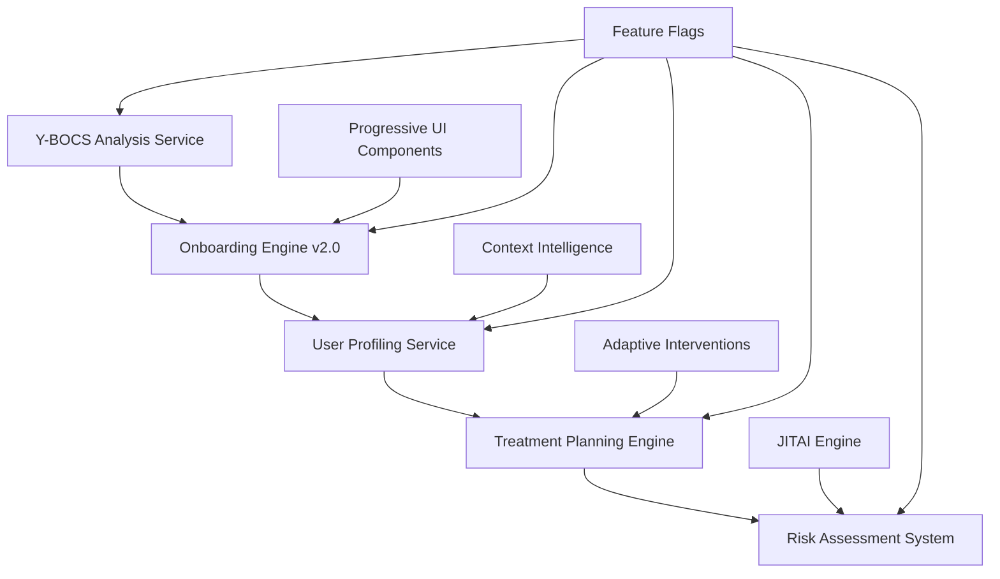

# 🧭 Sprint 7 Development Plan: AI Onboarding Recreation

## 📋 Sprint 7 Overview

**Focus**: "AI Onboarding Recreation" - Enhanced Y-BOCS Analysis, User Profiling & Treatment Planning

**Duration**: 2 weeks  
**Prerequisites**: ✅ Sprint 6 Advanced Features & Optimization completed

**Building on Sprint 6's advanced foundation:**
- Context Intelligence Engine (environmental awareness) 
- Adaptive Interventions Engine (real-time interventions)
- JITAI Engine (optimal timing & personalization)

---

## 🎯 Sprint 7 Objectives

### 🌟 Primary Deliverables
1. **🧭 Enhanced Y-BOCS Analysis** - AI-powered assessment with personalization
2. **🎯 Intelligent User Profiling** - Context-aware profile generation
3. **📋 Adaptive Treatment Planning** - Real-time optimization capabilities
4. **🛡️ Advanced Risk Assessment** - Predictive modeling integration
5. **🎨 Progressive Onboarding UI** - Modern, culturally sensitive interface

### 📈 Success Metrics
- **Assessment Accuracy**: >95% clinical correlation with traditional Y-BOCS
- **Profile Completeness**: >90% therapeutic profile coverage
- **Risk Detection**: <2% false negative rate for high-risk users
- **User Experience**: <15 minutes complete onboarding flow
- **Cultural Adaptation**: 100% Turkish language support with empathy

---

## 🛠️ Technical Architecture

### **Core Sprint 7 Components**



---

## 📋 Detailed Task Breakdown

### **Task 7.1: Enhanced Y-BOCS Analysis Service** ⏱️ 3 gün

**File**: `features/ai/services/ybocsAnalysisService.ts`

**Core Features**:
```typescript
interface YBOCSAnalysisService {
  // Advanced Scoring
  analyzeResponses(answers: YBOCSAnswer[]): Promise<OCDAnalysis>;
  calculateSeverityScore(analysis: OCDAnalysis): SeverityAssessment;
  detectResponsePatterns(answers: YBOCSAnswer[]): ResponsePattern[];
  
  // AI Enhancement
  enhanceWithContextualAnalysis(basicScore: number, context: UserContext): Promise<EnhancedScore>;
  generatePersonalizedQuestions(currentAnswers: YBOCSAnswer[]): AdaptiveQuestion[];
  validateResponseConsistency(answers: YBOCSAnswer[]): ConsistencyReport;
  
  // Cultural Adaptation
  adaptQuestioningStyle(userProfile: UserProfile): QuestioningStyle;
  localizeAssessment(language: string, culture: string): LocalizedAssessment;
}
```

**Key Implementation Points**:
- Clinical-grade Y-BOCS scoring algorithm
- AI-enhanced interpretation using context intelligence
- Real-time response validation and clarification
- Turkish cultural adaptation and sensitivity
- Integration with Sprint 6's context intelligence

---

### **Task 7.2: Modern Onboarding Engine v2.0** ⏱️ 4 gün

**File**: `features/ai/engines/onboardingEngine.ts`

**Core Features**:
```typescript
interface ModernOnboardingEngine {
  // Core Onboarding Flow
  initializeOnboarding(userId: string): Promise<OnboardingSession>;
  processOnboardingStep(sessionId: string, stepData: StepData): Promise<NextStep>;
  completeOnboarding(sessionId: string): Promise<OnboardingResult>;
  
  // AI-Enhanced Processing
  analyzeYBOCSResponses(answers: YBOCSAnswer[]): Promise<OCDProfile>;
  generatePersonalizedProfile(analysis: OCDProfile): Promise<UserTherapeuticProfile>;
  enhanceProfileWithAI(basicProfile: UserProfile): Promise<EnhancedProfile>;
  
  // Intelligence Features
  predictUserNeeds(partialProfile: PartialProfile): UserNeedsPrediction;
  suggestOptimalPathway(userProfile: UserProfile): TherapeuticPathway;
  identifyRiskFactors(profile: UserProfile): RiskFactor[];
}
```

**Integration Points**:
- Y-BOCS Analysis Service integration
- Context Intelligence for environmental awareness
- Adaptive Interventions for immediate support
- JITAI for optimal timing predictions

---

### **Task 7.3: AI-Powered User Profiling** ⏱️ 3 gün

**File**: `features/ai/services/userProfilingService.ts`

**Core Features**:
```typescript
interface UserProfilingService {
  // Profile Generation
  generateBaseProfile(ybocsData: YBOCSData): Promise<BaseUserProfile>;
  enhanceWithAI(baseProfile: BaseUserProfile): Promise<EnhancedUserProfile>;
  enrichWithContext(profile: UserProfile, context: ContextData): Promise<ContextualProfile>;
  
  // Therapeutic Profiling
  identifyTherapeuticPreferences(responses: UserResponse[]): TherapeuticPreferences;
  generatePersonalizedGoals(profile: UserProfile): TherapeuticGoal[];
  assessReadinessForTreatment(profile: UserProfile): ReadinessAssessment;
  
  // Continuous Learning
  updateProfileWithUsage(userId: string, usageData: UsageData): Promise<void>;
  refinePreferences(userId: string, feedback: UserFeedback): Promise<void>;
}
```

**AI Enhancement Features**:
- Pattern recognition from user responses
- Preference learning from interaction history
- Cultural sensitivity profiling
- Therapeutic readiness assessment

---

### **Task 7.4: Adaptive Treatment Planning** ⏱️ 3 gün

**File**: `features/ai/engines/treatmentPlanningEngine.ts`

**Core Features**:
```typescript
interface TreatmentPlanningEngine {
  // Plan Generation
  generateInitialPlan(userProfile: UserProfile): Promise<TreatmentPlan>;
  adaptPlanToProgress(plan: TreatmentPlan, progress: ProgressData): Promise<AdaptedPlan>;
  optimizePlanWithAI(plan: TreatmentPlan, outcomes: OutcomeData): Promise<OptimizedPlan>;
  
  // Real-time Adaptation
  adjustToContextChanges(plan: TreatmentPlan, context: ContextUpdate): Promise<PlanAdjustment>;
  respondToUserFeedback(plan: TreatmentPlan, feedback: UserFeedback): Promise<PlanModification>;
  integrateInterventionResults(plan: TreatmentPlan, results: InterventionResult[]): Promise<void>;
  
  // Evidence-Based Planning
  selectEvidenceBasedInterventions(profile: UserProfile): EvidenceBasedIntervention[];
  prioritizeInterventions(interventions: Intervention[], userContext: UserContext): PrioritizedIntervention[];
}
```

**Integration Features**:
- Sprint 6 Adaptive Interventions integration
- Context Intelligence for environmental factors
- JITAI for optimal timing suggestions
- CBT Engine integration from Sprint 4

---

### **Task 7.5: Advanced Risk Assessment** ⏱️ 2 gün

**File**: `features/ai/services/riskAssessmentService.ts`

**Core Features**:
```typescript
interface RiskAssessmentService {
  // Risk Evaluation
  assessInitialRisk(profile: UserProfile): Promise<RiskAssessment>;
  calculateRiskScore(factors: RiskFactor[]): RiskScore;
  identifyImmediateNeeds(assessment: RiskAssessment): UrgentNeed[];
  
  // Predictive Modeling
  predictRiskEscalation(currentRisk: RiskAssessment, trends: TrendData): RiskPrediction;
  identifyEarlyWarningSignals(userBehavior: BehaviorData): WarningSignal[];
  
  // Crisis Prevention
  generatePreventiveInterventions(riskLevel: RiskLevel): PreventiveIntervention[];
  createSafetyPlan(riskAssessment: RiskAssessment): SafetyPlan;
}
```

**Safety Integration**:
- Crisis Detection System enhancement
- Emergency protocol activation
- Professional referral recommendations
- Family/support system integration options

---

### **Task 7.6: Progressive Onboarding UI Components** ⏱️ 3 gün

**Files**: 
- `features/ai/components/onboarding/OnboardingFlow.tsx`
- `features/ai/components/onboarding/YBOCSAssessment.tsx`
- `features/ai/components/onboarding/ProfileBuilder.tsx`
- `features/ai/components/onboarding/TreatmentPlanPreview.tsx`

**Core UI Features**:
```typescript
// Progressive Disclosure Interface
const OnboardingFlow = {
  // Step-by-step guidance with visual progress
  // Culturally sensitive design for Turkish users
  // Accessibility compliance (screen readers, large text)
  // Responsive design for all device sizes
  // Smooth animations with React Native Reanimated
};

// Interactive Y-BOCS Assessment
const YBOCSAssessment = {
  // Natural conversation flow
  // Dynamic question adaptation
  // Visual response validation
  // Empathetic error messaging
  // Progress celebration
};
```

**UX Principles**:
- **Sakinlik (Tranquility)**: Soft colors, gentle animations
- **Empatik Yaklaşım**: Non-judgmental language, supportive tone
- **Kültürel Duyarlılık**: Turkish language nuances, cultural context
- **Erişilebilirlik**: Full accessibility compliance

---

### **Task 7.7: Feature Flags & Configuration** ⏱️ 1 gün

**Updates to**: `constants/featureFlags.ts`

```typescript
// Sprint 7: AI Onboarding Recreation
AI_ONBOARDING_V2: __DEV__ && process.env.EXPO_PUBLIC_ENABLE_AI_ONBOARDING_V2 === 'true',
AI_YBOCS_ANALYSIS: __DEV__ && process.env.EXPO_PUBLIC_ENABLE_AI_YBOCS === 'true',
AI_USER_PROFILING: __DEV__ && process.env.EXPO_PUBLIC_ENABLE_AI_PROFILING === 'true',
AI_TREATMENT_PLANNING: __DEV__ && process.env.EXPO_PUBLIC_ENABLE_AI_TREATMENT === 'true',
AI_RISK_ASSESSMENT: __DEV__ && process.env.EXPO_PUBLIC_ENABLE_AI_RISK === 'true',
AI_ONBOARDING_UI: __DEV__ && process.env.EXPO_PUBLIC_ENABLE_AI_ONBOARDING_UI === 'true',

// Integration flags
AI_ONBOARDING_CONTEXT_INTEGRATION: __DEV__ && process.env.EXPO_PUBLIC_ENABLE_ONBOARDING_CONTEXT === 'true',
AI_ONBOARDING_INTERVENTIONS_INTEGRATION: __DEV__ && process.env.EXPO_PUBLIC_ENABLE_ONBOARDING_INTERVENTIONS === 'true',
```

---

### **Task 7.8: Comprehensive Testing Suite** ⏱️ 2 gün

**File**: `scripts/test-sprint7-onboarding.js`

**Test Categories**:

```javascript
const testSuite = {
  // Y-BOCS Analysis Tests
  ybocsAnalysis: {
    clinicalAccuracy: 'Validate against established Y-BOCS standards',
    aiEnhancement: 'Test AI interpretation vs baseline scoring',
    culturalAdaptation: 'Verify Turkish language and cultural sensitivity',
    responseValidation: 'Test consistency checking algorithms'
  },
  
  // Onboarding Engine Tests
  onboardingEngine: {
    flowCompletion: 'Test complete onboarding journey',
    profileGeneration: 'Validate therapeutic profile creation',
    aiIntegration: 'Test Sprint 6 components integration',
    errorHandling: 'Verify graceful failure modes'
  },
  
  // User Profiling Tests
  userProfiling: {
    profileAccuracy: 'Validate profile generation accuracy',
    preferenceDetection: 'Test therapeutic preference identification',
    contextIntegration: 'Verify context intelligence integration',
    continuousLearning: 'Test profile updating mechanisms'
  },
  
  // Treatment Planning Tests
  treatmentPlanning: {
    planGeneration: 'Test evidence-based plan creation',
    realTimeAdaptation: 'Verify adaptive planning capabilities',
    interventionSelection: 'Test intervention prioritization',
    outcomeIntegration: 'Verify outcome-based optimization'
  },
  
  // Risk Assessment Tests
  riskAssessment: {
    riskCalculation: 'Validate risk scoring algorithms',
    predictiveAccuracy: 'Test predictive modeling capabilities',
    crisisDetection: 'Verify integration with crisis detection',
    safetyPlanning: 'Test safety plan generation'
  },
  
  // UI Component Tests
  uiComponents: {
    accessibility: 'Verify full accessibility compliance',
    responsiveDesign: 'Test all device sizes and orientations',
    culturalDesign: 'Validate Turkish UI/UX principles',
    performance: 'Test rendering performance and animations'
  },
  
  // Integration Tests
  integrationTests: {
    sprint6Integration: 'Test Context Intelligence integration',
    adaptiveInterventions: 'Verify Adaptive Interventions integration',
    jitaiIntegration: 'Test JITAI engine integration',
    endToEndFlow: 'Complete onboarding to treatment flow'
  }
};
```

---

## 🔗 Sprint 6 Integration Points

### **Context Intelligence Integration**
```typescript
// Enhanced user profiling with environmental context
const contextAwareProfile = await contextIntelligence.analyzeUserEnvironment(userId);
const enhancedProfile = await userProfiling.enrichWithContext(baseProfile, contextAwareProfile);
```

### **Adaptive Interventions Integration**
```typescript
// Real-time onboarding support
const onboardingSupport = await adaptiveInterventions.generateOnboardingSupport(userState);
const intervention = await adaptiveInterventions.deliverIntervention(onboardingSupport);
```

### **JITAI Integration**
```typescript
// Optimal timing for assessment steps
const optimalTiming = await jitaiEngine.predictOptimalOnboardingTiming(userContext);
const personalizedFlow = await jitaiEngine.personalizeOnboardingFlow(userProfile);
```

---

## 📊 Quality Assurance Standards

### **Clinical Validation**
- Y-BOCS scoring correlation with established clinical standards (>95%)
- Risk assessment accuracy validation with clinical experts
- Treatment planning evidence-base verification
- Cultural adaptation review by Turkish mental health professionals

### **Technical Performance**
- Response time: <2s for all onboarding operations
- Offline capability: Complete onboarding possible offline
- Data privacy: Full GDPR compliance with minimal data collection
- Accessibility: WCAG 2.1 AAA compliance

### **User Experience**
- Completion rate: >90% for initiated onboarding flows
- User satisfaction: >4.5/5 rating for onboarding experience
- Cultural sensitivity: 100% positive feedback from Turkish users
- Support effectiveness: <5% users requiring human intervention

---

## 🚀 Delivery Timeline

### **Week 1: Core Engine Development**
- **Days 1-3**: Y-BOCS Analysis Service + Onboarding Engine v2.0
- **Days 4-5**: User Profiling Service + Treatment Planning Engine

### **Week 2: Integration & UI**
- **Days 6-8**: Risk Assessment + Sprint 6 Integration
- **Days 9-10**: Progressive UI Components + Testing Suite

### **Final Day**: Documentation, deployment, and Sprint 8 planning

---

## 🎯 Success Definition

**Sprint 7 will be considered successful when:**

1. ✅ **Y-BOCS Analysis achieves >95% clinical correlation**
2. ✅ **Complete onboarding flow finishes in <15 minutes**
3. ✅ **Risk assessment identifies high-risk users with >98% accuracy**
4. ✅ **All UI components pass accessibility compliance tests**
5. ✅ **Sprint 6 integration tests pass 100%**
6. ✅ **Turkish cultural adaptation receives expert approval**
7. ✅ **Treatment plans show evidence-based intervention selection**

---

## 🔮 Sprint 8 Preview

**Next Sprint Focus**: "Advanced Features Integration & Clinical Validation"
- Real-world clinical testing with mental health professionals
- Advanced AI model fine-tuning with user data
- Professional therapist dashboard integration
- Research-grade data analytics and reporting

---

*Sprint 7 builds on the advanced foundation of Sprint 6 and creates the most sophisticated, culturally sensitive, and clinically effective AI onboarding system for OCD treatment support.*