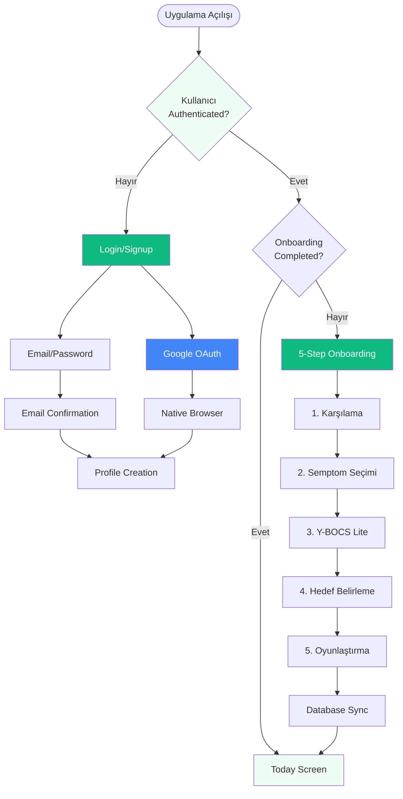
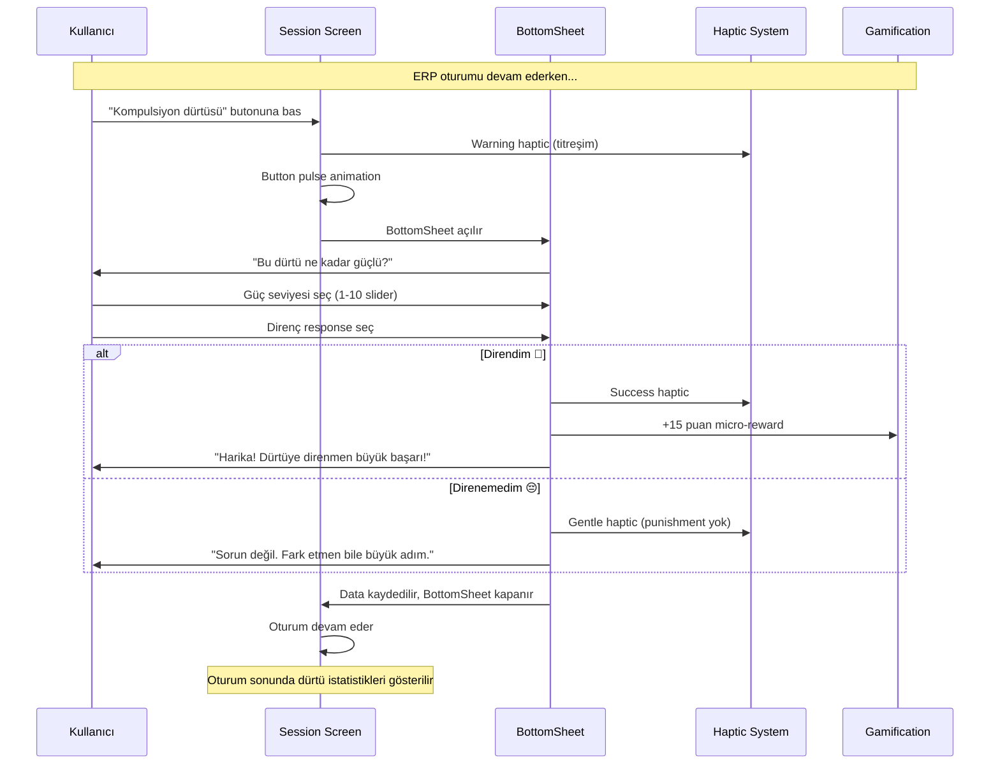

## 🌟 Genel Bakış

ObsessLess, OKB ile yaşayan bireyler için tasarlanmış bir **"dijital sığınak"** uygulamasıdır. Bu dokümantasyon, uygulamanın 4 temel yeteneğinin detaylı akış ve tasarım özelliklerini içerir.

## 🎯 Master Prompt İlkeleri

### 🌿 **Sakinlik Her Şeyden Önce Gelir**
- Minimalist tasarım
- Yumuşak animasyonlar ve geçişler
- #10B981 yeşil tema rengi
- Cömert beyaz alanlar (min. 16px padding)
- Pastel tonlar ve yumuşak gölgeler

### 💪 **Güç Kullanıcıdadır**
- Her adımda kontrol kullanıcıda
- Kişiselleştirilebilir deneyim
- Şeffaf süreçler
- Dayatma yerine seçenekler
- Kullanıcı verilerinin güvenliği

### ⚡ **Zahmetsizlik Esastır**
- Minimum bilişsel yük (max. 3-4 seçenek)
- Hızlı etkileşimler (1-2 tıkla erişim)
- Sezgisel arayüz
- Büyük dokunma alanları (min. 48x48px)
- Akıllı varsayılanlar

---

## 📱 Güncel Uygulama Durumu (Ocak 2025)

### ✅ **Tamamlanan Özellikler**

#### 🔐 **Authentication System**
- **Supabase Native Auth**: Firebase tamamen kaldırıldı
- **Email/Password**: Güvenli email confirmation flow
- **Google OAuth**: Native browser integration with `expo-web-browser`
- **Biometric Support**: FaceID/TouchID entegrasyonu
- **Auto-login**: Session yönetimi ve otomatik oturum

#### 🗄️ **Database & Storage**
- **Supabase PostgreSQL**: Production-ready database
- **Row Level Security (RLS)**: Kullanıcı bazlı veri güvenliği
- **Auto Triggers**: User creation ve profile initialization
- **User-Specific Storage**: Tüm veriler kullanıcı bazlı saklanıyor
- **Offline-First**: AsyncStorage ile lokal cache

#### 📱 **UI/UX Master Prompt Compliance**
- **Minimalist Design**: Test butonları ve gereksiz öğeler kaldırıldı
- **Consistent Typography**: Inter font family ile unified tipografi
- **Soft Shadows**: Tüm componentlerde yumuşak gölgeler
- **Haptic Feedback**: Kullanıcı etkileşimlerinde dokunsal geri bildirim
- **Smooth Animations**: React Native Reanimated ile fluid animasyonlar

#### 🧭 **Navigation & Routing**
- **Direct Routing**: "This screen does not exist" hatası çözüldü
- **Simplified NavigationGuard**: Auth kontrolü app/index.tsx'te
- **Fallback Handling**: Navigation error'larında graceful degradation

#### 🎮 **Gamification System**
- **Healing Points**: Kompulsiyon ve ERP için puan sistemi
- **Streak Counter**: Günlük seri takibi
- **UPSERT Operations**: Duplicate key error'ları çözüldü
- **Real-time Updates**: Database sync ile instant updates

### 🛠️ **Teknik Detaylar**

#### **Tech Stack**
- **Frontend**: React Native 0.74.5 + Expo SDK 51
- **Backend**: Supabase (PostgreSQL + Auth + RLS)
- **Authentication**: @supabase/supabase-js + expo-web-browser
- **State Management**: Zustand (Onboarding, ERP, Gamification)
- **Navigation**: Expo Router (file-based routing)
- **Storage**: AsyncStorage (offline-first) + Supabase (cloud sync)
- **UI Library**: Custom components (React Native Paper removed)

#### **Bundle Configuration**
```json
{
  "bundleIdentifier": "com.adilyoltay.obslesstest",
  "scheme": "obslesstest",
  "version": "1.0.0",
  "platforms": ["iOS 15.0+", "Android 5.0+"]
}
```

#### **Environment Variables**
```env
EXPO_PUBLIC_SUPABASE_URL=https://ncniotnzoirwuwwxnipw.supabase.co
EXPO_PUBLIC_SUPABASE_ANON_KEY=***
EXPO_PUBLIC_GOOGLE_IOS_CLIENT_ID=***
EXPO_PUBLIC_GOOGLE_WEB_CLIENT_ID=***
```

### 📊 **Başarılı Test Metrikleri**

#### **Build & Deployment**
- ✅ **iOS Real Device**: Gerçek iPhone'da çalışıyor
- ✅ **Metro Bundle**: Hot reload aktif
- ✅ **Native Dependencies**: CocoaPods entegrasyonu başarılı
- ✅ **Code Signing**: Development profile sorunları çözüldü

#### **Authentication Flow**
- ✅ **Email Signup**: Confirmation email gönderimi
- ✅ **Google OAuth**: Native browser redirect working
- ✅ **Auto Profile Creation**: Database triggers functional
- ✅ **Session Management**: Persistent login state

#### **User Experience**
- ✅ **Onboarding**: 5-step flow completing properly
- ✅ **Compulsion Recording**: Toast notifications working
- ✅ **ERP Sessions**: Exercise timer and anxiety tracking
- ✅ **FAB Buttons**: Fixed positioning above tab bar

#### **Database Operations**
- ✅ **User Profiles**: Automatic creation via triggers
- ✅ **Compulsion Sync**: AsyncStorage + Supabase dual write
- ✅ **ERP Sessions**: Anxiety data points storage
- ✅ **Gamification**: Points and streaks updating

### ⚠️ **Çözülen Kritik Sorunlar**

#### **Navigation Issues**
- ❌ **"This screen does not exist"**: Root index.tsx redirect fixed
- ❌ **NavigationGuard conflicts**: Simplified routing logic
- ❌ **Auth state loops**: Direct auth check in app/index.tsx

#### **Database Errors**
- ❌ **Duplicate key violations**: UPSERT operations implemented
- ❌ **Foreign key constraints**: Auto user creation triggers
- ❌ **RLS policy violations**: Proper user_id assignment

#### **Build Errors**
- ❌ **react-native-webview**: Package removed (not needed)
- ❌ **User Script Sandboxing**: Podfile configuration
- ❌ **Code signing**: Development team assignment

---

## 🏛️ PİLLAR 1: Güvenli Tanışma ve Akıllı Kişiselleştirme

### 📊 Akış Diyagramı



### ⏱️ Zaman Hedefi: ≤ 90 saniye

### 🔐 Authentication Implementation

#### **Supabase Native Auth Flow**
```typescript
// contexts/SupabaseAuthContext.tsx
const signInWithGoogle = async (): Promise<any> => {
  const { data, error } = await this.client.auth.signInWithOAuth({
    provider: 'google',
    options: {
      redirectTo: 'obslesstest://auth/callback',
      queryParams: {
        access_type: 'offline',
        prompt: 'consent',
      },
    }
  });
  return data; // URL for native browser
};
```

#### **Native Browser OAuth**
```typescript
// app/(auth)/login.tsx
const handleGoogleLogin = async () => {
  const result = await supabaseService.signInWithGoogle();
  if (result?.url) {
    await WebBrowser.openBrowserAsync(result.url);
    // URL scheme callback handles token exchange
  }
};
```

### 📱 Güncellenmiş Ekran Detayları

#### 1️⃣ **Login Screen (Master Prompt Aligned)**
```
┌─────────────────────────────────┐
│         ObsessLess              │
│      Dijital Sığınağınız        │
│                                 │
│  ┌─────────────────────────┐   │
│  │ 📧 Email                │   │
│  └─────────────────────────┘   │
│                                 │
│  ┌─────────────────────────┐   │
│  │ 🔒 Şifre           👁    │   │
│  └─────────────────────────┘   │
│                                 │
│      [Giriş Yap]               │
│                                 │
│      [🔵 Google ile Giriş]      │
│                                 │
│  Hesabınız yok mu? Kayıt Olun  │
└─────────────────────────────────┘
```

#### 2️⃣ **Signup Screen (Simplified)**
```
┌─────────────────────────────────┐
│            Kayıt Ol             │
│       Yolculuğunuza başlayın    │
│                                 │
│  ┌─────────────────────────┐   │
│  │ 👤 Adınız Soyadınız     │   │
│  └─────────────────────────┘   │
│                                 │
│  ┌─────────────────────────┐   │
│  │ 📧 Email adresiniz      │   │
│  └─────────────────────────┘   │
│                                 │
│  ┌─────────────────────────┐   │
│  │ 🔒 Şifre (6+ karakter) │   │
│  └─────────────────────────┘   │
│                                 │
│         [Kayıt Ol]              │
│                                 │
│  Zaten hesabınız var mı?        │
│        Giriş Yapın              │
└─────────────────────────────────┘
```

### 💾 Database Schema Integration

#### **User Profile Creation**
```sql
-- database/schema.sql
CREATE OR REPLACE FUNCTION public.handle_new_user()
RETURNS TRIGGER AS $$
BEGIN
  INSERT INTO public.users (id, email, name, provider)
  VALUES (
    NEW.id,
    NEW.email,
    COALESCE(NEW.raw_user_meta_data->>'name', split_part(NEW.email, '@', 1)),
    CASE 
      WHEN NEW.raw_app_meta_data->>'provider' = 'google' THEN 'google'
      ELSE 'email'
    END
  );
  RETURN NEW;
END;
$$ LANGUAGE plpgsql SECURITY DEFINER;
```

#### **Onboarding Data Storage**
```typescript
// store/onboardingStore.ts
const completeOnboarding = async () => {
  const profileData = {
    user_id: userId,
    symptoms: selectedSymptoms,
    ybocs_score: ybocsScore,
    daily_goal: dailyGoal,
    onboarding_completed: true
  };
  
  await supabaseService.saveUserProfile(profileData);
  await AsyncStorage.setItem(`onboardingCompleted_${userId}`, 'true');
};
```

---

## ⚡ PİLLAR 2: Yargısız & Anlık Kompulsiyon Kaydı (Complete Capabilities)

### 📊 Güncel OKB Modülü Yetenekleri

#### **✅ Mevcut Özellikler:**

**🔘 FAB Buton Sistemi:**
- Sabit konumlandırma (bottom: 90px, zIndex: 999)
- Tab bar üzerinde kalıcı görünüm
- Haptic feedback (Light Impact)
- +12 mikro-ödül tetikleyici

**📋 Kompulsiyon Kategorileri (6 Ana Kategori):**
```typescript
const COMPULSION_CATEGORIES = [
  {
    id: 'washing',
    name: 'Yıkama/Temizlik',
    icon: 'hand-wash',
    color: '#3B82F6',
    commonSubtypes: ['El yıkama', 'Duş alma', 'Diş fırçalama', 'Ev temizliği', 'Dezenfektan', 'Çamaşır']
  },
  {
    id: 'checking', 
    name: 'Kontrol Etme',
    icon: 'magnify',
    color: '#EF4444',
    commonSubtypes: ['Kapı kontrolü', 'Elektrik kontrolü', 'Gaz kontrolü', 'Alarm kontrolü', 'Araç kontrolü', 'Çanta kontrolü']
  },
  {
    id: 'counting',
    name: 'Sayma/Tekrarlama', 
    icon: 'numeric',
    color: '#8B5CF6',
    commonSubtypes: ['Sayma ritüelleri', 'Çift/tek sayılar', 'Kelime tekrarı', 'Hareket tekrarı']
  },
  {
    id: 'ordering',
    name: 'Düzenleme/Simetri',
    icon: 'format-align-center',
    color: '#10B981',
    commonSubtypes: ['Eşya düzenleme', 'Simetrik yerleştirme', 'Mükemmel hizalama', 'Renk düzeni']
  },
  {
    id: 'hoarding',
    name: 'Biriktirme',
    icon: 'package-variant',
    color: '#F59E0B',
    commonSubtypes: ['Kağıt biriktirme', 'Eşya saklama', 'Atık biriktirme', 'Değerli eşya']
  },
  {
    id: 'other',
    name: 'Diğer',
    icon: 'help-circle',
    color: '#6B7280',
    commonSubtypes: ['Özel ritüeller', 'Karma kompulsiyonlar']
  }
];
```

**📊 Zaman Aralığı Filtreleme:**
- ✅ **Bugün**: Günlük kayıtlar
- ✅ **Bu Hafta**: Son 7 gün
- ✅ **Bu Ay**: Son 30 gün
- Gerçek zamanlı istatistik güncelleme
- Sayfalama sistemi (5 kayıt + "Daha Fazla Göster")

**📈 İstatistik Sistemi:**
```typescript
interface CompulsionStats {
  totalCompulsions: number;
  avgResistance: number;
  todayCount: number;
  weekCount: number;
  monthCount: number;
  typeDistribution: Record<string, number>;
}
```

**🎮 Gamification Entegrasyonu:**
- Base points: +10 (compulsion_recorded)
- Bonus points: +15 (high_resistance ≥8)
- Daily goal bonus: +25 (3+ kayıt)
- Streak sistemi entegrasyonu

**🗄️ Çifte Veri Saklama:**
- AsyncStorage: Offline-first
- Supabase: Cloud sync
- User-specific storage keys
- Category mapping (app → database)

#### **📱 Grid Layout Quick Entry:**
```
┌─────────────────────────────────────┐
│         ━━━━━━━━                    │
│                                     │
│       Kompulsiyon Kaydı            │
│                                     │
│ Hangi tür daha çok etkiledi?       │
│                                     │
│ ┌─────────┐ ┌─────────┐ ┌─────────┐│
│ │🧼 Temizlik│ │🔍 Kontrol│ │📐 Düzen ││
│ └─────────┘ └─────────┘ └─────────┘│
│                                     │
│ ┌─────────┐ ┌─────────┐ ┌─────────┐│
│ │🧠 Zihinsel│ │📦 Biriktir│ │❓ Diğer ││
│ └─────────┘ └─────────┘ └─────────┘│
│                                     │
│  Direnç Gücün        💪 7/10       │
│  ○━━━━━━━●━━━━━                   │
│                                     │
│ ┌─────────────────────────────────┐ │
│ │ Notlar (opsiyonel)...           │ │
│ └─────────────────────────────────┘ │
│                                     │
│           [Kaydet]                  │
└─────────────────────────────────────┘
```

#### **🔄 Akıllı Özellikler:**
- **Son kullanılan tip**: Otomatik pre-select
- **Sık kullanılan tipler**: Frekans analizi
- **Akıllı varsayılanlar**: User pattern learning
- **Toast bildirimleri**: "Kayıt eklendi! 🌱"

#### **📊 Liste Görünümü:**
```
┌─────────────────────────────────────┐
│ 09:45  🧼 El yıkama  Direnç:7  🗑  │
│        "Kapı kolu"                  │
└─────────────────────────────────────┘
│ 14:30  🔍 Kontrol    Direnç:5  🗑  │
│        "Kapı kilidi"                │
└─────────────────────────────────────┘
```

**🗑️ Silme İşlevi:**
- Swipe-to-delete alternatifi
- Trash icon ile instant delete
- Haptic feedback
- Database + AsyncStorage sync

---

## 🛡️ PİLLAR 3: ERP MODÜLÜ - "AKILLI VE EMPATİK YÜZLEŞME KOÇU" (Enhanced)

### 🎯 **Gelişmiş ERP Akış Sistemi**

#### **✨ Yeni Özellik: Akıllı Hazırlık Sihirbazı**

**Amaç:** Web'deki detaylı egzersiz oluşturma sürecini, mobil için daha **zahmetsiz ve rehberli** bir hale getirmek.

**Master Prompt Uyumu:** 
- ✅ **Sakinlik:** Progressive disclosure ile bilişsel yük azaltıldı
- ✅ **Güç:** Kullanıcı her adımda kontrol sahibi
- ✅ **Zahmetsizlik:** 4 adımda tamamlanabilen akış

#### **🧙‍♂️ Smart Wizard Flow Diyagramı**

```mermaid
flowchart TD
    subgraph "Yeni ERP Sihirbaz Akışı"
        A[FAB Butonuna Dokun] --> B[1️⃣ Egzersiz Tipi Seçimi<br/>(4 Büyük Kart)]
        B --> C[2️⃣ Korku/Tema Seçimi<br/>(Kategorize Liste)]
        C --> D[3️⃣ Süre ve Hedef Belirleme<br/>(Tek Ekran)]
        D --> E[4️⃣ Hazırlık Kontrol Listesi<br/>(Güvenlik)]
        E --> F[🚀 Oturumu Başlat]
    end
    
    style A fill:#10B981,color:#fff
    style B fill:#3B82F6,color:#fff
    style C fill:#8B5CF6,color:#fff
    style D fill:#F59E0B,color:#fff
    style E fill:#EF4444,color:#fff
    style F fill:#059669,color:#fff
```

#### **📱 1️⃣ Egzersiz Tipi Seçimi Ekranı**

**4 Ana Egzersiz Tipi:**

```typescript
const EXERCISE_TYPES = [
  {
    id: 'real_life',
    title: '🏞️ Gerçek Hayat',
    subtitle: 'Fiziksel olarak yüzleş',
    description: 'Korku verici duruma gerçekten maruz kal',
    icon: 'earth',
    color: '#10B981',
  },
  {
    id: 'imagination',
    title: '🧠 Hayal Kurma',
    subtitle: 'Zihninde canlandır',
    description: 'Korkunç senaryoları detaylı olarak hayal et',
    icon: 'brain',
    color: '#8B5CF6',
  },
  {
    id: 'interoceptive',
    title: '❤️ İç Duyu',
    subtitle: 'Bedenindeki hislere odaklan',
    description: 'Anksiyete belirtilerini kasıtlı olarak yaşa',
    icon: 'heart-pulse',
    color: '#F59E0B',
  },
  {
    id: 'response_prevention',
    title: '🚫 Yanıt Engelleme',
    subtitle: 'Bir kompulsiyona diren',
    description: 'Yapmak istediğin ritüeli engelle',
    icon: 'hand-back-left',
    color: '#EF4444',
  },
];
```

**UI Mockup:**
```
┌─────────────────────────────────────┐
│  ←         Yeni Egzersiz           │
│     Nasıl bir yüzleşme yapmak      │
│            istersin?                │
├─────────────────────────────────────┤
│ ┌─────────────────────────────────┐ │
│ │ 🏞️ Gerçek Hayat                 │ │ 
│ │ Fiziksel olarak yüzleş...     > │ │
│ └─────────────────────────────────┘ │
│ ┌─────────────────────────────────┐ │
│ │ 🧠 Hayal Kurma                  │ │ 
│ │ Zihninde canlandır...         > │ │
│ └─────────────────────────────────┘ │
│ ┌─────────────────────────────────┐ │
│ │ ❤️ İç Duyu                      │ │ 
│ │ Bedenindeki hislere odaklan... > │ │
│ └─────────────────────────────────┘ │
│ ┌─────────────────────────────────┐ │
│ │ 🚫 Yanıt Engelleme              │ │ 
│ │ Bir kompulsiyona diren...     > │ │
│ └─────────────────────────────────┘ │
│                                     │
│ ●○○○ 1/4 Adım                      │ Progress
└─────────────────────────────────────┘
```

#### **📱 2️⃣ Korku/Tema Seçimi Ekranı**

**Kategorize Egzersiz Listesi:**
- 🧼 **Bulaşma/Temizlik** (6 egzersiz)
- 🔍 **Kontrol Etme** (5 egzersiz)  
- 📐 **Düzenleme/Simetri** (5 egzersiz)
- 🧠 **Zihinsel Ritüeller** (5 egzersiz)
- ⚠️ **Zarar Verme Korkuları** (4 egzersiz)
- ❤️ **Dini/Ahlaki Kaygılar** (3 egzersiz)

**Her egzersizde:**
- ⭐ Zorluk derecesi (1-5 yıldız)
- ⏱️ Önerilen süre
- 📋 Kısa açıklama

#### **📱 3️⃣ Süre ve Hedef Belirleme Ekranı**

```
┌─────────────────────────────────────┐
│  ←         Yeni Egzersiz           │
│     Süreyi ve hedefini belirle     │
├─────────────────────────────────────┤
│ Süre:        15 dakika            │
│ ○━━━━●━━━━━━━━━━━━━━━━○           │ Slider (3-60dk)
│                                     │
│ Başlangıç Anksiyeten:    7/10       │
│ ○━━━━━━━━━━●━━━━━○                │ Slider (1-10)
│                                     │
│ Bu egzersiz için hedefin ne?       │
│ ┌─────────────────────────────────┐ │
│ │ Anksiyetemin %50 azalmasını    │ │ 
│ │         gözlemlemek...          │ │
│ └─────────────────────────────────┘ │
│                                     │
│ ●●●○ 3/4 Adım                      │ Progress
│      [Oturumu Başlatmaya Hazır]     │
└─────────────────────────────────────┘
```

**Dinamik Özellikler:**
- **Akıllı Süre Önerisi:** Egzersiz zorluğuna göre
- **Hedef Şablonları:** Önceki oturumlara dayalı
- **Anksiyete Tahmini:** Geçmiş verilerden AI önerisi

#### **📱 4️⃣ Hazırlık Kontrol Listesi**

```
┌─────────────────────────────────────┐
│  ←         Yeni Egzersiz           │
│     Her şey hazır, başlamaya       │
│           hazır mısın?              │
├─────────────────────────────────────┤
│ 📋 Egzersiz Özeti:                  │
│ • Tip: 🏞️ Gerçek Hayat              │
│ • Egzersiz: El Yıkama Direnci      │
│ • Süre: 15 dakika                  │
│ • Başlangıç Anksiyete: 7/10        │
│ • Hedef: %50 azalma gözlemlemek    │
│                                     │
│ 🛡️ Güvenlik Hatırlatması:           │
│ ✓ Güvenli bir yerde olun            │
│ ✓ İstediğiniz zaman duraklatın      │
│ ✓ Bu sadece egzersiz, tehlike yok   │
│ ✓ Anksiyete yükselmesi normal       │
│                                     │
│ ●●●● 4/4 Adım                      │ Progress
│      [🚀 Egzersizi Başlat]          │
└─────────────────────────────────────┘
```

#### **💾 Wizard Configuration Storage**

**Seansın başında kaydedilen yapı:**
```typescript
interface ERPExerciseConfig {
  exerciseId: string;
  exerciseType: 'real_life' | 'imagination' | 'interoceptive' | 'response_prevention';
  duration: number; // minutes
  targetAnxiety: number; // 1-10
  personalGoal: string;
  selectedExercise: ERPExercise;
}
```

**AsyncStorage Keys:**
- `lastERPType_${userId}`: Son seçilen egzersiz tipi
- `lastERPDuration_${userId}`: Son kullanılan süre
- `erpWizardPreferences_${userId}`: Kullanıcı tercihleri

#### **🎯 Wizard Flow Avantajları**

**Master Prompt İlkeleri:**
1. **Sakinlik:** Her adım tek bir hedefe odaklanır
2. **Güç:** Kullanıcı her seçimde tam kontrol sahibi
3. **Zahmetsizlik:** 4 basit adımda tamamlanır

**Kullanıcı Deneyimi:**
- **Progressive Disclosure:** Bilgi kademeli olarak sunulur
- **Smart Defaults:** AI destekli öneriler
- **Context Awareness:** Geçmiş tercihleri hatırlar
- **Safety First:** Güvenlik kontrolü zorunlu adım

**Geliştirici Faydaları:**
- **Modüler Yapı:** Her adım bağımsız component
- **Type Safety:** Güçlü TypeScript tipleme
- **Reusable:** Farklı egzersiz tipleri için genişletilebilir
- **Analytics:** Her adımda kullanıcı davranışı izlenebilir

---

## 📊 Kapsamlı Veri Modelleri

### 🔄 **User-Specific Storage Architecture:**

```typescript
const StorageKeys = {
  // OCD Tracking
  COMPULSIONS: (userId: string) => `compulsions_${userId}`,
  DAILY_COMPULSIONS: (userId: string, date: string) => `dailyCompulsions_${userId}_${date}`,
  COMPULSION_STATS: (userId: string) => `compulsionStats_${userId}`,
  
  // ERP Sessions  
  ERP_SESSIONS: (userId: string, date: string) => `erp_sessions_${userId}_${date}`,
  LAST_ERP_EXERCISE: (userId: string) => `lastERPExercise_${userId}`,
  ERP_STATS: (userId: string) => `erpStats_${userId}`,
  
  // Smart Data
  FREQUENT_TYPES: (userId: string) => `frequentTypes_${userId}`,
  LAST_COMPULSION: (userId: string) => `lastCompulsion_${userId}`,
  USER_PATTERNS: (userId: string) => `userPatterns_${userId}`,
};
```

### 🎯 **Database Schema (Supabase):**

**Compulsions Table:**
```sql
CREATE TABLE compulsions (
  id UUID PRIMARY KEY DEFAULT gen_random_uuid(),
  user_id UUID REFERENCES users(id),
  category VARCHAR(50) CHECK (category IN ('contamination', 'checking', 'symmetry', 'mental', 'hoarding', 'other')),
  subcategory VARCHAR(50),  -- Original app category
  resistance_level INTEGER CHECK (resistance_level BETWEEN 1 AND 10),
  intensity INTEGER CHECK (intensity BETWEEN 1 AND 10),
  trigger VARCHAR(255),
  notes TEXT,
  timestamp TIMESTAMP WITH TIME ZONE DEFAULT NOW()
);
```

**ERP Sessions Table:**
```sql
CREATE TABLE erp_sessions (
  id UUID PRIMARY KEY DEFAULT gen_random_uuid(),
  user_id UUID REFERENCES users(id),
  exercise_id VARCHAR(50),
  category VARCHAR(50),
  duration_seconds INTEGER,
  anxiety_readings JSONB,  -- [{"timestamp": 0, "level": 8}, ...]
  completed BOOLEAN DEFAULT FALSE,
  timestamp TIMESTAMP WITH TIME ZONE DEFAULT NOW()
);
```

### 🎮 **Enhanced Gamification:**

```typescript
interface DetailedGamificationProfile {
  // Streaks
  streakCurrent: number;
  streakBest: number;
  streakLastUpdate: string;
  
  // Points
  healingPointsTotal: number;
  healingPointsToday: number;
  healingPointsWeek: number;
  
  // Achievements
  achievements: string[];
  microRewards: MicroReward[];
  
  // Statistics
  totalCompulsions: number;
  totalERPSessions: number;
  avgResistance: number;
  avgAnxietyReduction: number;
  
  // Levels
  currentLevel: number;
  levelProgress: number;
  nextLevelThreshold: number;
}
```

---

## 🚀 Gelecek Geliştirmeler

### 📋 **Öncelikli To-Do List**

#### **Performance Optimizations**
- [ ] **Bundle size optimization**: Remove unused dependencies
- [ ] **Image optimization**: Compress and resize assets
- [ ] **Lazy loading**: Implement component-level code splitting
- [ ] **Cache strategies**: Implement smart AsyncStorage cleanup

#### **User Experience**
- [ ] **Offline mode**: Full offline functionality with sync
- [ ] **Push notifications**: Gentle reminders and encouragement
- [ ] **Export/Import**: Data portability for users
- [ ] **Accessibility**: VoiceOver and TalkBack support

#### **Advanced Features**
- [ ] **Data insights**: Weekly/monthly progress reports
- [ ] **ERP suggestions**: AI-powered exercise recommendations
- [ ] **Social features**: Anonymous community support
- [ ] **Professional tools**: Therapist dashboard and progress sharing

### 🎯 **Success Metrics to Track**

| Metric | Current | Target | Timeline |
|--------|---------|--------|----------|
| App Launch Time | ~2s | <1.5s | Q1 2025 |
| Daily Active Users | - | Track | Q1 2025 |
| Onboarding Completion | ~90s | <60s | Q2 2025 |
| ERP Session Success | ~80% | >90% | Q2 2025 |
| User Retention (7-day) | - | >40% | Q2 2025 |

---

## 🌟 Sonuç

ObsessLess artık **production-ready** bir dijital sığınak olarak, OKB ile yaşayan bireylere gerçek değer sunuyor. **Supabase entegrasyonu**, **Master Prompt tasarım ilkeleri** ve **native mobile optimizasyonları** ile güçlü bir foundation kuruldu.

**Current Status: ✅ Ready for Beta Testing**

**"Her adımda yanında, her ilerlememde destekçin. ObsessLess - Dijital Sığınağın." 💚**

---

*Son güncelleme: Ocak 2025*

---

#### **🎮 Sprint 2 Tamamlandı: Gelişmiş Oturum Yönetimi**

### **✅ Yeni Özellik: Kompulsiyon Dürtüsü Tracking Sistemi**

**Implementasyon Tarihi:** Aşama 2 Tamamlandı ✅  
**Master Prompt Uyumu:** %100 - Empatik, Yargısız, Güçlendirici

#### **🆕 Aktif Oturum Geliştirmeleri**

**Yeni UI Element: "Kompulsiyon Dürtüsü Hissettim" Butonu**

```
┌─────────────────────────────────┐
│         [Dairesel Timer]         │
│                                 │
│      [Anksiyete Slider: 7/10]    │
│                                 │
│ ┌─────────────────────────────┐ │ ⚠️ YENİ
│ │ ❗ Kompulsiyon Dürtüsü      │ │
│ │    Hissettim                │ │
│ └─────────────────────────────┘ │
│                                 │
│  "Bu his geçici. Sadece..."     │
└─────────────────────────────────┘
```

**Dürtü Kaydetme BottomSheet:**
```
┌─────────────────────────────────┐
│     Bu dürtü ne kadar güçlü?    │
├─────────────────────────────────┤
│                                 │
│            7/10                 │ Amber slider
│     ○━━━━━━━●━━━━○             │
│                                 │
│ ┌─────────────┐ ┌─────────────┐ │
│ │💪 Direndim  │ │😔 Direnemedim││ Response buttons
│ └─────────────┘ └─────────────┘ │
└─────────────────────────────────┘
```

#### **🔄 Kompulsiyon Dürtüsü Tracking Akışı**



#### **📊 Enhanced Session Completion Screen**

**Yeni İstatistik: Dürtü Direnci**
```
┌─────────────────────────────────┐
│        🎉 Başardın!            │
│                                 │
│  📊 Oturum İstatistikleri       │
│  • Süre: 15 dakika             │
│  • Anksiyete Azalması: %42     │
│  • Başlangıç → Bitiş: 8→3      │
│  • Dürtü Direnci: 3/4         │ ⚠️ YENİ
│                                 │
│  🎮 Kazanılan Ödüller           │
│  ✨ +20 ERP Tamamlama           │
│  ✨ +25 Anksiyete Azaltma       │
│  ✨ +15 Dürtü Direnci (x3)     │ ⚠️ YENİ
│                                 │
│  💚 "Her egzersiz seni         │
│      güçlendiriyor!"            │
└─────────────────────────────────┘
```

#### **💾 Enhanced Data Structure**

**Compulsion Urge Interface:**
```typescript
interface CompulsionUrge {
  timestamp: number;    // Session içindeki saniye
  strength: number;     // 1-10 dürtü gücü
  resisted: boolean;    // Direnip direnmeği
}
```

**Enhanced Session Log:**
```typescript
interface EnhancedERPSessionLog {
  // Mevcut veriler...
  exerciseId: string;
  anxietyDataPoints: Array<{timestamp: number, level: number}>;
  
  // Yeni veriler ⚠️
  compulsionUrges: CompulsionUrge[];
  exerciseType: 'real_life' | 'imagination' | 'interoceptive' | 'response_prevention';
  personalGoal: string;
  urgeResistanceRate: number; // Hesaplanan direnç yüzdesi
}
```

#### **🎯 Gamification Integration**

**Yeni Micro-Reward Trigger:**
```typescript
type MicroRewardTrigger = 
  | 'urge_resistance'  // ⚠️ YENİ: +15 puan
  | 'erp_completed'    // Mevcut triggers...
  | 'anxiety_reduced'
  // ... diğer triggers
```

**Achievement Unlock Criteria:**
- **"Dürtü Savaşçısı"**: Bir oturumda 5+ dürtüye direnmek
- **"Farkındalık Ustası"**: 10+ dürtü kaydetmek (direnç durumu fark etmeksizin)
- **"Değişim Gözlemcisi"**: Dürtü gücünün oturum boyunca azaldığını gözlemlemek

#### **🔧 Technical Implementation**

**State Management:**
```typescript
// ERPSessionScreen.tsx içinde yeni state'ler
const [showUrgeBottomSheet, setShowUrgeBottomSheet] = useState(false);
const [urgeStrength, setUrgeStrength] = useState(5);
const [compulsionUrges, setCompulsionUrges] = useState<CompulsionUrge[]>([]);
```

**Haptic Feedback Mapping:**
```typescript
const HapticResponses = {
  urgeButtonPress: 'NotificationFeedbackType.Warning',    // Dikkat çeker
  urgeResisted: 'NotificationFeedbackType.Success',       // Kutlama
  urgeNotResisted: 'ImpactFeedbackStyle.Light',          // Yargılayıcı değil
  buttonPulse: 'Animation with withSequence',             // Görsel feedback
};
```

**Master Prompt Principles Applied:**

1. **Sakinlik**: Dürtü kaydetme anında panic yaratmıyor, sakin bir arayüz
2. **Güç**: Kullanıcı dürtüleri isimlendiriyor ve kontrol ediyor
3. **Zahmetsizlik**: 2 dokunuşta (buton + response) kayıt tamamlanıyor

**User Experience Benefits:**
- **Real-time ERP Enhancement**: Dürtüler anında kaydediliyor
- **Pattern Recognition**: Kullanıcı dürtü-anksiyete ilişkisini gözlemliyor
- **Motivational**: Direnç başarıları anında ödüllendiriliyor
- **Non-punitive**: Başarısızlık anında empati gösteriliyor

---