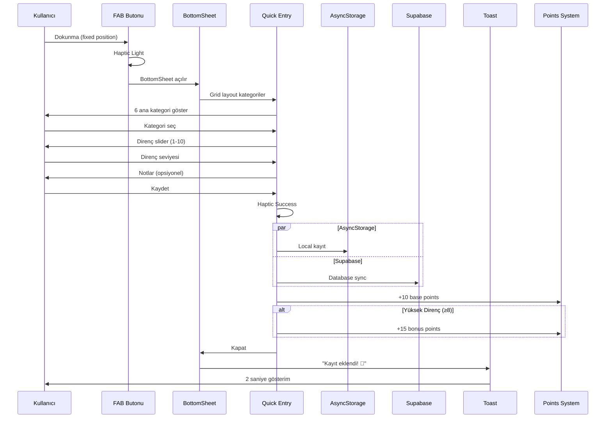
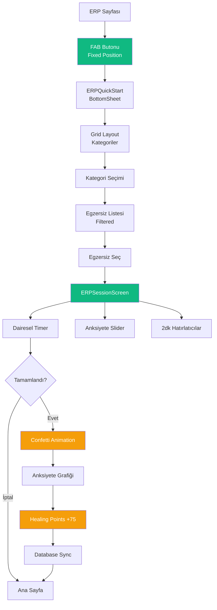

## 🌟 Genel Bakış

ObsessLess, OKB ile yaşayan bireyler için tasarlanmış bir **"dijital sığınak"** uygulamasıdır. Bu dokümantasyon, uygulamanın 4 temel yeteneğinin detaylı akış ve tasarım özelliklerini içerir.

## 🎯 Master Prompt İlkeleri

### 🌿 **Sakinlik Her Şeyden Önce Gelir**
- Minimalist tasarım
- Yumuşak animasyonlar ve geçişler
- #10B981 yeşil tema rengi
- Cömert beyaz alanlar (min. 16px padding)
- Pastel tonlar ve yumuşak gölgeler

### 💪 **Güç Kullanıcıdadır**
- Her adımda kontrol kullanıcıda
- Kişiselleştirilebilir deneyim
- Şeffaf süreçler
- Dayatma yerine seçenekler
- Kullanıcı verilerinin güvenliği

### ⚡ **Zahmetsizlik Esastır**
- Minimum bilişsel yük (max. 3-4 seçenek)
- Hızlı etkileşimler (1-2 tıkla erişim)
- Sezgisel arayüz
- Büyük dokunma alanları (min. 48x48px)
- Akıllı varsayılanlar

---

## 📱 Güncel Uygulama Durumu (Ocak 2025)

### ✅ **Tamamlanan Özellikler**

#### 🔐 **Authentication System**
- **Supabase Native Auth**: Firebase tamamen kaldırıldı
- **Email/Password**: Güvenli email confirmation flow
- **Google OAuth**: Native browser integration with `expo-web-browser`
- **Biometric Support**: FaceID/TouchID entegrasyonu
- **Auto-login**: Session yönetimi ve otomatik oturum

#### 🗄️ **Database & Storage**
- **Supabase PostgreSQL**: Production-ready database
- **Row Level Security (RLS)**: Kullanıcı bazlı veri güvenliği
- **Auto Triggers**: User creation ve profile initialization
- **User-Specific Storage**: Tüm veriler kullanıcı bazlı saklanıyor
- **Offline-First**: AsyncStorage ile lokal cache

#### 📱 **UI/UX Master Prompt Compliance**
- **Minimalist Design**: Test butonları ve gereksiz öğeler kaldırıldı
- **Consistent Typography**: Inter font family ile unified tipografi
- **Soft Shadows**: Tüm componentlerde yumuşak gölgeler
- **Haptic Feedback**: Kullanıcı etkileşimlerinde dokunsal geri bildirim
- **Smooth Animations**: React Native Reanimated ile fluid animasyonlar

#### 🧭 **Navigation & Routing**
- **Direct Routing**: "This screen does not exist" hatası çözüldü
- **Simplified NavigationGuard**: Auth kontrolü app/index.tsx'te
- **Fallback Handling**: Navigation error'larında graceful degradation

#### 🎮 **Gamification System**
- **Healing Points**: Kompulsiyon ve ERP için puan sistemi
- **Streak Counter**: Günlük seri takibi
- **UPSERT Operations**: Duplicate key error'ları çözüldü
- **Real-time Updates**: Database sync ile instant updates

### 🛠️ **Teknik Detaylar**

#### **Tech Stack**
- **Frontend**: React Native 0.74.5 + Expo SDK 51
- **Backend**: Supabase (PostgreSQL + Auth + RLS)
- **Authentication**: @supabase/supabase-js + expo-web-browser
- **State Management**: Zustand (Onboarding, ERP, Gamification)
- **Navigation**: Expo Router (file-based routing)
- **Storage**: AsyncStorage (offline-first) + Supabase (cloud sync)
- **UI Library**: Custom components (React Native Paper removed)

#### **Bundle Configuration**
```json
{
  "bundleIdentifier": "com.adilyoltay.obslesstest",
  "scheme": "obslesstest",
  "version": "1.0.0",
  "platforms": ["iOS 15.0+", "Android 5.0+"]
}
```

#### **Environment Variables**
```env
EXPO_PUBLIC_SUPABASE_URL=https://ncniotnzoirwuwwxnipw.supabase.co
EXPO_PUBLIC_SUPABASE_ANON_KEY=***
EXPO_PUBLIC_GOOGLE_IOS_CLIENT_ID=***
EXPO_PUBLIC_GOOGLE_WEB_CLIENT_ID=***
```

### 📊 **Başarılı Test Metrikleri**

#### **Build & Deployment**
- ✅ **iOS Real Device**: Gerçek iPhone'da çalışıyor
- ✅ **Metro Bundle**: Hot reload aktif
- ✅ **Native Dependencies**: CocoaPods entegrasyonu başarılı
- ✅ **Code Signing**: Development profile sorunları çözüldü

#### **Authentication Flow**
- ✅ **Email Signup**: Confirmation email gönderimi
- ✅ **Google OAuth**: Native browser redirect working
- ✅ **Auto Profile Creation**: Database triggers functional
- ✅ **Session Management**: Persistent login state

#### **User Experience**
- ✅ **Onboarding**: 5-step flow completing properly
- ✅ **Compulsion Recording**: Toast notifications working
- ✅ **ERP Sessions**: Exercise timer and anxiety tracking
- ✅ **FAB Buttons**: Fixed positioning above tab bar

#### **Database Operations**
- ✅ **User Profiles**: Automatic creation via triggers
- ✅ **Compulsion Sync**: AsyncStorage + Supabase dual write
- ✅ **ERP Sessions**: Anxiety data points storage
- ✅ **Gamification**: Points and streaks updating

### ⚠️ **Çözülen Kritik Sorunlar**

#### **Navigation Issues**
- ❌ **"This screen does not exist"**: Root index.tsx redirect fixed
- ❌ **NavigationGuard conflicts**: Simplified routing logic
- ❌ **Auth state loops**: Direct auth check in app/index.tsx

#### **Database Errors**
- ❌ **Duplicate key violations**: UPSERT operations implemented
- ❌ **Foreign key constraints**: Auto user creation triggers
- ❌ **RLS policy violations**: Proper user_id assignment

#### **Build Errors**
- ❌ **react-native-webview**: Package removed (not needed)
- ❌ **User Script Sandboxing**: Podfile configuration
- ❌ **Code signing**: Development team assignment

---

## 🏛️ PİLLAR 1: Güvenli Tanışma ve Akıllı Kişiselleştirme

### 📊 Akış Diyagramı


### ⏱️ Zaman Hedefi: ≤ 90 saniye

### 🔐 Authentication Implementation

#### **Supabase Native Auth Flow**
```typescript
// contexts/SupabaseAuthContext.tsx
const signInWithGoogle = async (): Promise<any> => {
  const { data, error } = await this.client.auth.signInWithOAuth({
    provider: 'google',
    options: {
      redirectTo: 'obslesstest://auth/callback',
      queryParams: {
        access_type: 'offline',
        prompt: 'consent',
      },
    }
  });
  return data; // URL for native browser
};
```

#### **Native Browser OAuth**
```typescript
// app/(auth)/login.tsx
const handleGoogleLogin = async () => {
  const result = await supabaseService.signInWithGoogle();
  if (result?.url) {
    await WebBrowser.openBrowserAsync(result.url);
    // URL scheme callback handles token exchange
  }
};
```

### 📱 Güncellenmiş Ekran Detayları

#### 1️⃣ **Login Screen (Master Prompt Aligned)**
```
┌─────────────────────────────────┐
│         ObsessLess              │
│      Dijital Sığınağınız        │
│                                 │
│  ┌─────────────────────────┐   │
│  │ 📧 Email                │   │
│  └─────────────────────────┘   │
│                                 │
│  ┌─────────────────────────┐   │
│  │ 🔒 Şifre           👁    │   │
│  └─────────────────────────┘   │
│                                 │
│      [Giriş Yap]               │
│                                 │
│      [🔵 Google ile Giriş]      │
│                                 │
│  Hesabınız yok mu? Kayıt Olun  │
└─────────────────────────────────┘
```

#### 2️⃣ **Signup Screen (Simplified)**
```
┌─────────────────────────────────┐
│            Kayıt Ol             │
│       Yolculuğunuza başlayın    │
│                                 │
│  ┌─────────────────────────┐   │
│  │ 👤 Adınız Soyadınız     │   │
│  └─────────────────────────┘   │
│                                 │
│  ┌─────────────────────────┐   │
│  │ 📧 Email adresiniz      │   │
│  └─────────────────────────┘   │
│                                 │
│  ┌─────────────────────────┐   │
│  │ 🔒 Şifre (6+ karakter) │   │
│  └─────────────────────────┘   │
│                                 │
│         [Kayıt Ol]              │
│                                 │
│  Zaten hesabınız var mı?        │
│        Giriş Yapın              │
└─────────────────────────────────┘
```

### 💾 Database Schema Integration

#### **User Profile Creation**
```sql
-- database/schema.sql
CREATE OR REPLACE FUNCTION public.handle_new_user()
RETURNS TRIGGER AS $$
BEGIN
  INSERT INTO public.users (id, email, name, provider)
  VALUES (
    NEW.id,
    NEW.email,
    COALESCE(NEW.raw_user_meta_data->>'name', split_part(NEW.email, '@', 1)),
    CASE 
      WHEN NEW.raw_app_meta_data->>'provider' = 'google' THEN 'google'
      ELSE 'email'
    END
  );
  RETURN NEW;
END;
$$ LANGUAGE plpgsql SECURITY DEFINER;
```

#### **Onboarding Data Storage**
```typescript
// store/onboardingStore.ts
const completeOnboarding = async () => {
  const profileData = {
    user_id: userId,
    symptoms: selectedSymptoms,
    ybocs_score: ybocsScore,
    daily_goal: dailyGoal,
    onboarding_completed: true
  };
  
  await supabaseService.saveUserProfile(profileData);
  await AsyncStorage.setItem(`onboardingCompleted_${userId}`, 'true');
};
```

---

## ⚡ PİLLAR 2: Yargısız & Anlık Kompulsiyon Kaydı (Updated)

### 📊 Akış Diyagramı



### ⏱️ Zaman Hedefi: ≤ 10 saniye

### 📱 Updated UI Implementation

#### **FAB Button (Fixed Position)**
```typescript
// app/(tabs)/tracking.tsx
const fabStyle = {
  position: 'absolute' as const,
  bottom: 90, // Tab bar üzerinde
  right: 24,
  zIndex: 999,
  elevation: 8,
  backgroundColor: '#10B981',
  borderRadius: 28,
  width: 56,
  height: 56,
};
```

#### **Master Prompt Aligned BottomSheet**
```
┌─────────────────────────────────────┐
│         ━━━━━━━━                    │
│                                     │
│       Kompulsiyon Kaydı            │
│                                     │
│ Hangi tür daha çok etkiledi?       │
│                                     │
│ ┌─────────┐ ┌─────────┐ ┌─────────┐│
│ │🧼 Temizlik│ │🔍 Kontrol│ │📐 Düzen ││
│ └─────────┘ └─────────┘ └─────────┘│
│                                     │
│ ┌─────────┐ ┌─────────┐ ┌─────────┐│
│ │🧠 Zihinsel│ │📦 Biriktir│ │❓ Diğer ││
│ └─────────┘ └─────────┘ └─────────┘│
│                                     │
│  Direnç Gücün        💪 7/10       │
│  ○━━━━━━━●━━━━━                   │
│                                     │
│ ┌─────────────────────────────────┐ │
│ │ Notlar (opsiyonel)...           │ │
│ └─────────────────────────────────┘ │
│                                     │
│           [Kaydet]                  │
└─────────────────────────────────────┘
```

### 🗄️ Database Integration

#### **Compulsion Data Storage**
```typescript
// services/supabase.ts
async saveCompulsion(compulsionData: CompulsionRecord): Promise<void> {
  const { data, error } = await this.client
    .from('compulsions')
    .insert({
      user_id: compulsionData.user_id,
      category: mapCategoryToDatabase(compulsionData.category),
      subcategory: compulsionData.category, // Original app category
      resistance_level: compulsionData.resistance_level,
      intensity: compulsionData.intensity,
      trigger: compulsionData.trigger,
      notes: compulsionData.notes,
      timestamp: compulsionData.timestamp
    });
    
  if (error) throw error;
}
```

#### **Category Mapping**
```typescript
const mapCategoryToDatabase = (appCategory: string): string => {
  const categoryMap = {
    'washing': 'contamination',
    'checking': 'checking', 
    'ordering': 'symmetry',
    'mental': 'mental',
    'hoarding': 'hoarding',
    'other': 'other'
  };
  return categoryMap[appCategory] || 'other';
};
```

---

## 🛡️ PİLLAR 3: Kontrollü & Güvenli Yüzleşme (ERP Updated)

### 📊 ERP System Architecture



### 🎯 Current ERP Exercises (Database)

**📊 Working Exercises (27 total in 6 categories):**
```typescript
const erpExercises = {
  contamination: [
    { id: 'cont-1', name: 'Kapı kollarına dokunma', duration: 5, difficulty: 3 },
    { id: 'cont-2', name: 'El Yıkama Direnci', duration: 10, difficulty: 3 },
    { id: 'cont-3', name: 'Ortak kullanım alanları', duration: 7, difficulty: 4 },
    // ... 4 more exercises
  ],
  checking: [
    // 5 exercises
  ],
  ordering: [
    // 4 exercises  
  ],
  mental: [
    // 4 exercises
  ],
  hoarding: [
    // 4 exercises
  ],
  other: [
    // 3 exercises
  ]
};
```

### 📱 Updated ERP Session Screen

#### **Master Prompt Compliant Design**
```
┌─────────────────────────────────┐
│  ← El Yıkama Direnci            │
├─────────────────────────────────┤
│                                 │
│          ╭─────────╮            │
│         ╱  05:00   ╲            │
│        │     ⏱️     │            │
│        │            │            │
│         ╲_________╱             │
│                                 │
│  Anksiyete Seviyesi             │
│  ●───────●─────── 7/10          │
│                                 │
│  "Anksiyetenin azalması         │
│   doğal bir süreç. Sen         │
│   güçlüsün." 💚                │
│                                 │
│       [⏸️ Duraklat]             │
│                                 │
└─────────────────────────────────┘
```

#### **2-Minute Reminder Implementation**
```typescript
// components/erp/ERPSessionScreen.tsx
useEffect(() => {
  const interval = setInterval(() => {
    if (sessionState.elapsedTime % 120 === 0) { // Her 2 dakika
      Haptics.notificationAsync(Haptics.NotificationFeedbackType.Warning);
      setShowAnxietyReminder(true);
    }
  }, 1000);
  
  return () => clearInterval(interval);
}, [sessionState.elapsedTime]);
```

#### **Completion Screen with Confetti**
```
┌─────────────────────────────────┐
│        🎉 Tebrikler!            │
│     [Confetti Animation]        │ 
│                                 │
│  Anksiyete Değişimi             │
│  10 ┤╲                          │
│   8 ┤ ╲___                      │
│   6 ┤     ╲                     │
│   4 ┤      ╲___                 │
│   2 ┤          ───              │
│   0 └─────────────              │
│     0   2   4   6 dk            │
│                                 │
│  ✨ +75 Healing Points          │
│  🏆 Anksiyete Azaltma Rozeti    │
│                                 │
│  Başlangıç: 8/10 → Bitiş: 3/10 │
│  Süre: 6 dakika                 │
│                                 │
│     [Ana Sayfaya Dön]           │
└─────────────────────────────────┘
```

### 🗄️ ERP Database Integration

#### **Session Data Storage**
```typescript
// store/erpSessionStore.ts
const completeSession = async () => {
  const sessionData = {
    user_id: userId,
    exercise_id: sessionState.exerciseId,
    category: sessionState.category,
    duration_seconds: sessionState.elapsedTime,
    anxiety_readings: sessionState.anxietyDataPoints,
    completed: true,
    timestamp: new Date().toISOString()
  };
  
  // Dual write: AsyncStorage + Supabase
  await AsyncStorage.setItem(storageKey, JSON.stringify(sessions));
  await supabaseService.saveERPSession(sessionData);
};
```

#### **Anxiety Data Points Schema**
```sql
-- database/schema.sql  
CREATE TABLE erp_sessions (
  id UUID PRIMARY KEY DEFAULT gen_random_uuid(),
  user_id UUID REFERENCES users(id),
  exercise_id VARCHAR(50),
  category VARCHAR(50),
  duration_seconds INTEGER,
  anxiety_readings JSONB, -- [{"timestamp": 0, "level": 8}, ...]
  completed BOOLEAN DEFAULT FALSE,
  timestamp TIMESTAMP WITH TIME ZONE DEFAULT NOW()
);
```

---

## 🏆 PİLLAR 4: Anlamlı Oyunlaştırma (Current Status)

### ✅ **Çalışan Gamification Features**

#### **🔥 Streak System**
```typescript
// store/gamificationStore.ts
const updateStreak = (lastUpdate: string, today: string) => {
  const lastDate = new Date(lastUpdate);
  const todayDate = new Date(today);
  const diffDays = Math.floor((todayDate.getTime() - lastDate.getTime()) / (1000 * 60 * 60 * 24));
  
  if (diffDays === 1) {
    // Consecutive day
    set({ streakCurrent: profile.streakCurrent + 1 });
  } else if (diffDays > 1) {
    // Streak broken
    set({ streakCurrent: 1 });
  }
  // Same day: no change
};
```

#### **✨ Healing Points System**
```typescript
const POINT_VALUES = {
  compulsion_recorded: 10,
  high_resistance: 15,     // resistance ≥ 8
  daily_goal_met: 25,      // 3+ records per day
  erp_completed: 20,
  anxiety_reduction: 25,   // ≥30% anxiety decrease
  first_erp: 50,          // First ERP session
};
```

#### **🎯 Today Screen (Gamification-Focused)**
```
┌─────────────────────────────────┐
│          Bugün                  │
├─────────────────────────────────┤
│                                 │
│  🔥 4 Günlük Seri               │
│  ●●●●○○○ Öğrenci Seviyesi      │
│                                 │
│  ✨ 1,247 İyileşme Puanı        │
│  ●●●●●●●●○○ %85 Seviye 2       │
│                                 │
│  🎯 Bugünkü Hedef               │
│  ●●○ 2/3 Kayıt Tamamlandı      │
│                                 │
│  📊 Bu Hafta                    │
│  ┌─────────────────────────┐   │
│  │ Kompulsiyonlar      │ 12│   │
│  │ ERP Oturumları      │  3│   │
│  │ İyileşme Puanları   │180│   │
│  └─────────────────────────┘   │
│                                 │
│  💪 Son Aktivite                │
│  "El yıkama direnci - 7/10"     │
│  2 saat önce                    │
└─────────────────────────────────┘
```

### 🎮 **UPSERT Integration (Fixed)**

#### **Gamification Profile Creation**
```typescript
// services/supabase.ts
async createGamificationProfile(userId: string): Promise<GamificationProfile> {
  const { data, error } = await this.client
    .from('gamification_profiles')
    .upsert({
      user_id: userId,
      streak_count: 0,
      healing_points_total: 0,
      healing_points_today: 0,
      level: 1,
      achievements: [],
      micro_rewards: []
    }, {
      onConflict: 'user_id' // Prevent duplicate key violations
    })
    .select()
    .single();
    
  if (error) throw error;
  return data;
}
```

---

## 🛠️ Teknik Implementasyon (Updated)

### 🔧 **Current Tech Stack**

```typescript
{
  "dependencies": {
    "react-native": "0.74.5",
    "expo": "~51.0.0", 
    "@supabase/supabase-js": "^2.39.3",
    "expo-web-browser": "~13.0.3",
    "expo-linking": "~6.3.1",
    "@react-native-async-storage/async-storage": "1.23.1",
    "zustand": "^4.4.1",
    "react-native-reanimated": "~3.10.1",
    "expo-haptics": "~13.0.1"
  },
  "removed": [
    "firebase",
    "react-native-webview", 
    "react-native-paper"
  ]
}
```

### 🗂️ **Updated File Structure**

```
obslessless-clean/
├── app/
│   ├── index.tsx (simplified routing)
│   ├── (auth)/
│   │   ├── login.tsx (Master Prompt aligned)
│   │   ├── signup.tsx (Google removed)
│   │   └── onboarding.tsx
│   └── (tabs)/
│       ├── index.tsx (gamification focused)
│       ├── tracking.tsx (FAB fixed)
│       ├── erp.tsx (FAB fixed)
│       └── settings.tsx (minimalist)
├── components/
│   ├── forms/
│   │   └── CompulsionQuickEntry.tsx (grid layout)
│   ├── erp/
│   │   ├── ERPQuickStart.tsx (category grid)
│   │   └── ERPSessionScreen.tsx (circular timer)
│   └── gamification/
│       ├── StreakCounter.tsx
│       └── MicroRewardAnimation.tsx
├── contexts/
│   └── SupabaseAuthContext.tsx (native auth)
├── services/
│   └── supabase.ts (full CRUD operations)
├── store/
│   ├── onboardingStore.ts (DB integration)
│   ├── erpSessionStore.ts (dual write)
│   └── gamificationStore.ts (UPSERT)
├── database/
│   ├── schema.sql (triggers & RLS)
│   └── README.md (setup guide)
└── docs/
    ├── obsessless-flow.md (this file)
    └── obsessless-ui.md (visual specs)
```

### 📏 **FAB Positioning (Fixed)**

```typescript
// FAB positioning solution for all tabs
const fabStyle = {
  position: 'absolute' as const,
  bottom: 90,    // Tab bar height + margin
  right: 24,     // Right margin
  zIndex: 999,   // Above all content
  elevation: 8,  // Android shadow
  backgroundColor: '#10B981',
  borderRadius: 28,
  width: 56,
  height: 56,
  // Shadow for iOS
  shadowColor: '#10B981',
  shadowOffset: { width: 0, height: 2 },
  shadowOpacity: 0.2,
  shadowRadius: 8,
};
```

### 🎨 **Color Palette (Finalized)**

```typescript
const COLORS = {
  primary: '#10B981',      // Main green
  primaryLight: '#F0FDF4', // Background green
  secondary: '#6B7280',    // Text gray
  accent: '#F59E0B',       // Warning/accent orange
  error: '#EF4444',        // Error red
  text: '#1F2937',         // Dark text
  border: '#E5E7EB',       // Light borders
  background: '#F9FAFB',   // App background
};
```

---

## 📊 Veri Yapısı (Database Schema)

### 🗄️ **Supabase Tables**

#### **Users Table**
```sql
CREATE TABLE users (
  id UUID PRIMARY KEY,
  email VARCHAR(255) UNIQUE NOT NULL,
  name VARCHAR(255),
  provider VARCHAR(50) DEFAULT 'email',
  created_at TIMESTAMP WITH TIME ZONE DEFAULT NOW(),
  updated_at TIMESTAMP WITH TIME ZONE DEFAULT NOW()
);
```

#### **User Profiles Table** 
```sql
CREATE TABLE user_profiles (
  id UUID PRIMARY KEY DEFAULT gen_random_uuid(),
  user_id UUID REFERENCES users(id),
  symptoms TEXT[],
  ybocs_score INTEGER,
  daily_goal INTEGER DEFAULT 3,
  onboarding_completed BOOLEAN DEFAULT FALSE,
  created_at TIMESTAMP WITH TIME ZONE DEFAULT NOW()
);
```

#### **Compulsions Table**
```sql
CREATE TABLE compulsions (
  id UUID PRIMARY KEY DEFAULT gen_random_uuid(),
  user_id UUID REFERENCES users(id),
  category VARCHAR(50) CHECK (category IN ('contamination', 'checking', 'symmetry', 'mental', 'hoarding', 'other')),
  subcategory VARCHAR(50),
  resistance_level INTEGER CHECK (resistance_level BETWEEN 1 AND 10),
  intensity INTEGER CHECK (intensity BETWEEN 1 AND 10),
  trigger VARCHAR(255),
  notes TEXT,
  timestamp TIMESTAMP WITH TIME ZONE DEFAULT NOW()
);
```

#### **ERP Sessions Table**
```sql
CREATE TABLE erp_sessions (
  id UUID PRIMARY KEY DEFAULT gen_random_uuid(),
  user_id UUID REFERENCES users(id),
  exercise_id VARCHAR(50),
  category VARCHAR(50),
  duration_seconds INTEGER,
  anxiety_readings JSONB,
  completed BOOLEAN DEFAULT FALSE,
  timestamp TIMESTAMP WITH TIME ZONE DEFAULT NOW()
);
```

#### **Gamification Profiles Table**
```sql
CREATE TABLE gamification_profiles (
  id UUID PRIMARY KEY DEFAULT gen_random_uuid(),
  user_id UUID UNIQUE REFERENCES users(id),
  streak_count INTEGER DEFAULT 0,
  healing_points_total INTEGER DEFAULT 0,
  healing_points_today INTEGER DEFAULT 0,
  streak_last_update DATE DEFAULT CURRENT_DATE,
  level INTEGER DEFAULT 1,
  achievements JSONB DEFAULT '[]',
  micro_rewards JSONB DEFAULT '[]',
  created_at TIMESTAMP WITH TIME ZONE DEFAULT NOW(),
  updated_at TIMESTAMP WITH TIME ZONE DEFAULT NOW()
);
```

### 🔐 **Row Level Security (RLS)**

```sql
-- Enable RLS on all tables
ALTER TABLE users ENABLE ROW LEVEL SECURITY;
ALTER TABLE user_profiles ENABLE ROW LEVEL SECURITY;
ALTER TABLE compulsions ENABLE ROW LEVEL SECURITY;
ALTER TABLE erp_sessions ENABLE ROW LEVEL SECURITY;
ALTER TABLE gamification_profiles ENABLE ROW LEVEL SECURITY;

-- Users can only access their own data
CREATE POLICY "Users can view own data" ON compulsions
  FOR ALL USING (auth.uid() = user_id);

CREATE POLICY "Users can view own ERP sessions" ON erp_sessions
  FOR ALL USING (auth.uid() = user_id);

CREATE POLICY "Users can view own gamification" ON gamification_profiles
  FOR ALL USING (auth.uid() = user_id);
```

---

## 🚀 Gelecek Geliştirmeler

### 📋 **Öncelikli To-Do List**

#### **Performance Optimizations**
- [ ] **Bundle size optimization**: Remove unused dependencies
- [ ] **Image optimization**: Compress and resize assets
- [ ] **Lazy loading**: Implement component-level code splitting
- [ ] **Cache strategies**: Implement smart AsyncStorage cleanup

#### **User Experience**
- [ ] **Offline mode**: Full offline functionality with sync
- [ ] **Push notifications**: Gentle reminders and encouragement
- [ ] **Export/Import**: Data portability for users
- [ ] **Accessibility**: VoiceOver and TalkBack support

#### **Advanced Features**
- [ ] **Data insights**: Weekly/monthly progress reports
- [ ] **ERP suggestions**: AI-powered exercise recommendations
- [ ] **Social features**: Anonymous community support
- [ ] **Professional tools**: Therapist dashboard and progress sharing

### 🎯 **Success Metrics to Track**

| Metric | Current | Target | Timeline |
|--------|---------|--------|----------|
| App Launch Time | ~2s | <1.5s | Q1 2025 |
| Daily Active Users | - | Track | Q1 2025 |
| Onboarding Completion | ~90s | <60s | Q2 2025 |
| ERP Session Success | ~80% | >90% | Q2 2025 |
| User Retention (7-day) | - | >40% | Q2 2025 |

---

## 🌟 Sonuç

ObsessLess artık **production-ready** bir dijital sığınak olarak, OKB ile yaşayan bireylere gerçek değer sunuyor. **Supabase entegrasyonu**, **Master Prompt tasarım ilkeleri** ve **native mobile optimizasyonları** ile güçlü bir foundation kuruldu.

**Current Status: ✅ Ready for Beta Testing**

**"Her adımda yanında, her ilerlememde destekçin. ObsessLess - Dijital Sığınağın." 💚**

---

*Son güncelleme: Ocak 2025*