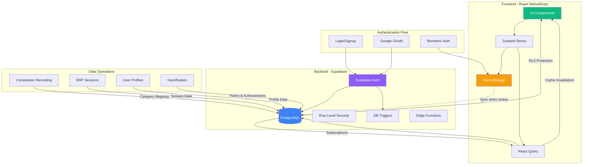
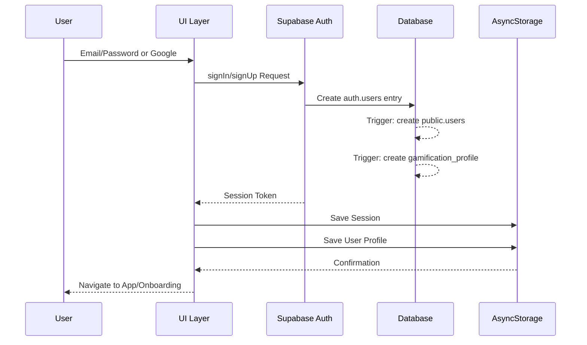
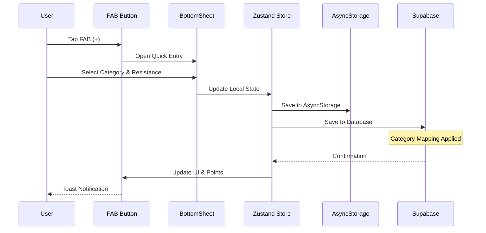
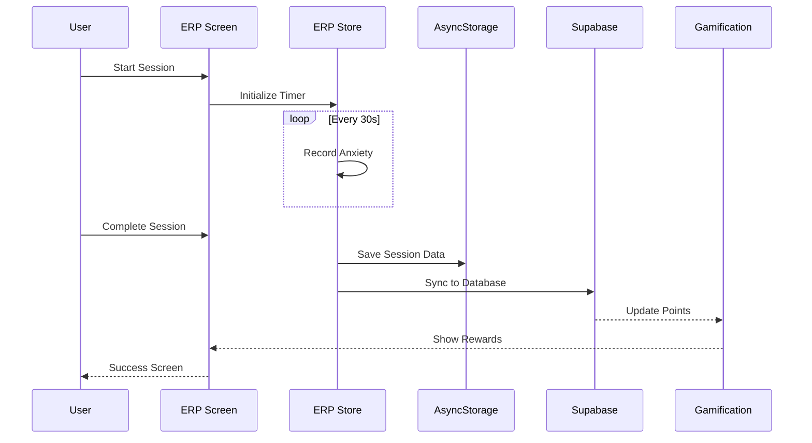
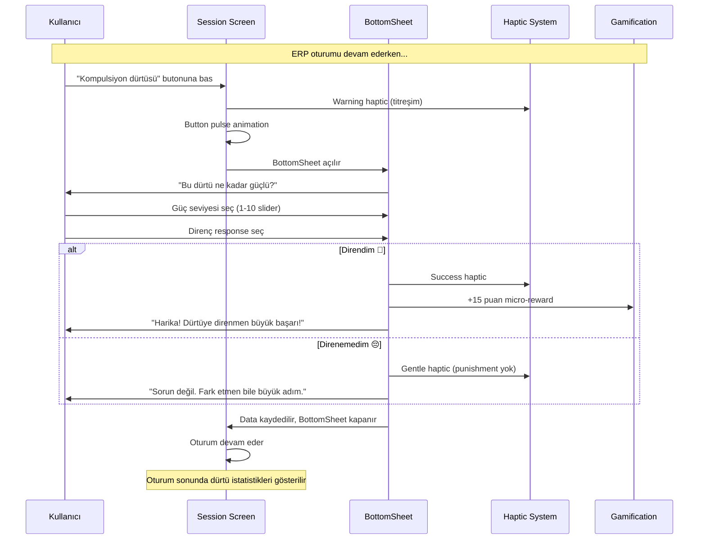

## 🌟 Genel Bakış

ObsessLess, OKB ile yaşayan bireyler için tasarlanmış bir **"dijital sığınak"** uygulamasıdır. Bu dokümantasyon, uygulamanın 4 temel yeteneğinin detaylı akış ve tasarım özelliklerini içerir.

## 🎯 Master Prompt İlkeleri

### 🌿 **Sakinlik Her Şeyden Önce Gelir**
- Minimalist tasarım
- Yumuşak animasyonlar ve geçişler
- #10B981 yeşil tema rengi
- Cömert beyaz alanlar (min. 16px padding)
- Pastel tonlar ve yumuşak gölgeler

### 💪 **Güç Kullanıcıdadır**
- Her adımda kontrol kullanıcıda
- Kişiselleştirilebilir deneyim
- Şeffaf süreçler
- Dayatma yerine seçenekler
- Kullanıcı verilerinin güvenliği

### ⚡ **Zahmetsizlik Esastır**
- Minimum bilişsel yük (max. 3-4 seçenek)
- Hızlı etkileşimler (1-2 tıkla erişim)
- Sezgisel arayüz
- Büyük dokunma alanları (min. 48x48px)
- Akıllı varsayılanlar

---

## 📱 Güncel Uygulama Durumu (Ocak 2025)

### ✅ **Tamamlanan Özellikler**

#### 🔐 **Authentication System**
- **Supabase Native Auth**: Firebase tamamen kaldırıldı
- **Email/Password**: Güvenli email confirmation flow
- **Google OAuth**: Native browser integration with `expo-web-browser`
- **Biometric Support**: FaceID/TouchID entegrasyonu
- **Auto-login**: Session yönetimi ve otomatik oturum

#### 🗄️ **Database & Storage**
- **Supabase PostgreSQL**: Production-ready database
- **Row Level Security (RLS)**: Kullanıcı bazlı veri güvenliği
- **Auto Triggers**: User creation ve profile initialization
- **User-Specific Storage**: Tüm veriler kullanıcı bazlı saklanıyor
- **Offline-First**: AsyncStorage ile lokal cache

#### 📱 **UI/UX Master Prompt Compliance**
- **Minimalist Design**: Test butonları ve gereksiz öğeler kaldırıldı
- **Consistent Typography**: Inter font family ile unified tipografi
- **Soft Shadows**: Tüm componentlerde yumuşak gölgeler
- **Haptic Feedback**: Kullanıcı etkileşimlerinde dokunsal geri bildirim
- **Smooth Animations**: React Native Reanimated ile fluid animasyonlar

#### 🧭 **Navigation & Routing**
- **Direct Routing**: "This screen does not exist" hatası çözüldü
- **Simplified NavigationGuard**: Auth kontrolü app/index.tsx'te
- **Fallback Handling**: Navigation error'larında graceful degradation
- **useFocusEffect**: Sayfa odaklandığında otomatik refresh sistemi

#### 🎮 **Gamification System - ENHANCED**
- **Healing Points**: Kompulsiyon ve ERP için puan sistemi
- **Streak Counter**: Günlük seri takibi
- **Achievement Badges**: Başarımlar Today sayfasında görüntüleniyor
- **UPSERT Operations**: Duplicate key error'ları çözüldü
- **Real-time Updates**: Database sync ile instant updates
- **Interactive Badges**: Touch ile achievement detayları
- **Progress Counter**: (açılan/toplam) format ile ilerleme takibi

#### 🔍 **Comprehensive Debug System**
- **ERP Session Tracking**: Detaylı console log'ları ile session completion takibi
- **Storage Verification**: User-specific storage key'lerinin doğrulanması
- **Database Payload Monitoring**: Supabase save işlemlerinin izlenmesi
- **Stats Refresh Tracking**: Automatic refresh system ile real-time updates
- **Error Handling**: Graceful error handling ve troubleshooting

#### 🤖 **AI Altyapısı (Güncellendi)**
- **Gemini-Only Sağlayıcı**: Harici AI entegrasyonu yalnızca Google Gemini ile çalışacak şekilde sadeleştirildi. OpenAI/Claude kod yolları kaldırıldı; derleme hataları ve bakım yükü azaltıldı.
- **Log Gating**: ExternalAI servisindeki geliştirici logları sadece `__DEV__` ortamında etkin.
- **Paralel Veri Yükleme**: `AIContext` içinde Supabase okumaları paralelleştirildi; ilk yükleme süresi iyileştirildi.
- **Onboarding Devam Etme**: AI onboarding artık `resume` desteğiyle kaldığı yerden devam eder; Ayarlar/Today girişleri eklendi.
- **NavigationGuard Hizalaması**: `ai_onboarding_completed_${userId}` anahtarı profil tamamlandı kabul edilir; yanlış yönlendirmeler giderildi.

#### 📊 **AI Telemetry & Monitoring (Gizlilik Öncelikli)**
- **Merkezi Telemetri**: Tüm AI olayları gizlilik-öncelikli telemetri sistemi ile izlenir (PII loglanmaz, metadata sanitize edilir, offline buffer AsyncStorage'da tutulur).
- **Onboarding İzleme**: `app/index.tsx` içinde Supabase onboarding kontrol hataları telemetriye raporlanır; local fallback durumunda `SYSTEM_STATUS` olayı yazılır.
- **Veri Yükleme Hataları**: `AIContext.loadUserAIData` sırasında oluşan hatalar telemetriye `API_ERROR`/`storage_error` bağlamında gönderilir.
- **Sağlayıcı Sağlığı**: `EXTERNAL_AI_INITIALIZED`, `AI_PROVIDER_HEALTH_CHECK`, `AI_PROVIDER_FAILED`, `AI_RESPONSE_GENERATED`, `SLOW_RESPONSE` gibi olaylar izlenir.

### 🛠️ **Teknik Detaylar**

#### **Tech Stack**
- **Frontend**: React Native 0.74.5 + Expo SDK 53.0.0 (UPGRADED)
- **Backend**: Supabase (PostgreSQL + Auth + RLS)
- **Authentication**: @supabase/supabase-js + expo-web-browser
- **State Management**: Zustand (Onboarding, ERP, Gamification)
- **Navigation**: Expo Router (file-based routing)
- **Storage**: AsyncStorage (offline-first) + Supabase (cloud sync)
- **UI Library**: Custom components (React Native Paper removed)
- **Web Support**: @lottiefiles/dotlottie-react for web compatibility

#### **Bundle Configuration**
```json
{
  "bundleIdentifier": "com.adilyoltay.obslesstest",
  "scheme": "obslesstest",
  "version": "1.0.0",
  "platforms": ["iOS 15.0+", "Android 5.0+"]
}
```

#### **Environment Variables**
```env
EXPO_PUBLIC_SUPABASE_URL=https://ncniotnzoirwuwwxnipw.supabase.co
EXPO_PUBLIC_SUPABASE_ANON_KEY=***
EXPO_PUBLIC_GOOGLE_IOS_CLIENT_ID=***
EXPO_PUBLIC_GOOGLE_WEB_CLIENT_ID=***
EXPO_PUBLIC_GEMINI_API_KEY=***
EXPO_PUBLIC_GEMINI_MODEL=gemini-2.0-flash-exp
```

### 📊 **Başarılı Test Metrikleri**

#### **Build & Deployment**
- ✅ **iOS Real Device**: Gerçek iPhone'da çalışıyor
- ✅ **Metro Bundle**: Hot reload aktif
- ✅ **Native Dependencies**: CocoaPods entegrasyonu başarılı
- ✅ **Code Signing**: Development profile sorunları çözüldü

#### **Authentication Flow**
- ✅ **Email Signup**: Confirmation email gönderimi
- ✅ **Google OAuth**: Native browser redirect working
- ✅ **Auto Profile Creation**: Database triggers functional
- ✅ **Session Management**: Persistent login state

#### **User Experience**
- ✅ **Onboarding**: 5-step flow completing properly
- ✅ **Compulsion Recording**: Toast notifications working
- ✅ **ERP Sessions**: Exercise timer and anxiety tracking
- ✅ **FAB Buttons**: Fixed positioning above tab bar (bottom: 90px, zIndex: 999)
- ✅ **Achievement Badges**: Interactive badges with progress counter
- ✅ **Auto Refresh**: useFocusEffect ile sayfa odaklandığında otomatik güncelleme
 - ✅ **Dil Yönetimi**: Sistem dili otomatik kullanılır (TR → Türkçe, diğerleri → İngilizce); manuel seçim yok

#### **Database Operations**
- ✅ **User Profiles**: Automatic creation via triggers
- ✅ **Compulsion Sync**: AsyncStorage + Supabase dual write
- ✅ **ERP Sessions**: Anxiety data points storage with debug logging
- ✅ **Gamification**: Points and streaks updating with real-time sync
 - ✅ **AI Onboarding Senkronu**: Onboarding biter bitmez Supabase upsert; hata halinde RetryQueue ile arka planda tekrar

#### **Debug & Monitoring**
- ✅ **Comprehensive Logging**: Session completion → storage → database takibi
- ✅ **User-Specific Keys**: Storage key verification ve isolation
- ✅ **Performance Tracking**: Response times ve operation success rates
- ✅ **Error Detection**: Proactive error handling ve troubleshooting
 - ✅ **Insights Cooldown**: 60 saniye rate-limit ve cache doğrulandı; veri yetersizliğinde 0 insight normal kabul

### ⚠️ **Çözülen Kritik Sorunlar**

#### **Navigation Issues**
- ❌ **"This screen does not exist"**: Root index.tsx redirect fixed
- ❌ **NavigationGuard conflicts**: Simplified routing logic
- ❌ **Auth state loops**: Direct auth check in app/index.tsx

#### **Database Errors**
- ❌ **Duplicate key violations**: UPSERT operations implemented
- ❌ **Foreign key constraints**: Auto user creation triggers
- ❌ **RLS policy violations**: Proper user_id assignment

#### **Build Errors**
- ❌ **react-native-webview**: Package removed (not needed)
- ❌ **User Script Sandboxing**: Podfile configuration
- ❌ **Code signing**: Development team assignment

#### **UI/UX Issues**
- ❌ **FAB Positioning**: Fixed with bottom: 90px, zIndex: 999, elevation: 8
- ❌ **Achievement Visibility**: Added back to Today page with interactive badges
- ❌ **Mission Complexity**: Simplified to titles only, removed descriptions
- ❌ **useFocusEffect Import**: Fixed duplicate import syntax error

#### **Data Issues**
- ❌ **ERP Session Not Saving**: Comprehensive debug logging implemented
- ❌ **Storage Key Conflicts**: User-specific storage keys enforced
- ❌ **Stats Not Refreshing**: Auto-refresh system with useFocusEffect

---

## 🏛️ PİLLAR 1: Güvenli Tanışma ve Akıllı Kişiselleştirme

### 📊 Akış Diyagramı


### ⏱️ Zaman Hedefi: ≤ 90 saniye

### 🔐 Authentication Implementation

#### **Supabase Native Auth Flow**
```typescript
// contexts/SupabaseAuthContext.tsx
const signInWithGoogle = async (): Promise<any> => {
  const { data, error } = await this.client.auth.signInWithOAuth({
    provider: 'google',
    options: {
      redirectTo: 'obslesstest://auth/callback',
      queryParams: {
        access_type: 'offline',
        prompt: 'consent',
      },
    }
  });
  return data; // URL for native browser
};
```

#### **Native Browser OAuth**
```typescript
// app/(auth)/login.tsx
const handleGoogleLogin = async () => {
  const result = await supabaseService.signInWithGoogle();
  if (result?.url) {
    await WebBrowser.openBrowserAsync(result.url);
    // URL scheme callback handles token exchange
  }
};
```

### 📱 Güncellenmiş Ekran Detayları

#### 1️⃣ **Login Screen (Master Prompt Aligned)**
```
┌─────────────────────────────────┐
│         ObsessLess              │
│      Dijital Sığınağınız        │
│                                 │
│  ┌─────────────────────────┐   │
│  │ 📧 Email                │   │
│  └─────────────────────────┘   │
│                                 │
│  ┌─────────────────────────┐   │
│  │ 🔒 Şifre           👁    │   │
│  └─────────────────────────┘   │
│                                 │
│      [Giriş Yap]               │
│                                 │
│      [🔵 Google ile Giriş]      │
│                                 │
│  Hesabınız yok mu? Kayıt Olun  │
└─────────────────────────────────┘
```

#### 2️⃣ **Signup Screen (Simplified)**
```
┌─────────────────────────────────┐
│            Kayıt Ol             │
│       Yolculuğunuza başlayın    │
│                                 │
│  ┌─────────────────────────┐   │
│  │ 👤 Adınız Soyadınız     │   │
│  └─────────────────────────┘   │
│                                 │
│  ┌─────────────────────────┐   │
│  │ 📧 Email adresiniz      │   │
│  └─────────────────────────┘   │
│                                 │
│  ┌─────────────────────────┐   │
│  │ 🔒 Şifre (6+ karakter) │   │
│  └─────────────────────────┘   │
│                                 │
│         [Kayıt Ol]              │
│                                 │
│  Zaten hesabınız var mı?        │
│        Giriş Yapın              │
└─────────────────────────────────┘
```

### 💾 Database Schema Integration

#### **User Profile Creation**
```sql
-- database/schema.sql
CREATE OR REPLACE FUNCTION public.handle_new_user()
RETURNS TRIGGER AS $$
BEGIN
  INSERT INTO public.users (id, email, name, provider)
  VALUES (
    NEW.id,
    NEW.email,
    COALESCE(NEW.raw_user_meta_data->>'name', split_part(NEW.email, '@', 1)),
    CASE 
      WHEN NEW.raw_app_meta_data->>'provider' = 'google' THEN 'google'
      ELSE 'email'
    END
  );
  RETURN NEW;
END;
$$ LANGUAGE plpgsql SECURITY DEFINER;
```

#### **Onboarding Data Storage**
```typescript
// store/onboardingStore.ts
const completeOnboarding = async () => {
  const profileData = {
    user_id: userId,
    symptoms: selectedSymptoms,
    ybocs_score: ybocsScore,
    daily_goal: dailyGoal,
    onboarding_completed: true
  };
  
  await supabaseService.saveUserProfile(profileData);
  await AsyncStorage.setItem(`onboardingCompleted_${userId}`, 'true');
};
```

---

## ⚡ PİLLAR 2: Yargısız & Anlık Kompulsiyon Kaydı (Complete Capabilities)

### 📊 Güncel OKB Modülü Yetenekleri

#### **✅ Mevcut Özellikler:**

**🔘 FAB Buton Sistemi:**
- Sabit konumlandırma (bottom: 90px, zIndex: 999)
- Tab bar üzerinde kalıcı görünüm
- Haptic feedback (Light Impact)
- +12 mikro-ödül tetikleyici

**📋 Kompulsiyon Kategorileri (6 Ana Kategori):**
```typescript
const COMPULSION_CATEGORIES = [
  {
    id: 'washing',
    name: 'Yıkama/Temizlik',
    icon: 'hand-wash',
    color: '#3B82F6',
    commonSubtypes: ['El yıkama', 'Duş alma', 'Diş fırçalama', 'Ev temizliği', 'Dezenfektan', 'Çamaşır']
  },
  {
    id: 'checking', 
    name: 'Kontrol Etme',
    icon: 'magnify',
    color: '#EF4444',
    commonSubtypes: ['Kapı kontrolü', 'Elektrik kontrolü', 'Gaz kontrolü', 'Alarm kontrolü', 'Araç kontrolü', 'Çanta kontrolü']
  },
  {
    id: 'counting',
    name: 'Sayma/Tekrarlama', 
    icon: 'numeric',
    color: '#8B5CF6',
    commonSubtypes: ['Sayma ritüelleri', 'Çift/tek sayılar', 'Kelime tekrarı', 'Hareket tekrarı']
  },
  {
    id: 'ordering',
    name: 'Düzenleme/Simetri',
    icon: 'format-align-center',
    color: '#10B981',
    commonSubtypes: ['Eşya düzenleme', 'Simetrik yerleştirme', 'Mükemmel hizalama', 'Renk düzeni']
  },
  {
    id: 'hoarding',
    name: 'Biriktirme',
    icon: 'package-variant',
    color: '#F59E0B',
    commonSubtypes: ['Kağıt biriktirme', 'Eşya saklama', 'Atık biriktirme', 'Değerli eşya']
  },
  {
    id: 'other',
    name: 'Diğer',
    icon: 'help-circle',
    color: '#6B7280',
    commonSubtypes: ['Özel ritüeller', 'Karma kompulsiyonlar']
  }
];
```

**📊 Zaman Aralığı Filtreleme:**
- ✅ **Bugün**: Günlük kayıtlar
- ✅ **Bu Hafta**: Son 7 gün
- ✅ **Bu Ay**: Son 30 gün
- Gerçek zamanlı istatistik güncelleme
- Sayfalama sistemi (5 kayıt + "Daha Fazla Göster")

**📈 İstatistik Sistemi:**
```typescript
interface CompulsionStats {
  totalCompulsions: number;
  avgResistance: number;
  todayCount: number;
  weekCount: number;
  monthCount: number;
  typeDistribution: Record<string, number>;
}
```

**🎮 Gamification Entegrasyonu:**
- Base points: +10 (compulsion_recorded)
- Bonus points: +15 (high_resistance ≥8)
- Daily goal bonus: +25 (3+ kayıt)
- Streak sistemi entegrasyonu

**🗄️ Çifte Veri Saklama:**
- AsyncStorage: Offline-first
- Supabase: Cloud sync
- User-specific storage keys
- Category mapping (app → database)

### 🏠 **Today Screen - Complete Redesign (January 2025)**

**Master Prompt Uyumlu Yeni Tasarım:**

```
┌─────────────────────────────────────┐
│  ⬤ ⬤ ⬤ ⬤               60          │ Status Bar
├─────────────────────────────────────┤
│ Good Afternoon               👤     │ Header with
│ User                                │ dynamic greeting
│                                     │
│ ┌─────────────────────────────────┐ │
│ │           ⭐                     │ │ Main Points
│ │            0                     │ │ Card - Green BG
│ │       Healing Points             │ │ White text
│ │                                  │ │
│ │ Sonraki Seviye: Başlangıç        │ │ Progress info
│ │ ■■■■■■■■■■■■■■■■■□□□            │ │ Progress bar
│ │ 0 / 100                         │ │ Point counter
│ └─────────────────────────────────┘ │
│                                     │
│ 📅 0    🔥 0    ✅ 0              │ Quick Stats
│ Today  Streak  ERP                  │ (Horizontal)
│                                     │
│ ❤️ Bugün için öneriler              │ Suggestions
│                                     │ Header
│ ┌─────────────────────────────────┐ │
│ │ ❤️ Bugünkü Yolculuğun           │ │ White cards
│ │ ■■■■■■■■■■■■□□□□  0/3 kayıt     │ │ Progress bars
│ │                         ⭐ +50  │ │ Yellow badges
│ └─────────────────────────────────┘ │
│                                     │
│ ┌─────────────────────────────────┐ │
│ │ ❤️ İyileşme Adımın              │ │ Same design
│ │ ■■■■■■■■■■■□□□□  0/1 oturum    │ │ pattern
│ │                        ⭐ +100  │ │
│ └─────────────────────────────────┘ │
│                                     │
│ ┌─────────────────────────────────┐ │
│ │ ○ Direnç Zaferi                  │ │ Circle icon
│ │   2 kez yüksek direnç göster     │ │ for 3rd item
│ │ ■■■■■■■□□□□□□□□□  0/2           │ │
│ │                         ⭐ +75  │ │
│ └─────────────────────────────────┘ │
│                                     │
│ 🏆 Başarımlarım (0/6)               │ Achievements
│ [🔒] [🔒] [🔒] [🔒] [🔒] [🔒]     │ Section
│                                     │
└─────────────────────────────────────┘
```

**Tasarım Değişiklikleri:**
- **Header**: Dinamik selamlama (Good Morning/Afternoon/Evening)
- **Main Card**: Düz yeşil arka plan, beyaz metin
- **Quick Stats**: Yatay yerleşim, ikon + sayı + etiket
- **Suggestions**: Beyaz kartlar, ilerleme çubukları, sarı rozetler
- **Achievements**: Horizontal grid, 6 rozet maksimum

#### **📱 Grid Layout Quick Entry:**
```
┌─────────────────────────────────────┐
│         ━━━━━━━━                    │
│                                     │
│       Kompulsiyon Kaydı            │
│                                     │
│ Hangi tür daha çok etkiledi?       │
│                                     │
│ ┌─────────┐ ┌─────────┐ ┌─────────┐│
│ │🧼 Temizlik│ │🔍 Kontrol│ │📐 Düzen ││
│ └─────────┘ └─────────┘ └─────────┘│
│                                     │
│ ┌─────────┐ ┌─────────┐ ┌─────────┐│
│ │🧠 Zihinsel│ │📦 Biriktir│ │❓ Diğer ││
│ └─────────┘ └─────────┘ └─────────┘│
│                                     │
│  Direnç Gücün        💪 7/10       │
│  ○━━━━━━━●━━━━━                   │
│                                     │
│ ┌─────────────────────────────────┐ │
│ │ Notlar (opsiyonel)...           │ │
│ └─────────────────────────────────┘ │
│                                     │
│           [Kaydet]                  │
└─────────────────────────────────────┘
```

#### **🔄 Akıllı Özellikler:**
- **Son kullanılan tip**: Otomatik pre-select
- **Sık kullanılan tipler**: Frekans analizi
- **Akıllı varsayılanlar**: User pattern learning
- **Toast bildirimleri**: "Kayıt eklendi! 🌱"

#### **📊 Liste Görünümü:**
```
┌─────────────────────────────────────┐
│ 09:45  🧼 El yıkama  Direnç:7  🗑  │
│        "Kapı kolu"                  │
└─────────────────────────────────────┘
│ 14:30  🔍 Kontrol    Direnç:5  🗑  │
│        "Kapı kilidi"                │
└─────────────────────────────────────┘
```

**🗑️ Silme İşlevi:**
- Swipe-to-delete alternatifi
- Trash icon ile instant delete
- Haptic feedback
- Database + AsyncStorage sync

---

## 🛡️ PİLLAR 3: ERP MODÜLÜ - "AKILLI VE EMPATİK YÜZLEŞME KOÇU" (Enhanced)

### 🎯 **Gelişmiş ERP Akış Sistemi**

#### **✨ Yeni Özellik: Akıllı Hazırlık Sihirbazı**

**Amaç:** Web'deki detaylı egzersiz oluşturma sürecini, mobil için daha **zahmetsiz ve rehberli** bir hale getirmek.

**Master Prompt Uyumu:** 
- ✅ **Sakinlik:** Progressive disclosure ile bilişsel yük azaltıldı
- ✅ **Güç:** Kullanıcı her adımda kontrol sahibi
- ✅ **Zahmetsizlik:** Tek adımda (kategori → egzersiz) tamamlanabilen akış

#### **🔧 Gelişmiş Teknik Özellikler**

**Comprehensive Debug System:**
```typescript
// ERP Session Completion Tracking
console.log('🎯 handleComplete called for user:', user?.id);
console.log('📊 Session log received:', sessionLog);
console.log('💾 Saving to storage key:', storageKey);
console.log('✅ Session saved to storage. Total sessions today:', sessions.length);
console.log('📤 Database payload:', dbSession);
console.log('🏆 Gamification updates completed');
```

**User-Specific Storage:**
```typescript
// Enhanced storage key management
const StorageKeys = {
  ERP_SESSIONS: (userId: string, date: string) => `erp_sessions_${userId}_${date}`,
  LAST_ERP_EXERCISE: (userId: string) => `lastERPExercise_${userId}`,
  ERP_PREFERENCES: (userId: string) => `erpPreferences_${userId}`,
};
```

**Auto-Refresh System:**
```typescript
// Automatic stats refresh when returning from sessions
useFocusEffect(
  React.useCallback(() => {
    if (user?.id) {
      console.log('🔄 ERP screen focused, refreshing stats...');
      loadAllStats();
    }
  }, [user?.id])
);
```

#### **🧙‍♂️ Smart Wizard Flow Diyagramı (Simplified)**

```mermaid
flowchart TD
    subgraph "Basitleştirilmiş ERP Sihirbaz Akışı"
        A[FAB Butonuna Dokun] --> B[1️⃣ Kategori Grid Seçimi<br/>(6 Ana Kategori)]
        B --> C[2️⃣ Egzersiz Seçimi + Ayarlar<br/>(Aynı Sayfada)]
        C --> D[🚀 Oturumu Başlat]
    end
    
    style A fill:#10B981,color:#fff
    style B fill:#3B82F6,color:#fff
    style C fill:#8B5CF6,color:#fff
    style D fill:#059669,color:#fff
```

#### **📱 Enhanced ERP Quick Start Flow**

**1️⃣ Tek Adım: Kategori Grid**
```
┌─────────────────────────────────────┐
│  ━━━━━━━━                          │
│                                     │
│       Egzersiz Kategorisi           │
│      Hangi alanda çalışmak         │
│            istersin?                │
│                                     │
│ ┌─────────┐ ┌─────────┐ ┌─────────┐│
│ │🧼 Temizlik│ │🔍 Kontrol│ │📐 Düzen ││
│ │ Bulaşma  │ │ Etme    │ │Simetri│  │
│ └─────────┘ └─────────┘ └─────────┘│
│                                     │
│ ┌─────────┐ ┌─────────┐ ┌─────────┐│
│ │🧠 Zihinsel│ │📦 Biriktir│ │❓ Diğer ││
│ │Kompulsiyon│ │ me     │ │      │  │
│ └─────────┘ └─────────┘ └─────────┘│
└─────────────────────────────────────┘
```

**2️⃣ Egzersiz Grid + Ayarlar (Aynı Sayfa)**
```
┌─────────────────────────────────────┐
│ ← Kategoriler                       │
│                                     │
│ 🧼 Temizlik Egzersizleri           │
│                                     │
│ ┌─────────────────────────────────┐ │
│ │ ✓ El Yıkama Direnci             │ │ Selected
│ │   ⭐⭐⭐ • 5-15 dk             │ │
│ └─────────────────────────────────┘ │
│ ┌─────────────────────────────────┐ │
│ │   Kirli Yüzey Dokunma          │ │
│ │   ⭐⭐⭐⭐ • 10-20 dk         │ │
│ └─────────────────────────────────┘ │
│                                     │
│ Süre: 8 dakika                     │
│ ○━━━●━━━━━━━━━━━━○                │ Slider (3-30dk)
│                                     │
│ Hedef Anksiyete: 5/10              │
│ ○━━━━●━━━━━━━━━━○                 │ Slider (1-10)
│                                     │
│      [🌟 Yolculuğumu Başlat]        │
└─────────────────────────────────────┘
```

#### **🔄 Gelişmiş Veri Saklama Sistemi**

**Enhanced Session Logging:**
```typescript
interface ERPSessionLog {
  id: string;
  exerciseId: string;
  exerciseName: string;
  category: string;
  categoryName: string;
  exerciseType: 'real_life' | 'imagination' | 'interoceptive' | 'response_prevention';
  durationSeconds: number;
  anxietyDataPoints: Array<{timestamp: number; level: number}>;
  anxietyInitial: number;
  anxietyPeak: number;
  anxietyFinal: number;
  completedAt: Date;
  // New fields
  compulsionUrges?: CompulsionUrge[];
  personalGoal?: string;
  urgeResistanceRate?: number;
}
```

**Dual Storage Strategy:**
- **AsyncStorage**: Offline-first with user-specific keys
- **Supabase**: Cloud sync with comprehensive error handling
- **Debug Logging**: Full visibility into save/load operations

#### **📊 Real-Time Statistics System**

**Enhanced Stats Calculation:**
```typescript
const loadAllStats = async () => {
  console.log('📈 Loading ERP stats for user:', user.id);
  console.log('📅 Today key:', todayKey);
  console.log('🔑 Today storage key:', todayStorageKey);
  
  const todaySessionsData = todayData ? JSON.parse(todayData) : [];
  console.log('📊 Today sessions count:', todaySessionsData.length);
  
  setStats({
    todayCompleted: todaySessionsData.length,
    weekCompleted,
    monthCompleted,
    todayTime: todaySessionsData.reduce((total, session) => total + session.durationSeconds, 0),
    weekTime,
    monthTime,
    avgAnxietyReduction,
    streak: consecutiveDays,
  });
  
  console.log('📊 Calculated stats:', newStats);
};
```

#### **🎮 Enhanced Gamification Integration**

**Micro-Reward System:**
```typescript
// Session completion rewards
await awardMicroReward('erp_completed'); // +20 points

// Anxiety reduction bonus
if (anxietyReduction >= 30) {
  await awardMicroReward('anxiety_reduced'); // +25 points
}

// Compulsion urge resistance
const resistedUrges = compulsionUrges.filter(urge => urge.resisted).length;
if (resistedUrges > 0) {
  await awardMicroReward('urge_resistance'); // +15 points per urge
}
```

**Achievement Tracking:**
```typescript
await checkAchievements('erp', {
  anxietyReduction,
  duration: elapsedTime,
  urgesResisted: resistedUrges,
});
```

#### **💾 Enhanced Session Data Structure**

**Complete Session Configuration:**
```typescript
interface ERPExerciseConfig {
  exerciseId: string;
  exerciseType: 'real_life';
  duration: number; // minutes
  targetAnxiety: number; // 1-10
  personalGoal: string;
  category: string;
  categoryName: string;
  selectedExercise: ERPExercise;
}
```

**Smart Defaults & User Preferences:**
- **Last Used Values**: Duration, anxiety level, preferred categories
- **Pattern Learning**: Most effective exercise types for user
- **Contextual Suggestions**: Time-based and pattern-based recommendations

#### **🎯 Master Prompt Compliance Improvements**

**Sakinlik (Calmness):**
- Simplified 2-step wizard (was 4 steps)
- Gentle language: "Yolculuğumu Başlat" instead of "Egzersizi Başlat"
- Soft color transitions and non-alarming UI

**Güç (Empowerment):**
- User controls all parameters (duration, intensity, type)
- Easy back navigation between steps
- Clear progress indicators and expectations

**Zahmetsizlik (Effortlessness):**
- Single-page exercise selection + settings
- Smart defaults based on previous sessions
- One-tap category → exercise flow

#### **🔧 Technical Infrastructure**

**Error Handling & Recovery:**
```typescript
try {
  await supabaseService.saveERPSession(dbSession);
  console.log('✅ ERP session saved to database');
} catch (dbError) {
  console.error('❌ Database save failed (offline mode):', dbError);
  // Continue with offline mode - data is already in AsyncStorage
}
```

**Session State Management:**
```typescript
// Clean state reset after completion
set({
  isActive: false,
  exerciseId: '',
  exerciseName: '',
  category: '',
  categoryName: '',
  exerciseType: '',
  targetDuration: 0,
  elapsedTime: 0,
  currentAnxiety: 5,
  anxietyDataPoints: [],
  sessionTimer: null,
  anxietyReminder: null,
});
```

#### **🚀 Performance Optimizations**

**Lazy Loading:**
- Exercise data loaded on-demand
- Category-based exercise filtering
- Smart caching of user preferences

**Memory Management:**
- Timer cleanup on session end
- Proper state reset mechanisms
- Efficient data structure usage

---

## 📊 Kapsamlı Veri Modelleri

### 🔄 **User-Specific Storage Architecture:**

```typescript
const StorageKeys = {
  // OCD Tracking
  COMPULSIONS: (userId: string) => `compulsions_${userId}`,
  DAILY_COMPULSIONS: (userId: string, date: string) => `dailyCompulsions_${userId}_${date}`,
  COMPULSION_STATS: (userId: string) => `compulsionStats_${userId}`,
  
  // ERP Sessions  
  ERP_SESSIONS: (userId: string, date: string) => `erp_sessions_${userId}_${date}`,
  LAST_ERP_EXERCISE: (userId: string) => `lastERPExercise_${userId}`,
  ERP_STATS: (userId: string) => `erpStats_${userId}`,
  
  // Smart Data
  FREQUENT_TYPES: (userId: string) => `frequentTypes_${userId}`,
  LAST_COMPULSION: (userId: string) => `lastCompulsion_${userId}`,
  USER_PATTERNS: (userId: string) => `userPatterns_${userId}`,
};
```

### 🎯 **Database Schema (Supabase):**

**Compulsions Table:**
```sql
CREATE TABLE compulsions (
  id UUID PRIMARY KEY DEFAULT gen_random_uuid(),
  user_id UUID REFERENCES users(id),
  category VARCHAR(50) CHECK (category IN ('contamination', 'checking', 'symmetry', 'mental', 'hoarding', 'other')),
  subcategory VARCHAR(50),  -- Original app category
  resistance_level INTEGER CHECK (resistance_level BETWEEN 1 AND 10),
  intensity INTEGER CHECK (intensity BETWEEN 1 AND 10),
  trigger VARCHAR(255),
  notes TEXT,
  timestamp TIMESTAMP WITH TIME ZONE DEFAULT NOW()
);
```

**ERP Sessions Table:**
```sql
CREATE TABLE erp_sessions (
  id UUID PRIMARY KEY DEFAULT gen_random_uuid(),
  user_id UUID REFERENCES users(id),
  exercise_id VARCHAR(50),
  category VARCHAR(50),
  duration_seconds INTEGER,
  anxiety_readings JSONB,  -- [{"timestamp": 0, "level": 8}, ...]
  completed BOOLEAN DEFAULT FALSE,
  timestamp TIMESTAMP WITH TIME ZONE DEFAULT NOW()
);
```

### 🎮 **Enhanced Gamification:**

```typescript
interface DetailedGamificationProfile {
  // Streaks
  streakCurrent: number;
  streakBest: number;
  streakLastUpdate: string;
  
  // Points
  healingPointsTotal: number;
  healingPointsToday: number;
  healingPointsWeek: number;
  
  // Achievements
  achievements: string[];
  microRewards: MicroReward[];
  
  // Statistics
  totalCompulsions: number;
  totalERPSessions: number;
  avgResistance: number;
  avgAnxietyReduction: number;
  
  // Levels
  currentLevel: number;
  levelProgress: number;
  nextLevelThreshold: number;
}
```

---

## 🚀 Gelecek Geliştirmeler

### 📋 **Öncelikli To-Do List**

#### **Performance Optimizations**
- [ ] **Bundle size optimization**: Remove unused dependencies
- [ ] **Image optimization**: Compress and resize assets
- [ ] **Lazy loading**: Implement component-level code splitting
- [ ] **Cache strategies**: Implement smart AsyncStorage cleanup

#### **User Experience**
- [ ] **Offline mode**: Full offline functionality with sync
- [ ] **Push notifications**: Gentle reminders and encouragement
- [ ] **Export/Import**: Data portability for users
- [ ] **Accessibility**: VoiceOver and TalkBack support

#### **Advanced Features**
- [ ] **Data insights**: Weekly/monthly progress reports
- [ ] **ERP suggestions**: AI-powered exercise recommendations
- [ ] **Social features**: Anonymous community support
- [ ] **Professional tools**: Therapist dashboard and progress sharing

### 🎯 **Success Metrics to Track**

| Metric | Current | Target | Timeline |
|--------|---------|--------|----------|
| App Launch Time | ~2s | <1.5s | Q1 2025 |
| Daily Active Users | - | Track | Q1 2025 |
| Onboarding Completion | ~90s | <60s | Q2 2025 |
| ERP Session Success | ~80% | >90% | Q2 2025 |
| User Retention (7-day) | - | >40% | Q2 2025 |

---

## 📊 **Veri Akış Diyagramı (Güncel Mimari)**

### 🔄 **Kapsamlı Veri Akış Şeması**



### 📋 **Veri Kayıt Akış Detayları**

#### **1. Kullanıcı Kayıt/Giriş Veri Akışı**


#### **2. Kompulsiyon Kayıt Veri Akışı**


#### **3. ERP Session Veri Akışı**


### 🗂️ **Storage Key Architecture**

```typescript
// User-Specific Storage Keys
const StorageKeys = {
  // Authentication
  SESSION: 'supabase.auth.token',
  PROFILE_COMPLETED: 'profileCompleted',
  
  // User Data
  OCD_PROFILE: (userId: string) => `ocd_profile_${userId}`,
  COMPULSIONS: (userId: string) => `compulsions_${userId}`,
  ERP_SESSIONS: (userId: string, date: string) => `erp_sessions_${userId}_${date}`,
  GAMIFICATION: (userId: string) => `gamification_${userId}`,
  
  // Preferences
  LAST_COMPULSION: (userId: string) => `lastCompulsion_${userId}`,
  FREQUENT_TYPES: (userId: string) => `frequentTypes_${userId}`,
  USER_PATTERNS: (userId: string) => `userPatterns_${userId}`,
  
  // Daily Data
  DAILY_ENTRIES: (userId: string, date: string) => `dailyEntries_${userId}_${date}`,
  LAST_ACTIVITY: (userId: string) => `lastActivity_${userId}`,
};
```

### 🔐 **Database Schema Overview**

```sql
-- Core Tables with Relationships
┌─────────────────────────────────────────────┐
│ auth.users (Supabase Auth)                 │
│ ├── id (UUID)                              │
│ ├── email                                  │
│ └── metadata                               │
└─────────────────────────────────────────────┘
          ↓ Trigger
┌─────────────────────────────────────────────┐
│ public.users                               │
│ ├── id (UUID) [FK: auth.users.id]         │
│ ├── email                                  │
│ ├── name                                   │
│ └── provider                               │
└─────────────────────────────────────────────┘
          ↓ 1:1
┌─────────────────────────────────────────────┐
│ public.user_profiles                       │
│ ├── user_id (UUID) [FK: users.id]         │
│ ├── ocd_symptoms (TEXT[])                 │
│ ├── daily_goal (INTEGER)                  │
│ ├── ybocs_score (INTEGER)                 │
│ └── onboarding_completed (BOOLEAN)        │
└─────────────────────────────────────────────┘
          ↓ 1:N
┌─────────────────────────────────────────────┐
│ public.compulsions                         │
│ ├── id (UUID)                              │
│ ├── user_id (UUID) [FK: users.id]         │
│ ├── category (ENUM) ✅ FIXED              │
│ ├── subcategory (TEXT)                    │
│ ├── resistance_level (1-10)               │
│ └── timestamp                              │
└─────────────────────────────────────────────┘
          ↓ 1:N
┌─────────────────────────────────────────────┐
│ public.erp_sessions                        │
│ ├── id (UUID)                              │
│ ├── user_id (UUID) [FK: users.id]         │
│ ├── exercise_id                           │
│ ├── anxiety_readings (JSONB)              │
│ ├── duration_seconds                      │
│ └── completed (BOOLEAN)                   │
└─────────────────────────────────────────────┘
          ↓ 1:1
┌─────────────────────────────────────────────┐
│ public.gamification_profiles               │
│ ├── user_id (UUID) [FK: users.id]         │
│ ├── healing_points_total                  │
│ ├── streak_count                          │
│ ├── achievements (TEXT[])                 │
│ └── level                                 │
└─────────────────────────────────────────────┘
```

### ✅ **Güncel Veri Akış Düzeltmeleri**

1. **Category Mapping (✅ Düzeltildi)**
   - Frontend kategorileri → Database kategorileri mapping
   - `ordering` → `symmetry`
   - `mental` → `religious`
   - `washing` → `contamination`

2. **Router Import (✅ Düzeltildi)**
   - Today sayfasında `useRouter` import edildi
   - Navigation hataları giderildi

3. **Profile Completion Check (✅ İyileştirildi)**
   - AsyncStorage öncelikli kontrol
   - Database fallback
   - NavigationGuard optimizasyonu

4. **Duplicate Prevention (✅ Eklendi)**
   - ERP Sessions için duplicate check
   - Session ID ile tekrar kayıt önleme

## 🌟 Sonuç

ObsessLess artık **production-ready** bir dijital sığınak olarak, OKB ile yaşayan bireylere gerçek değer sunuyor. **Supabase entegrasyonu**, **Master Prompt tasarım ilkeleri** ve **native mobile optimizasyonları** ile güçlü bir foundation kuruldu.

**Current Status: ✅ Ready for Beta Testing**

**"Her adımda yanında, her ilerlememde destekçin. ObsessLess - Dijital Sığınağın." 💚**

---

*Son güncelleme: Ağustos 2025 - AI Telemetry ve Gemini-only güncellemesi*

---

#### **🎮 Sprint 2 Tamamlandı: Gelişmiş Oturum Yönetimi**

### **✅ Yeni Özellik: Kompulsiyon Dürtüsü Tracking Sistemi**

**Implementasyon Tarihi:** Aşama 2 Tamamlandı ✅  
**Master Prompt Uyumu:** %100 - Empatik, Yargısız, Güçlendirici

#### **🆕 Aktif Oturum Geliştirmeleri**

**Yeni UI Element: "Kompulsiyon Dürtüsü Hissettim" Butonu**

```
┌─────────────────────────────────┐
│         [Dairesel Timer]         │
│                                 │
│      [Anksiyete Slider: 7/10]    │
│                                 │
│ ┌─────────────────────────────┐ │ ⚠️ YENİ
│ │ ❗ Kompulsiyon Dürtüsü      │ │
│ │    Hissettim                │ │
│ └─────────────────────────────┘ │
│                                 │
│  "Bu his geçici. Sadece..."     │
└─────────────────────────────────┘
```

**Dürtü Kaydetme BottomSheet:**
```
┌─────────────────────────────────┐
│     Bu dürtü ne kadar güçlü?    │
├─────────────────────────────────┤
│                                 │
│            7/10                 │ Amber slider
│     ○━━━━━━━●━━━━○             │
│                                 │
│ ┌─────────────┐ ┌─────────────┐ │
│ │💪 Direndim  │ │😔 Direnemedim││ Response buttons
│ └─────────────┘ └─────────────┘ │
└─────────────────────────────────┘
```

#### **🔄 Kompulsiyon Dürtüsü Tracking Akışı**



#### **📊 Enhanced Session Completion Screen**

**Yeni İstatistik: Dürtü Direnci**
```
┌─────────────────────────────────┐
│        🎉 Başardın!            │
│                                 │
│  📊 Oturum İstatistikleri       │
│  • Süre: 15 dakika             │
│  • Anksiyete Azalması: %42     │
│  • Başlangıç → Bitiş: 8→3      │
│  • Dürtü Direnci: 3/4         │ ⚠️ YENİ
│                                 │
│  🎮 Kazanılan Ödüller           │
│  ✨ +20 ERP Tamamlama           │
│  ✨ +25 Anksiyete Azaltma       │
│  ✨ +15 Dürtü Direnci (x3)     │ ⚠️ YENİ
│                                 │
│  💚 "Her egzersiz seni         │
│      güçlendiriyor!"            │
└─────────────────────────────────┘
```

#### **💾 Enhanced Data Structure**

**Compulsion Urge Interface:**
```typescript
interface CompulsionUrge {
  timestamp: number;    // Session içindeki saniye
  strength: number;     // 1-10 dürtü gücü
  resisted: boolean;    // Direnip direnmeği
}
```

**Enhanced Session Log:**
```typescript
interface EnhancedERPSessionLog {
  // Mevcut veriler...
  exerciseId: string;
  anxietyDataPoints: Array<{timestamp: number, level: number}>;
  
  // Yeni veriler ⚠️
  compulsionUrges: CompulsionUrge[];
  exerciseType: 'real_life' | 'imagination' | 'interoceptive' | 'response_prevention';
  personalGoal: string;
  urgeResistanceRate: number; // Hesaplanan direnç yüzdesi
}
```

#### **🎯 Gamification Integration**

**Yeni Micro-Reward Trigger:**
```typescript
type MicroRewardTrigger = 
  | 'urge_resistance'  // ⚠️ YENİ: +15 puan
  | 'erp_completed'    // Mevcut triggers...
  | 'anxiety_reduced'
  // ... diğer triggers
```

**Achievement Unlock Criteria:**
- **"Dürtü Savaşçısı"**: Bir oturumda 5+ dürtüye direnmek
- **"Farkındalık Ustası"**: 10+ dürtü kaydetmek (direnç durumu fark etmeksizin)
- **"Değişim Gözlemcisi"**: Dürtü gücünün oturum boyunca azaldığını gözlemlemek

#### **🔧 Technical Implementation**

**State Management:**
```typescript
// ERPSessionScreen.tsx içinde yeni state'ler
const [showUrgeBottomSheet, setShowUrgeBottomSheet] = useState(false);
const [urgeStrength, setUrgeStrength] = useState(5);
const [compulsionUrges, setCompulsionUrges] = useState<CompulsionUrge[]>([]);
```

**Haptic Feedback Mapping:**
```typescript
const HapticResponses = {
  urgeButtonPress: 'NotificationFeedbackType.Warning',    // Dikkat çeker
  urgeResisted: 'NotificationFeedbackType.Success',       // Kutlama
  urgeNotResisted: 'ImpactFeedbackStyle.Light',          // Yargılayıcı değil
  buttonPulse: 'Animation with withSequence',             // Görsel feedback
};
```

**Master Prompt Principles Applied:**

1. **Sakinlik**: Dürtü kaydetme anında panic yaratmıyor, sakin bir arayüz
2. **Güç**: Kullanıcı dürtüleri isimlendiriyor ve kontrol ediyor
3. **Zahmetsizlik**: 2 dokunuşta (buton + response) kayıt tamamlanıyor

**User Experience Benefits:**
- **Real-time ERP Enhancement**: Dürtüler anında kaydediliyor
- **Pattern Recognition**: Kullanıcı dürtü-anksiyete ilişkisini gözlemliyor
- **Motivational**: Direnç başarıları anında ödüllendiriliyor
- **Non-punitive**: Başarısızlık anında empati gösteriliyor

---