## 🌟 Genel Bakış

ObsessLess, OKB ile yaşayan bireyler için tasarlanmış bir **"dijital sığınak"** uygulamasıdır. Bu dokümantasyon, uygulamanın 4 temel yeteneğinin detaylı akış ve tasarım özelliklerini içerir.

## 🎯 Master Prompt İlkeleri

### 🌿 **Sakinlik Her Şeyden Önce Gelir**
- Minimalist tasarım
- Yumuşak animasyonlar ve geçişler
- #10B981 yeşil tema rengi
- Cömert beyaz alanlar (min. 16px padding)
- Pastel tonlar ve yumuşak gölgeler

### 💪 **Güç Kullanıcıdadır**
- Her adımda kontrol kullanıcıda
- Kişiselleştirilebilir deneyim
- Şeffaf süreçler
- Dayatma yerine seçenekler
- Kullanıcı verilerinin güvenliği

### ⚡ **Zahmetsizlik Esastır**
- Minimum bilişsel yük (max. 3-4 seçenek)
- Hızlı etkileşimler (1-2 tıkla erişim)
- Sezgisel arayüz
- Büyük dokunma alanları (min. 48x48px)
- Akıllı varsayılanlar

---

## 📱 Güncel Uygulama Durumu (Ocak 2025)

### ✅ **Tamamlanan Özellikler**

#### 🔐 **Authentication System**
- **Supabase Native Auth**: Firebase tamamen kaldırıldı
- **Email/Password**: Güvenli email confirmation flow
- **Google OAuth**: Native browser integration with `expo-web-browser`
- **Biometric Support**: FaceID/TouchID entegrasyonu
- **Auto-login**: Session yönetimi ve otomatik oturum

#### 🗄️ **Database & Storage**
- **Supabase PostgreSQL**: Production-ready database
- **Row Level Security (RLS)**: Kullanıcı bazlı veri güvenliği
- **Auto Triggers**: User creation ve profile initialization
- **User-Specific Storage**: Tüm veriler kullanıcı bazlı saklanıyor
- **Offline-First**: AsyncStorage ile lokal cache

#### 📱 **UI/UX Master Prompt Compliance**
- **Minimalist Design**: Test butonları ve gereksiz öğeler kaldırıldı
- **Consistent Typography**: Inter font family ile unified tipografi
- **Soft Shadows**: Tüm componentlerde yumuşak gölgeler
- **Haptic Feedback**: Kullanıcı etkileşimlerinde dokunsal geri bildirim
- **Smooth Animations**: React Native Reanimated ile fluid animasyonlar

#### 🧭 **Navigation & Routing**
- **Direct Routing**: "This screen does not exist" hatası çözüldü
- **Simplified NavigationGuard**: Auth kontrolü app/index.tsx'te
- **Fallback Handling**: Navigation error'larında graceful degradation

#### 🎮 **Gamification System**
- **Healing Points**: Kompulsiyon ve ERP için puan sistemi
- **Streak Counter**: Günlük seri takibi
- **UPSERT Operations**: Duplicate key error'ları çözüldü
- **Real-time Updates**: Database sync ile instant updates

### 🛠️ **Teknik Detaylar**

#### **Tech Stack**
- **Frontend**: React Native 0.74.5 + Expo SDK 51
- **Backend**: Supabase (PostgreSQL + Auth + RLS)
- **Authentication**: @supabase/supabase-js + expo-web-browser
- **State Management**: Zustand (Onboarding, ERP, Gamification)
- **Navigation**: Expo Router (file-based routing)
- **Storage**: AsyncStorage (offline-first) + Supabase (cloud sync)
- **UI Library**: Custom components (React Native Paper removed)

#### **Bundle Configuration**
```json
{
  "bundleIdentifier": "com.adilyoltay.obslesstest",
  "scheme": "obslesstest",
  "version": "1.0.0",
  "platforms": ["iOS 15.0+", "Android 5.0+"]
}
```

#### **Environment Variables**
```env
EXPO_PUBLIC_SUPABASE_URL=https://ncniotnzoirwuwwxnipw.supabase.co
EXPO_PUBLIC_SUPABASE_ANON_KEY=***
EXPO_PUBLIC_GOOGLE_IOS_CLIENT_ID=***
EXPO_PUBLIC_GOOGLE_WEB_CLIENT_ID=***
```

### 📊 **Başarılı Test Metrikleri**

#### **Build & Deployment**
- ✅ **iOS Real Device**: Gerçek iPhone'da çalışıyor
- ✅ **Metro Bundle**: Hot reload aktif
- ✅ **Native Dependencies**: CocoaPods entegrasyonu başarılı
- ✅ **Code Signing**: Development profile sorunları çözüldü

#### **Authentication Flow**
- ✅ **Email Signup**: Confirmation email gönderimi
- ✅ **Google OAuth**: Native browser redirect working
- ✅ **Auto Profile Creation**: Database triggers functional
- ✅ **Session Management**: Persistent login state

#### **User Experience**
- ✅ **Onboarding**: 5-step flow completing properly
- ✅ **Compulsion Recording**: Toast notifications working
- ✅ **ERP Sessions**: Exercise timer and anxiety tracking
- ✅ **FAB Buttons**: Fixed positioning above tab bar

#### **Database Operations**
- ✅ **User Profiles**: Automatic creation via triggers
- ✅ **Compulsion Sync**: AsyncStorage + Supabase dual write
- ✅ **ERP Sessions**: Anxiety data points storage
- ✅ **Gamification**: Points and streaks updating

### ⚠️ **Çözülen Kritik Sorunlar**

#### **Navigation Issues**
- ❌ **"This screen does not exist"**: Root index.tsx redirect fixed
- ❌ **NavigationGuard conflicts**: Simplified routing logic
- ❌ **Auth state loops**: Direct auth check in app/index.tsx

#### **Database Errors**
- ❌ **Duplicate key violations**: UPSERT operations implemented
- ❌ **Foreign key constraints**: Auto user creation triggers
- ❌ **RLS policy violations**: Proper user_id assignment

#### **Build Errors**
- ❌ **react-native-webview**: Package removed (not needed)
- ❌ **User Script Sandboxing**: Podfile configuration
- ❌ **Code signing**: Development team assignment

---

## 🏛️ PİLLAR 1: Güvenli Tanışma ve Akıllı Kişiselleştirme

### 📊 Akış Diyagramı

```mermaid
flowchart TD
    Start([Uygulama Açılışı]) --> AuthCheck{Kullanıcı<br/>Authenticated?}
    AuthCheck -->|Hayır| Login[Login/Signup]
    AuthCheck -->|Evet| ProfileCheck{Onboarding<br/>Completed?}
    
    Login --> EmailAuth[Email/Password]
    Login --> GoogleAuth[Google OAuth]
    EmailAuth --> EmailConfirm[Email Confirmation]
    GoogleAuth --> NativeBrowser[Native Browser]
    EmailConfirm --> ProfileSetup[Profile Creation]
    NativeBrowser --> ProfileSetup
    
    ProfileCheck -->|Hayır| Onboarding[5-Step Onboarding]
    ProfileCheck -->|Evet| MainApp[Today Screen]
    
    Onboarding --> Welcome[1. Karşılama]
    Welcome --> Symptoms[2. Semptom Seçimi]
    Symptoms --> YBOCS[3. Y-BOCS Lite]
    YBOCS --> Goals[4. Hedef Belirleme]
    Goals --> GamificationIntro[5. Oyunlaştırma]
    GamificationIntro --> DBSync[Database Sync]
    DBSync --> MainApp
    
    style AuthCheck fill:#F0FDF4
    style Login fill:#10B981,color:#fff
    style GoogleAuth fill:#4285F4,color:#fff
    style Onboarding fill:#10B981,color:#fff
    style MainApp fill:#F0FDF4
```



### ⏱️ Zaman Hedefi: ≤ 90 saniye

### 🔐 Authentication Implementation

#### **Supabase Native Auth Flow**
```typescript
// contexts/SupabaseAuthContext.tsx
const signInWithGoogle = async (): Promise<any> => {
  const { data, error } = await this.client.auth.signInWithOAuth({
    provider: 'google',
    options: {
      redirectTo: 'obslesstest://auth/callback',
      queryParams: {
        access_type: 'offline',
        prompt: 'consent',
      },
    }
  });
  return data; // URL for native browser
};
```

#### **Native Browser OAuth**
```typescript
// app/(auth)/login.tsx
const handleGoogleLogin = async () => {
  const result = await supabaseService.signInWithGoogle();
  if (result?.url) {
    await WebBrowser.openBrowserAsync(result.url);
    // URL scheme callback handles token exchange
  }
};
```

### 📱 Güncellenmiş Ekran Detayları

#### 1️⃣ **Login Screen (Master Prompt Aligned)**
```
┌─────────────────────────────────┐
│         ObsessLess              │
│      Dijital Sığınağınız        │
│                                 │
│  ┌─────────────────────────┐   │
│  │ 📧 Email                │   │
│  └─────────────────────────┘   │
│                                 │
│  ┌─────────────────────────┐   │
│  │ 🔒 Şifre           👁    │   │
│  └─────────────────────────┘   │
│                                 │
│      [Giriş Yap]               │
│                                 │
│      [🔵 Google ile Giriş]      │
│                                 │
│  Hesabınız yok mu? Kayıt Olun  │
└─────────────────────────────────┘
```

#### 2️⃣ **Signup Screen (Simplified)**
```
┌─────────────────────────────────┐
│            Kayıt Ol             │
│       Yolculuğunuza başlayın    │
│                                 │
│  ┌─────────────────────────┐   │
│  │ 👤 Adınız Soyadınız     │   │
│  └─────────────────────────┘   │
│                                 │
│  ┌─────────────────────────┐   │
│  │ 📧 Email adresiniz      │   │
│  └─────────────────────────┘   │
│                                 │
│  ┌─────────────────────────┐   │
│  │ 🔒 Şifre (6+ karakter) │   │
│  └─────────────────────────┘   │
│                                 │
│         [Kayıt Ol]              │
│                                 │
│  Zaten hesabınız var mı?        │
│        Giriş Yapın              │
└─────────────────────────────────┘
```

### 💾 Database Schema Integration

#### **User Profile Creation**
```sql
-- database/schema.sql
CREATE OR REPLACE FUNCTION public.handle_new_user()
RETURNS TRIGGER AS $$
BEGIN
  INSERT INTO public.users (id, email, name, provider)
  VALUES (
    NEW.id,
    NEW.email,
    COALESCE(NEW.raw_user_meta_data->>'name', split_part(NEW.email, '@', 1)),
    CASE 
      WHEN NEW.raw_app_meta_data->>'provider' = 'google' THEN 'google'
      ELSE 'email'
    END
  );
  RETURN NEW;
END;
$$ LANGUAGE plpgsql SECURITY DEFINER;
```

#### **Onboarding Data Storage**
```typescript
// store/onboardingStore.ts
const completeOnboarding = async () => {
  const profileData = {
    user_id: userId,
    symptoms: selectedSymptoms,
    ybocs_score: ybocsScore,
    daily_goal: dailyGoal,
    onboarding_completed: true
  };
  
  await supabaseService.saveUserProfile(profileData);
  await AsyncStorage.setItem(`onboardingCompleted_${userId}`, 'true');
};
```

---

## ⚡ PİLLAR 2: Yargısız & Anlık Kompulsiyon Kaydı (Complete Capabilities)

### 📊 Güncel OKB Modülü Yetenekleri

#### **✅ Mevcut Özellikler:**

**🔘 FAB Buton Sistemi:**
- Sabit konumlandırma (bottom: 90px, zIndex: 999)
- Tab bar üzerinde kalıcı görünüm
- Haptic feedback (Light Impact)
- +12 mikro-ödül tetikleyici

**📋 Kompulsiyon Kategorileri (6 Ana Kategori):**
```typescript
const COMPULSION_CATEGORIES = [
  {
    id: 'washing',
    name: 'Yıkama/Temizlik',
    icon: 'hand-wash',
    color: '#3B82F6',
    commonSubtypes: ['El yıkama', 'Duş alma', 'Diş fırçalama', 'Ev temizliği', 'Dezenfektan', 'Çamaşır']
  },
  {
    id: 'checking', 
    name: 'Kontrol Etme',
    icon: 'magnify',
    color: '#EF4444',
    commonSubtypes: ['Kapı kontrolü', 'Elektrik kontrolü', 'Gaz kontrolü', 'Alarm kontrolü', 'Araç kontrolü', 'Çanta kontrolü']
  },
  {
    id: 'counting',
    name: 'Sayma/Tekrarlama', 
    icon: 'numeric',
    color: '#8B5CF6',
    commonSubtypes: ['Sayma ritüelleri', 'Çift/tek sayılar', 'Kelime tekrarı', 'Hareket tekrarı']
  },
  {
    id: 'ordering',
    name: 'Düzenleme/Simetri',
    icon: 'format-align-center',
    color: '#10B981',
    commonSubtypes: ['Eşya düzenleme', 'Simetrik yerleştirme', 'Mükemmel hizalama', 'Renk düzeni']
  },
  {
    id: 'hoarding',
    name: 'Biriktirme',
    icon: 'package-variant',
    color: '#F59E0B',
    commonSubtypes: ['Kağıt biriktirme', 'Eşya saklama', 'Atık biriktirme', 'Değerli eşya']
  },
  {
    id: 'other',
    name: 'Diğer',
    icon: 'help-circle',
    color: '#6B7280',
    commonSubtypes: ['Özel ritüeller', 'Karma kompulsiyonlar']
  }
];
```

**📊 Zaman Aralığı Filtreleme:**
- ✅ **Bugün**: Günlük kayıtlar
- ✅ **Bu Hafta**: Son 7 gün
- ✅ **Bu Ay**: Son 30 gün
- Gerçek zamanlı istatistik güncelleme
- Sayfalama sistemi (5 kayıt + "Daha Fazla Göster")

**📈 İstatistik Sistemi:**
```typescript
interface CompulsionStats {
  totalCompulsions: number;
  avgResistance: number;
  todayCount: number;
  weekCount: number;
  monthCount: number;
  typeDistribution: Record<string, number>;
}
```

**🎮 Gamification Entegrasyonu:**
- Base points: +10 (compulsion_recorded)
- Bonus points: +15 (high_resistance ≥8)
- Daily goal bonus: +25 (3+ kayıt)
- Streak sistemi entegrasyonu

**🗄️ Çifte Veri Saklama:**
- AsyncStorage: Offline-first
- Supabase: Cloud sync
- User-specific storage keys
- Category mapping (app → database)

#### **📱 Grid Layout Quick Entry:**
```
┌─────────────────────────────────────┐
│         ━━━━━━━━                    │
│                                     │
│       Kompulsiyon Kaydı            │
│                                     │
│ Hangi tür daha çok etkiledi?       │
│                                     │
│ ┌─────────┐ ┌─────────┐ ┌─────────┐│
│ │🧼 Temizlik│ │🔍 Kontrol│ │📐 Düzen ││
│ └─────────┘ └─────────┘ └─────────┘│
│                                     │
│ ┌─────────┐ ┌─────────┐ ┌─────────┐│
│ │🧠 Zihinsel│ │📦 Biriktir│ │❓ Diğer ││
│ └─────────┘ └─────────┘ └─────────┘│
│                                     │
│  Direnç Gücün        💪 7/10       │
│  ○━━━━━━━●━━━━━                   │
│                                     │
│ ┌─────────────────────────────────┐ │
│ │ Notlar (opsiyonel)...           │ │
│ └─────────────────────────────────┘ │
│                                     │
│           [Kaydet]                  │
└─────────────────────────────────────┘
```

#### **🔄 Akıllı Özellikler:**
- **Son kullanılan tip**: Otomatik pre-select
- **Sık kullanılan tipler**: Frekans analizi
- **Akıllı varsayılanlar**: User pattern learning
- **Toast bildirimleri**: "Kayıt eklendi! 🌱"

#### **📊 Liste Görünümü:**
```
┌─────────────────────────────────────┐
│ 09:45  🧼 El yıkama  Direnç:7  🗑  │
│        "Kapı kolu"                  │
└─────────────────────────────────────┘
│ 14:30  🔍 Kontrol    Direnç:5  🗑  │
│        "Kapı kilidi"                │
└─────────────────────────────────────┘
```

**🗑️ Silme İşlevi:**
- Swipe-to-delete alternatifi
- Trash icon ile instant delete
- Haptic feedback
- Database + AsyncStorage sync

---

## 🛡️ PİLLAR 3: Kontrollü & Güvenli Yüzleşme (Complete ERP Capabilities)

### 📊 Güncel ERP Modülü Yetenekleri

#### **✅ Mevcut Özellikler:**

**🏋️ ERP Egzersiz Kütüphanesi (27 Egzersiz, 6 Kategori):**

**1. 🧼 Bulaşma/Temizlik (6 egzersiz):**
- Kapı kollarına dokunma (5dk, Zorluk: 3/5)
- El Yıkama Direnci (10dk, Zorluk: 3/5)
- Ortak kullanım alanları (7dk, Zorluk: 4/5)
- Para ve metal eşyalar (6dk, Zorluk: 5/5)
- Toplu taşıma kullanımı (15dk, Zorluk: 4/5)
- Yemek hazırlama hijyeni (20dk, Zorluk: 5/5)

**2. 🔍 Kontrol Etme (5 egzersiz):**
- Kapı kilidi kontrolü yapmama (10dk, Zorluk: 4/5)
- Elektrik/gaz kontrolü yapmama (8dk, Zorluk: 5/5)
- Mesajları tekrar okumama (5dk, Zorluk: 3/5)
- Alarm kurduğunu kontrol etmeme (3dk, Zorluk: 2/5)
- İş teslimi kontrol etmeme (30dk, Zorluk: 5/5)

**3. 📐 Düzenleme/Simetri (5 egzersiz):**
- Eşyaları düzensiz bırakma (5dk, Zorluk: 2/5)
- Asimetrik düzenleme (10dk, Zorluk: 4/5)
- Mükemmeliyetçilikten kaçınma (15dk, Zorluk: 5/5)
- Sayıları tamamlamama (8dk, Zorluk: 3/5)
- Çift/tek sayı kurallarını bozma (12dk, Zorluk: 4/5)

**4. 🧠 Zihinsel Ritüeller (5 egzersiz):**
- Düşünce durdurma (10dk, Zorluk: 4/5)
- Zihinsel tekrarları engelleme (8dk, Zorluk: 5/5)
- Belirsizliğe dayanma (12dk, Zorluk: 5/5)
- Kötü düşünceleri kabul etme (15dk, Zorluk: 5/5)
- Zihinsel kontrol bırakma (20dk, Zorluk: 5/5)

**5. ⚠️ Zarar Verme Korkuları (4 egzersiz):**
- Keskin eşya yakınında durma (5dk, Zorluk: 4/5)
- Araba kullanırken düşüncelere izin verme (30dk, Zorluk: 5/5)
- Yüksek yerlerden bakma (8dk, Zorluk: 3/5)
- Bebek/çocuk yakınında olma (15dk, Zorluk: 5/5)

**6. ❤️ Dini/Ahlaki Kaygılar (3 egzersiz):**
- Kutsal kitap yanında olumsuz düşünce (10dk, Zorluk: 4/5)
- İbadet sırasında dikkati dağıtma (15dk, Zorluk: 5/5)
- Ahlaki şüpheleri kabul etme (12dk, Zorluk: 4/5)

#### **🎯 ERP Session Screen Özellikleri:**

**🕐 Dairesel Timer:**
- Ekran genişliğinin %70'i
- Stroke: 12px
- Smooth linear progress animation
- Real-time countdown

**📊 Anksiyete Tracking:**
- 1-10 arası slider
- Real-time güncelleme
- 2 dakikada bir pulse animasyon
- Anxiety data points storage

**💬 Sakinleştirici Mesajlar (8 adet):**
```typescript
const CALMING_MESSAGES = [
  "Bu his geçici. Sadece bir duygu, sen o duygu değilsin.",
  "Nefesine odaklan. İçeri... Dışarı...",
  "Güvendesin. Bu sadece bir egzersiz.",
  "Her saniye seni güçlendiriyor.",
  "Korkuyla yüzleşmek cesaret ister. Sen cesursun.",
  "Bedenindeki gerginliği fark et ve bırak.",
  "Bu anı kabul et. Direnmeden, yargılamadan.",
  "Anksiyete sadece bir yanlış alarm. Tehlike yok.",
];
```

**⚡ Hatırlatıcı Sistemi:**
- 2 dakikada bir haptic feedback
- Pulse animation ile anxiety update reminder
- Non-intrusive, dismissible popup

#### **🎉 Completion Screen Özellikleri:**

**🎊 Confetti Animation:**
- Lottie animation integration
- Full-screen celebration effect
- Auto-play, non-looping

**📈 İstatistik Gösterimi:**
```
┌─────────────────────────────────┐
│        🎉 Başardın!            │
│     [Confetti Animation]        │ 
│                                 │
│  ✅ Tamamlanan Egzersiz         │
│  "El Yıkama Direnci"            │
│                                 │
│  📊 Oturum İstatistikleri       │
│  Süre: 10 dakika               │
│  Anksiyete Azalması: %42       │
│  Başlangıç → Bitiş: 8→5        │
│                                 │
│  🎮 Kazanılan Ödüller           │
│  ✨ +20 Temel ERP Puanı         │
│  ✨ +25 Anksiyete Azaltma       │
│  🏆 İlk Adım Rozeti (İlk ERP)   │
│                                 │
│  💚 Motivasyon Mesajı           │
│  "Her egzersiz seni güçlendiriyor!"|
└─────────────────────────────────┘
```

#### **🎮 Gamification Integration:**

**Ödül Sistemi:**
```typescript
const ERP_REWARDS = {
  erp_completed: 20,           // Temel tamamlama
  anxiety_reduced: 25,         // ≥30% azalma
  first_erp: 50,              // İlk ERP oturumu
  high_duration: 30,          // ≥15 dakika
  perfect_session: 40,        // Hiç pause etmeden
};
```

**Achievement Unlock:**
- "İlk Adım" (İlk ERP)
- "Habitüasyon Gözlemcisi" (%50+ anxiety reduction)
- "Maraton Koşucusu" (30+ dakika)
- "Cesur Kalp" (Zorluk 5/5 egzersiz)

#### **🗄️ Session Data Storage:**

**AsyncStorage + Supabase Dual Write:**
```typescript
interface ERPSession {
  id: string;
  exerciseId: string;
  exerciseName: string;
  category: string;
  durationSeconds: number;
  anxietyInitial: number;
  anxietyPeak: number;
  anxietyFinal: number;
  completedAt: Date;
  anxietyDataPoints: Array<{
    timestamp: number;
    level: number;
  }>;
}
```

**Database Schema:**
```sql
CREATE TABLE erp_sessions (
  id UUID PRIMARY KEY DEFAULT gen_random_uuid(),
  user_id UUID REFERENCES users(id),
  exercise_id VARCHAR(50),
  category VARCHAR(50),
  duration_seconds INTEGER,
  anxiety_readings JSONB,
  completed BOOLEAN DEFAULT FALSE,
  timestamp TIMESTAMP WITH TIME ZONE DEFAULT NOW()
);
```

#### **📊 ERP Tracking Dashboard:**

**Zaman Aralığı Filtreleme:**
- ✅ **Bugün**: Günlük oturumlar
- ✅ **Bu Hafta**: Son 7 gün
- ✅ **Bu Ay**: Son 30 gün

**İstatistik Kartları:**
```typescript
interface ERPStats {
  todayCompleted: number;
  weekCompleted: number;
  monthCompleted: number;
  todayTime: number;        // minutes
  weekTime: number;
  monthTime: number;
  avgAnxietyReduction: number;  // percentage
  streak: number;           // consecutive days
}
```

**🔄 Session List View:**
```
┌─────────────────────────────────────┐
│ 11:20  El Yıkama Direnci        🗑  │
│        8 dk • Anksiyete: 8→3        │
│        ✅ Tamamlandı               │
└─────────────────────────────────────┘
│ 16:45  Kapı Kolları Dokunma     🗑  │
│        5 dk • Anksiyete: 6→4        │
│        ✅ Tamamlandı               │
└─────────────────────────────────────┘
```

#### **🚀 ERP Quick Start Workflow:**

**Two-Stage Selection:**
1. **Category Grid**: 6 ana kategori
2. **Exercise List**: Filtered by category
3. **Instant Start**: Direct session başlatma

**Smart Suggestions:**
- Son kullanılan egzersiz
- Difficulty-based recommendations
- User pattern analysis

#### **⚡ Performance Optimizations:**

- **AsyncStorage Cache**: Last exercise storage
- **Pre-render**: Category icons
- **Lazy Load**: Exercise details
- **Debounce**: Category switching

---

## 📊 Kapsamlı Veri Modelleri

### 🔄 **User-Specific Storage Architecture:**

```typescript
const StorageKeys = {
  // OCD Tracking
  COMPULSIONS: (userId: string) => `compulsions_${userId}`,
  DAILY_COMPULSIONS: (userId: string, date: string) => `dailyCompulsions_${userId}_${date}`,
  COMPULSION_STATS: (userId: string) => `compulsionStats_${userId}`,
  
  // ERP Sessions  
  ERP_SESSIONS: (userId: string, date: string) => `erp_sessions_${userId}_${date}`,
  LAST_ERP_EXERCISE: (userId: string) => `lastERPExercise_${userId}`,
  ERP_STATS: (userId: string) => `erpStats_${userId}`,
  
  // Smart Data
  FREQUENT_TYPES: (userId: string) => `frequentTypes_${userId}`,
  LAST_COMPULSION: (userId: string) => `lastCompulsion_${userId}`,
  USER_PATTERNS: (userId: string) => `userPatterns_${userId}`,
};
```

### 🎯 **Database Schema (Supabase):**

**Compulsions Table:**
```sql
CREATE TABLE compulsions (
  id UUID PRIMARY KEY DEFAULT gen_random_uuid(),
  user_id UUID REFERENCES users(id),
  category VARCHAR(50) CHECK (category IN ('contamination', 'checking', 'symmetry', 'mental', 'hoarding', 'other')),
  subcategory VARCHAR(50),  -- Original app category
  resistance_level INTEGER CHECK (resistance_level BETWEEN 1 AND 10),
  intensity INTEGER CHECK (intensity BETWEEN 1 AND 10),
  trigger VARCHAR(255),
  notes TEXT,
  timestamp TIMESTAMP WITH TIME ZONE DEFAULT NOW()
);
```

**ERP Sessions Table:**
```sql
CREATE TABLE erp_sessions (
  id UUID PRIMARY KEY DEFAULT gen_random_uuid(),
  user_id UUID REFERENCES users(id),
  exercise_id VARCHAR(50),
  category VARCHAR(50),
  duration_seconds INTEGER,
  anxiety_readings JSONB,  -- [{"timestamp": 0, "level": 8}, ...]
  completed BOOLEAN DEFAULT FALSE,
  timestamp TIMESTAMP WITH TIME ZONE DEFAULT NOW()
);
```

### 🎮 **Enhanced Gamification:**

```typescript
interface DetailedGamificationProfile {
  // Streaks
  streakCurrent: number;
  streakBest: number;
  streakLastUpdate: string;
  
  // Points
  healingPointsTotal: number;
  healingPointsToday: number;
  healingPointsWeek: number;
  
  // Achievements
  achievements: string[];
  microRewards: MicroReward[];
  
  // Statistics
  totalCompulsions: number;
  totalERPSessions: number;
  avgResistance: number;
  avgAnxietyReduction: number;
  
  // Levels
  currentLevel: number;
  levelProgress: number;
  nextLevelThreshold: number;
}
```

---

## 🚀 Gelecek Geliştirmeler

### 📋 **Öncelikli To-Do List**

#### **Performance Optimizations**
- [ ] **Bundle size optimization**: Remove unused dependencies
- [ ] **Image optimization**: Compress and resize assets
- [ ] **Lazy loading**: Implement component-level code splitting
- [ ] **Cache strategies**: Implement smart AsyncStorage cleanup

#### **User Experience**
- [ ] **Offline mode**: Full offline functionality with sync
- [ ] **Push notifications**: Gentle reminders and encouragement
- [ ] **Export/Import**: Data portability for users
- [ ] **Accessibility**: VoiceOver and TalkBack support

#### **Advanced Features**
- [ ] **Data insights**: Weekly/monthly progress reports
- [ ] **ERP suggestions**: AI-powered exercise recommendations
- [ ] **Social features**: Anonymous community support
- [ ] **Professional tools**: Therapist dashboard and progress sharing

### 🎯 **Success Metrics to Track**

| Metric | Current | Target | Timeline |
|--------|---------|--------|----------|
| App Launch Time | ~2s | <1.5s | Q1 2025 |
| Daily Active Users | - | Track | Q1 2025 |
| Onboarding Completion | ~90s | <60s | Q2 2025 |
| ERP Session Success | ~80% | >90% | Q2 2025 |
| User Retention (7-day) | - | >40% | Q2 2025 |

---

## 🌟 Sonuç

ObsessLess artık **production-ready** bir dijital sığınak olarak, OKB ile yaşayan bireylere gerçek değer sunuyor. **Supabase entegrasyonu**, **Master Prompt tasarım ilkeleri** ve **native mobile optimizasyonları** ile güçlü bir foundation kuruldu.

**Current Status: ✅ Ready for Beta Testing**

**"Her adımda yanında, her ilerlememde destekçin. ObsessLess - Dijital Sığınağın." 💚**

---

*Son güncelleme: Ocak 2025*