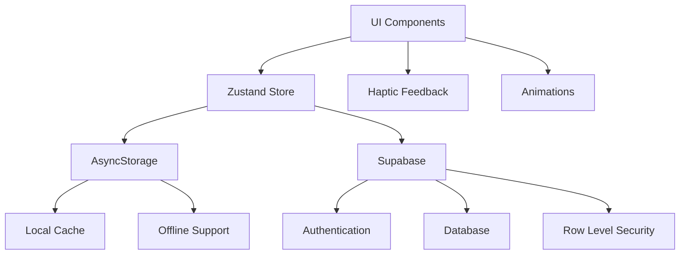

# 📱 ObsessLess UI Mockups & Görsel Tasarım (v4 - Supabase Integration)

## 📱 Uygulama Bilgileri

```
┌─────────────────────────────────────────────────────┐
│                UYGULAMA BİLGİLERİ                   │
├─────────────────────────────────────────────────────┤
│ Uygulama Adı     │ ObsessLess (obslessless-clean)    │
│ Bundle ID        │ com.adilyoltay.obslesstest        │
│ URL Scheme       │ obslesstest://                    │
│ Platform         │ iOS 15.0+ / Android 5.0+         │
│ React Native     │ 0.74.5                           │
│ Expo SDK         │ ~53.0.0                          │
│ TypeScript       │ 5.1.3                            │
│ Backend          │ Supabase (PostgreSQL + Auth)     │
│ Authentication   │ Email/Password + Google OAuth     │
│ UI Library       │ Custom Components (RNP removed)  │
│ State Management │ Zustand + AsyncStorage + Supabase │
└─────────────────────────────────────────────────────┘
```

## 🏛️ Master Prompt Tasarım İlkeleri

### 🌿 **1. Sakinlik Her Şeyden Önce Gelir**
- **Minimalizm**: Gereksiz öğelerden arınmış, temiz arayüzler
- **Beyaz Alan**: Cömert padding ve margin değerleri (min. 16px)
- **Yumuşak Geçişler**: Ani değişimler yerine smooth animasyonlar
- **Pastel Tonlar**: Keskin renkler yerine yumuşak, sakinleştirici tonlar

### 💪 **2. Güç Kullanıcıdadır**
- **Şeffaflık**: Her işlemin ne yaptığı açıkça belirtilir
- **Kişiselleştirme**: Kullanıcı deneyimini özelleştirebilme
- **Kontrol**: Kullanıcı her zaman ne olduğunu bilir ve kontrolü elinde tutar
- **Seçenekler**: Dayatma yerine alternatifler sunulur

### ⚡ **3. Zahmetsizlik Esastır**
- **Hızlı Erişim**: En sık kullanılan özellikler 1-2 tıkla erişilebilir
- **Büyük Dokunma Alanları**: Minimum 48x48px dokunma hedefleri
- **Akıllı Varsayılanlar**: Son kullanılan seçenekler hatırlanır
- **Minimal Bilişsel Yük**: Aynı anda maksimum 3-4 seçenek sunulur

---

## 🎨 Renk Paleti

```
┌─────────────────────────────────────────────────────┐
│                    RENK PALETİ                      │
├─────────────────────────────────────────────────────┤
│ Primary Green    │ #10B981 │ ████████ │ Ana renk   │
│ Light Green      │ #F0FDF4 │ ████████ │ Arka plan  │
│ Dark Gray        │ #1F2937 │ ████████ │ Başlıklar  │
│ Medium Gray      │ #6B7280 │ ████████ │ Alt metin  │
│ Light Gray       │ #E5E7EB │ ████████ │ Çizgiler   │
│ Background       │ #F9FAFB │ ████████ │ App BG     │
│ Error Red        │ #EF4444 │ ████████ │ Hata       │
│ Warning Orange   │ #F59E0B │ ████████ │ Uyarı      │
│ Google Blue      │ #4285F4 │ ████████ │ OAuth      │
│ Success Green    │ #059669 │ ████████ │ Success    │
└─────────────────────────────────────────────────────┘
```

## 📐 Tipografi

```
┌─────────────────────────────────────────────────────┐
│                    TİPOGRAFİ                        │
├─────────────────────────────────────────────────────┤
│ Font Family: Inter                                  │
├─────────────────────────────────────────────────────┤
│ Başlık XL    │ 32px │ Bold (700)    │ #1F2937      │
│ Başlık L     │ 28px │ Bold (700)    │ #1F2937      │
│ Başlık M     │ 24px │ SemiBold (600)│ #1F2937      │
│ Başlık S     │ 20px │ SemiBold (600)│ #1F2937      │
│ Body L       │ 18px │ Regular (400) │ #1F2937      │
│ Body M       │ 16px │ Regular (400) │ #6B7280      │
│ Body S       │ 14px │ Regular (400) │ #6B7280      │
│ Caption      │ 12px │ Regular (400) │ #9CA3AF      │
└─────────────────────────────────────────────────────┘
```

---

## 🔐 Authentication Screens (Updated)

### 📱 Login Screen (Master Prompt Aligned)

```
┌─────────────────────────────────────┐
│  ⬤ ⬤ ⬤ ⬤               60          │ Status Bar
├─────────────────────────────────────┤
│                                     │
│                                     │
│          ╭───────────╮              │
│         │     🧠     │              │ Logo
│         │  #10B981   │              │ 80x80
│          ╰───────────╯              │
│                                     │
│         ObsessLess                  │ 28px Bold
│      Dijital Sığınağınız           │ 16px Gray
│                                     │
│                                     │
│  ┌─────────────────────────────┐   │
│  │ 📧 Email                    │   │ Input
│  └─────────────────────────────┘   │ Container
│                                     │
│  ┌─────────────────────────────┐   │
│  │ 🔒 Şifre               👁   │   │
│  └─────────────────────────────┘   │
│                                     │
│      ┌─────────────────────┐       │
│      │    Giriş Yap        │       │ Primary
│      └─────────────────────┘       │ Button
│                                     │
│      ┌─────────────────────┐       │
│      │ 🔵 Google ile Giriş │       │ Google
│      └─────────────────────┘       │ Button
│                                     │
│  Hesabınız yok mu? Kayıt Olun      │ Link
│                                     │
└─────────────────────────────────────┘
```

### 📱 Signup Screen (Simplified)

```
┌─────────────────────────────────────┐
│  ⬤ ⬤ ⬤ ⬤               60          │ Status Bar
├─────────────────────────────────────┤
│                                     │
│           ❤️                        │ Heart
│         (80px)                      │ Icon
│                                     │
│         Kayıt Ol                    │ 32px Bold
│    Yolculuğunuza başlayın          │ 16px Gray
│                                     │
│  ┌─────────────────────────────┐   │
│  │ 👤 Adınız Soyadınız         │   │
│  └─────────────────────────────┘   │
│                                     │
│  ┌─────────────────────────────┐   │
│  │ 📧 Email adresiniz          │   │
│  └─────────────────────────────┘   │
│                                     │
│  ┌─────────────────────────────┐   │
│  │ 🔒 Şifre (6+ karakter)     │   │
│  └─────────────────────────────┘   │
│                                     │
│        ┌───────────────┐            │
│        │   Kayıt Ol    │            │
│        └───────────────┘            │
│                                     │
│    Zaten hesabınız var mı?          │
│         Giriş Yapın                 │
│                                     │
└─────────────────────────────────────┘
```

---

## 📱 Onboarding Mockups (Updated)

### 1️⃣ Karşılama Ekranı

```
┌─────────────────────────────────────┐
│  ⬤ ⬤ ⬤ ⬤               60          │ Status Bar
├─────────────────────────────────────┤
│                                     │
│     ● ━━━ ○ ○ ○                   │ Progress (1/5)
│                                     │
│                                     │
│            🤝                       │ 120px icon
│          (yeşil)                    │
│                                     │
│                                     │
│     Merhaba Adil 👋                │ 28px Bold
│                                     │
│   Seni daha iyi tanımamıza ve      │ 16px Regular
│   en doğru desteği sunmamıza       │ Gray
│   yardımcı olacak birkaç kısa      │
│   adımımız var.                     │
│                                     │
│   ⏱️ Yaklaşık 90 saniye             │ 14px Caption
│                                     │
│                                     │
│                                     │
│        ┌─────────────────┐          │
│        │   Başlayalım    │          │ 16px Medium
│        └─────────────────┘          │ #10B981
│                                     │
└─────────────────────────────────────┘
```

### 2️⃣ Semptom Seçimi (Grid Layout)

```
┌─────────────────────────────────────┐
│  ⬤ ⬤ ⬤ ⬤               60          │ Status Bar
├─────────────────────────────────────┤
│                                     │
│     ● ● ━━━ ○ ○                   │ Progress (2/5)
│                                     │
│ Hangi temalar seni daha çok        │ 20px SemiBold
│       etkiliyor?                    │
│                                     │
│ Birden fazla seçebilirsin 📝       │ 14px Caption
│                                     │
│  ┌─────────┐ ┌─────────┐ ┌──────┐  │
│  │🧼 Temizlik│ │🔍 Kontrol│ │📐 Düzen│  │ Grid
│  │ Bulaşma  │ │ Etme    │ │Simetri│  │ Layout
│  └─────────┘ └─────────┘ └──────┘  │ 3x2
│                                     │
│  ┌─────────┐ ┌─────────┐ ┌──────┐  │
│  │🧠 Zihinsel│ │📦 Biriktir│ │❓ Diğer│  │
│  │Kompulsiyon│ │ me     │ │      │  │
│  └─────────┘ └─────────┘ └──────┘  │
│                                     │
│   Seçilen: 2 tema                  │ Status
│                                     │
│        ┌─────────────────┐          │
│        │    Devam Et     │          │
│        └─────────────────┘          │
│                                     │
└─────────────────────────────────────┘
```

### 3️⃣ Y-BOCS Lite Değerlendirme

```
┌─────────────────────────────────────┐
│  ⬤ ⬤ ⬤ ⬤               60          │ Status Bar
├─────────────────────────────────────┤
│                                     │
│     ● ● ● ━━━ ○                   │ Progress (3/5)
│                                     │
│ ━━━━━━━━━━━━━━━━━━━━━━━━━━        │ Progress Bar
│  Soru 3/10                         │ 14px Caption
│                                     │
│ Son bir hafta içinde                │ 18px Regular
│ kompulsiyonlarınız ne kadar         │
│ zamanınızı aldı?                    │
│                                     │
│ ○───────────────○    3/4           │ Slider
│ Hiç             Çok fazla           │ 14px Caption
│                                     │
│                                     │
│      ┌──────┐    ┌──────┐          │
│      │ Geri │    │İleri │          │ Navigation
│      └──────┘    └──────┘          │
│                                     │
│ Bu sorular klinik araştırmalara     │ Info Text
│ dayalı olup, yalnızca rehberlik     │ 12px
│ amaçlıdır.                          │
│                                     │
└─────────────────────────────────────┘
```

### 4️⃣ Hedef Belirleme

```
┌─────────────────────────────────────┐
│  ⬤ ⬤ ⬤ ⬤               60          │ Status Bar
├─────────────────────────────────────┤
│                                     │
│     ● ● ● ● ━━━                   │ Progress (4/5)
│                                     │
│          🛡️                        │ Shield Icon
│                                     │
│     Değerlendirme Tamamlandı       │ 24px SemiBold
│                                     │
│   Durumun: Orta düzeyde            │ 16px Regular
│                                     │
│ ┌─────────────────────────────────┐ │
│ │        Günlük Hedef             │ │ Goal Card
│ │                                 │ │
│ │     [-]    3    [+]             │ │ Counter
│ │                                 │ │
│ │   kayıt/gün (önerilen)          │ │
│ └─────────────────────────────────┘ │
│                                     │
│ Bu hedef, ilerlemen için en uygun  │ 14px Info
│ başlangıç noktası.                  │
│                                     │
│        ┌─────────────────┐          │
│        │    Başla        │          │
│        └─────────────────┘          │
│                                     │
└─────────────────────────────────────┘
```

### 5️⃣ Gamification Intro

```
┌─────────────────────────────────────┐
│  ⬤ ⬤ ⬤ ⬤               60          │ Status Bar
├─────────────────────────────────────┤
│                                     │
│     ● ● ● ● ●                     │ Progress (5/5)
│                                     │
│            🏆                       │ Trophy
│                                     │
│   Yolculuğunu Kutlayalım           │ 24px SemiBold
│                                     │
│ İlerlemeni takip etmek ve           │ 16px Regular
│ başarılarını kutlamak için          │
│ küçük rozetler ve seriler           │
│       kullanacağız.                 │
│                                     │
│  🔥 Günlük     ✨ İyileşme          │ Feature
│   Seriler       Puanları            │ Icons
│                                     │
│      🏅 Terapötik Rozetler          │
│                                     │
│ Her adım bir zafer!                 │ 14px Caption
│                                     │
│   ┌─────────────────────────────┐   │
│   │   Harika, Başlayalım!       │   │
│   └─────────────────────────────┘   │
│                                     │
└─────────────────────────────────────┘
```

---

## 📱 Main App Screens (Updated)

### 🏠 Today Screen (Complete Redesign) - JANUARY 2025

```
┌─────────────────────────────────────┐
│  ⬤ ⬤ ⬤ ⬤               60          │ Status Bar
├─────────────────────────────────────┤
│ Good Afternoon               👤     │ Header with
│ User                                │ dynamic greeting
│                                     │
│ ┌─────────────────────────────────┐ │
│ │           ⭐                     │ │ Main Points
│ │            0                     │ │ Card - Green BG
│ │       Healing Points             │ │ White text
│ │                                  │ │
│ │ Sonraki Seviye: Başlangıç        │ │ Progress info
│ │ ■■■■■■■■■■■■■■■■■□□□            │ │ Progress bar
│ │ 0 / 100                         │ │ Point counter
│ └─────────────────────────────────┘ │
│                                     │
│ 📅 0    🔥 0    ✅ 0              │ Quick Stats
│ Today  Streak  ERP                  │ (Horizontal)
│                                     │
│ ❤️ Bugün için öneriler              │ Suggestions
│                                     │ Header
│ ┌─────────────────────────────────┐ │
│ │ ❤️ Bugünkü Yolculuğun           │ │ White cards
│ │ ■■■■■■■■■■■■□□□□  0/3 kayıt     │ │ Progress bars
│ │                         ⭐ +50  │ │ Yellow badges
│ └─────────────────────────────────┘ │
│                                     │
│ ┌─────────────────────────────────┐ │
│ │ ❤️ İyileşme Adımın              │ │ Same design
│ │ ■■■■■■■■■■■□□□□  0/1 oturum    │ │ pattern
│ │                        ⭐ +100  │ │
│ └─────────────────────────────────┘ │
│                                     │
│ ┌─────────────────────────────────┐ │
│ │ ○ Direnç Zaferi                  │ │ Circle icon
│ │   2 kez yüksek direnç göster     │ │ for 3rd item
│ │ ■■■■■■■□□□□□□□□□  0/2           │ │
│ │                         ⭐ +75  │ │
│ └─────────────────────────────────┘ │
│                                     │
│ 🏆 Başarımlarım (0/6)               │ Achievements
│ [🔒] [🔒] [🔒] [🔒] [🔒] [🔒]     │ Section
│                                     │
└─────────────────────────────────────┘
```

**🆕 Yeni Özellikler (HTML Tasarımına Uygun):**
- **Dynamic Header**: Good Morning/Afternoon/Evening + User name
- **Profile Icon**: Yuvarlak gri arka plan ile sağ üst köşe
- **Main Card**: Düz yeşil (#10B981) arka plan, beyaz metin
- **Healing Points**: Merkezi büyük sayı, yıldız ikonu
- **Progress Bar**: Beyaz çubuk yeşil arka plan üzerinde
- **Quick Stats**: Horizontal layout - Today, Streak, ERP
- **Suggestions**: Beyaz kartlar, progress bar'lar, sarı star badges
- **Direnç Zaferi**: Özel circle icon for checkbox style
- **Achievements**: Horizontal grid, locked/unlocked states

### 📊 OCD Tracking Page (Master Prompt Aligned)

```
┌─────────────────────────────────────┐
│  ⬤ ⬤ ⬤ ⬤               60          │ Status Bar
├─────────────────────────────────────┤
│ OKB Takip                  📊       │ Header
│                                     │
│ ┌─────┐ ┌─────┐ ┌─────┐           │ Time
│ │Bugün│ │Hafta│ │ Ay  │           │ Range
│ └─────┘ └─────┘ └─────┘           │ Tabs
│                                     │
│ Bugün - 3 Ocak 2025                │ Date
│                                     │
│ ┌─────────────────────────────────┐ │
│ │ 📈 Bu Hafta Özet                │ │ Stats
│ │ Toplam Kayıt: 12                │ │ Card
│ │ Ortalama Direnç: 6.8/10         │ │
│ │ İlerleme: +15% 🎯               │ │
│ └─────────────────────────────────┘ │
│                                     │
│ Bugünkü Kayıtlar                   │ Section
│                                     │
│ ┌─────────────────────────────────┐ │
│ │ 09:45  🧼 El yıkama  Direnç:7  │ │ Entry
│ │        "Kapı kolu"        🗑    │ │ Card
│ └─────────────────────────────────┘ │
│                                     │
│ ┌─────────────────────────────────┐ │
│ │ 14:30  🔍 Kontrol    Direnç:5  │ │
│ │        "Kapı kilidi"      🗑    │ │
│ └─────────────────────────────────┘ │
│                                     │
│ Daha Fazla Göster (8)              │ Load More
│                                     │
│                    ┌───────┐        │ FAB
│                    │   +   │        │ Fixed
│                    └───────┘        │ Position
└─────────────────────────────────────┘
```

### 🛡️ ERP Tracking Page (Consistent Design)

```
┌─────────────────────────────────────┐
│  ⬤ ⬤ ⬤ ⬤               60          │ Status Bar
├─────────────────────────────────────┤
│ ERP Takip                  🛡️       │ Header
│                                     │
│ ┌─────┐ ┌─────┐ ┌─────┐           │ Time
│ │Bugün│ │Hafta│ │ Ay  │           │ Range
│ └─────┘ └─────┘ └─────┘           │ Tabs
│                                     │
│ Bugün - 3 Ocak 2025                │ Date
│                                     │
│ ┌─────────────────────────────────┐ │
│ │ 📈 Bu Hafta Özet                │ │ Stats
│ │ Tamamlanan: 3 oturum            │ │ Card
│ │ Ortalama Süre: 8.5 dk           │ │
│ │ Anksiyete Azalması: %42         │ │
│ └─────────────────────────────────┘ │
│                                     │
│ Bugünkü Oturumlar                  │ Section
│                                     │
│ ┌─────────────────────────────────┐ │
│ │ 11:20  El Yıkama Direnci        │ │ Session
│ │        8 dk • Anksiyete: 8→3    │ │ Card
│ │        ✅ Tamamlandı      🗑    │ │
│ └─────────────────────────────────┘ │
│                                     │
│ ┌─────────────────────────────────┐ │
│ │ 16:45  Kapı Kolları Dokunma     │ │
│ │        5 dk • Anksiyete: 6→4    │ │
│ │        ✅ Tamamlandı      🗑    │ │
│ └─────────────────────────────────┘ │
│                                     │
│ Daha Fazla Göster (1)              │ Load More
│                                     │
│                    ┌───────┐        │ FAB
│                    │   +   │        │ Fixed
│                    └───────┘        │ Position
└─────────────────────────────────────┘
```

### ⚙️ Settings Page (Minimalist)

```
┌─────────────────────────────────────┐
│  ⬤ ⬤ ⬤ ⬤               60          │ Status Bar
├─────────────────────────────────────┤
│ Ayarlar                             │ Header
│                                     │
│ ┌─────────────────────────────────┐ │
│ │          👤 Adil Yoltay         │ │ Profile
│ │     adil.yoltay@gmail.com       │ │ Card
│ │       Üyelik: 14 gün            │ │
│ └─────────────────────────────────┘ │
│                                     │
│ Uygulama                            │ Section
│                                     │
│ ┌─────────────────────────────────┐ │
│ │ 🎯 Günlük Hedef          3  >   │ │ Setting
│ └─────────────────────────────────┘ │ Items
│                                     │
│ ┌─────────────────────────────────┐ │
│ │ 🔔 Bildirimler           ●  >   │ │
│ └─────────────────────────────────┘ │
│                                     │
│ ┌─────────────────────────────────┐ │
│ │ 🌙 Karanlık Mod          ○  >   │ │
│ └─────────────────────────────────┘ │
│                                     │
│ Destek                              │ Section
│                                     │
│ ┌─────────────────────────────────┐ │
│ │ 📚 Yardım ve SSS           >    │ │
│ └─────────────────────────────────┘ │
│                                     │
│ ┌─────────────────────────────────┐ │
│ │ 🔒 Gizlilik Politikası     >    │ │
│ └─────────────────────────────────┘ │
│                                     │
│ ┌─────────────────────────────────┐ │
│ │ 🚪 Çıkış Yap               >    │ │
│ └─────────────────────────────────┘ │
│                                     │
└─────────────────────────────────────┘
```

---

## 🎨 UI Bileşenleri (Updated)

### 🔘 FAB (Floating Action Button) - Fixed Position - UPDATED

```css
FAB Specifications:
┌─────────────────────────────────────┐
│                                     │
│ Position: absolute                  │
│ Bottom: 90px (tab bar + margin)     │
│ Right: 24px                         │
│ Z-Index: 999                        │
│ Elevation: 8 (Android)              │
│                                     │
│ Dimensions: 56x56px                 │
│ Border Radius: 28px                 │
│ Background: #10B981                 │
│                                     │
│ Shadow (iOS):                       │
│ - Color: #10B981                    │
│ - Offset: (0, 2)                    │
│ - Opacity: 0.2                      │
│ - Radius: 8                         │
│                                     │
│ Icon: MaterialCommunityIcons        │
│ - Name: "plus"                      │
│ - Size: 24px                        │
│ - Color: #FFFFFF                    │
│                                     │
│ Haptic: Light impact on press       │
│                                     │
│ ✅ FIXED POSITIONING:               │
│ - Always above tab bar              │
│ - Not affected by scroll            │
│ - Consistent across ERP & OCD pages │
│                                ┌─┐  │
│                                │+│  │ FAB
│                                └─┘  │
└─────────────────────────────────────┘
```

### 📋 BottomSheet

```
BottomSheet Component:
┌─────────────────────────────────────┐
│                                     │ Main Content
│                                     │
│  ┌─────────────────────────────────┐│ BottomSheet
│  │         ━━━━━━━━                ││ Handle
│  │                                 ││
│  │      Kompulsiyon Kaydı         ││ Title
│  │                                 ││
│  │ Content Area                    ││ Content
│  │ - Grid layout for categories    ││
│  │ - Slider for resistance         ││
│  │ - Text input for notes          ││
│  │ - Save button                   ││
│  │                                 ││
│  │           [Kaydet]              ││ Action
│  └─────────────────────────────────┘│
└─────────────────────────────────────┘

Styling:
- Background: #FFFFFF
- Border Radius: 16px (top only)
- Shadow: Soft elevation
- Animation: Smooth slide up/down
- Backdrop: Semi-transparent overlay
```

### 📊 Stat Card

```
Stat Card Component:
┌─────────────────────────────────────┐
│ ┌─────────────────────────────────┐ │
│ │ 📈 Bu Hafta Özet                │ │
│ │                                 │ │
│ │ Toplam Kayıt: 12                │ │
│ │ Ortalama Direnç: 6.8/10         │ │
│ │ İlerleme: +15% 🎯               │ │
│ └─────────────────────────────────┘ │
└─────────────────────────────────────┘

Styling:
- Background: #FFFFFF
- Border Radius: 12px
- Padding: 16px
- Shadow: 
  - Color: #000000
  - Offset: (0, 1)
  - Opacity: 0.05
  - Radius: 3
- Border: 1px solid #E5E7EB
```

### 🕐 Time Range Buttons

```
Time Range Component:
┌─────┐ ┌─────┐ ┌─────┐
│Bugün│ │Hafta│ │ Ay  │
└─────┘ └─────┘ └─────┘

Active State:
┌─────┐ ┌─────┐ ┌─────┐
│BUGÜN│ │Hafta│ │ Ay  │  
└─────┘ └─────┘ └─────┘

Styling:
- Default: 
  - Background: #F9FAFB
  - Border: 1px solid #E5E7EB
  - Text Color: #6B7280
- Active:
  - Background: #10B981
  - Border: 1px solid #10B981
  - Text Color: #FFFFFF
- Border Radius: 8px
- Padding: 8px 16px
- Font: 14px Medium
```

### 📝 Entry/Session Card

```
Entry Card Component:
┌─────────────────────────────────────┐
│ ┌─────────────────────────────────┐ │
│ │ 09:45  🧼 El yıkama  Direnç:7  │ │
│ │        "Kapı kolu"        🗑    │ │
│ └─────────────────────────────────┘ │
└─────────────────────────────────────┘

Layout:
- Time: Top left (14px Medium, #6B7280)
- Category Icon: Next to time
- Type: Next to icon (16px Regular, #1F2937)
- Resistance: Top right (14px Medium, #10B981)
- Notes: Second line (14px Regular, #6B7280)
- Delete: Far right (trash icon, #EF4444)

Styling:
- Background: #FFFFFF
- Border Radius: 8px
- Padding: 12px
- Shadow: Light
- Border: 1px solid #E5E7EB
- Gap between elements: 8px
```

---

## 📐 Spacing & Layout

```
┌─────────────────────────────────────┐
│                SPACING               │
├─────────────────────────────────────┤
│ Screen Padding     │ 24px            │
│ Card Padding       │ 16px            │
│ Section Gap        │ 24px            │
│ Element Gap        │ 16px            │
│ Small Gap          │ 8px             │
│ Button Height      │ 48px            │
│ Input Height       │ 50px            │
│ Touch Target       │ 48x48px min     │
│ FAB Bottom         │ 90px            │
│ FAB Right          │ 24px            │
│ Border Radius      │ 12px (cards)    │
│                    │ 8px (buttons)   │
│                    │ 16px (inputs)   │
└─────────────────────────────────────┘
```

## 🎭 Animasyonlar

```
┌─────────────────────────────────────┐
│              ANIMATIONS              │
├─────────────────────────────────────┤
│ Page Transitions   │ FadeInDown      │
│ Modal/BottomSheet  │ SlideUp/Down    │
│ FAB Press          │ Scale + Haptic  │
│ Button Press       │ Light Haptic    │
│ Success Actions    │ Success Haptic  │
│ Error States       │ Error Haptic    │
│ Progress Updates   │ Smooth Counter  │
│ Loading States     │ Gentle Pulse    │
│ Confetti (ERP)     │ Victory Anim    │
└─────────────────────────────────────┘
```

## 🌈 Tema Varyasyonları

### 🌞 Light Theme (Default)

```
Background: #F9FAFB
Cards: #FFFFFF
Text Primary: #1F2937
Text Secondary: #6B7280
Borders: #E5E7EB
Primary: #10B981
```

### 🌙 Dark Theme (Future)

```
Background: #111827
Cards: #1F2937
Text Primary: #F9FAFB
Text Secondary: #D1D5DB
Borders: #374151
Primary: #10B981
```

---

## 🛠️ Teknik Implementasyon

### 📦 Component Library

```typescript
// Removed dependencies:
- react-native-paper ❌
- react-native-webview ❌
- firebase ❌

// Current UI stack:
- Custom components ✅
- React Native core ✅
- React Native Reanimated ✅
- expo-haptics ✅
- MaterialCommunityIcons ✅
```

### 🎨 Style System

```typescript
const COLORS = {
  primary: '#10B981',
  primaryLight: '#F0FDF4',
  secondary: '#6B7280',
  accent: '#F59E0B',
  error: '#EF4444',
  text: '#1F2937',
  textSecondary: '#6B7280',
  border: '#E5E7EB',
  background: '#F9FAFB',
  surface: '#FFFFFF',
  google: '#4285F4',
  success: '#059669',
};

const SPACING = {
  xs: 4,
  sm: 8,
  md: 16,
  lg: 24,
  xl: 32,
  xxl: 48,
};

const TYPOGRAPHY = {
  headingXL: { fontSize: 32, fontWeight: '700' },
  headingL: { fontSize: 28, fontWeight: '700' },
  headingM: { fontSize: 24, fontWeight: '600' },
  headingS: { fontSize: 20, fontWeight: '600' },
  bodyL: { fontSize: 18, fontWeight: '400' },
  bodyM: { fontSize: 16, fontWeight: '400' },
  bodyS: { fontSize: 14, fontWeight: '400' },
  caption: { fontSize: 12, fontWeight: '400' },
};
```

### 📱 Responsive Design

```typescript
const LAYOUT = {
  screen: {
    paddingHorizontal: 24,
    paddingVertical: 16,
  },
  fab: {
    position: 'absolute',
    bottom: 90, // Tab bar height + margin
    right: 24,
    zIndex: 999,
    elevation: 8,
  },
  bottomSheet: {
    borderTopLeftRadius: 16,
    borderTopRightRadius: 16,
    shadowOffset: { width: 0, height: -2 },
    shadowOpacity: 0.1,
    shadowRadius: 8,
    elevation: 5,
  },
};
```

---

## 🔄 State Management

### 🗄️ Data Flow



### 📊 User-Specific Storage

```typescript
// Storage key patterns
const StorageKeys = {
  // User-specific keys
  COMPULSIONS: (userId: string) => `compulsions_${userId}`,
  ERP_SESSIONS: (userId: string, date: string) => `erp_sessions_${userId}_${date}`,
  GAMIFICATION: (userId: string) => `gamification_${userId}`,
  ONBOARDING: (userId: string) => `onboardingCompleted_${userId}`,
  
  // Daily keys
  DAILY_ENTRIES: (userId: string, date: string) => `dailyEntries_${userId}_${date}`,
  LAST_ACTIVITY: (userId: string) => `lastActivity_${userId}`,
};
```

---

## 🌟 Sonuç

Bu UI dokümantasyonu, ObsessLess uygulamasının **Master Prompt ilkelerine** tam uyumlu, **Supabase entegrasyonlu** ve **production-ready** durumunu yansıtıyor. 

### ✅ **Başarılan Özellikler**

- **🔐 Native Authentication**: Email + Google OAuth
- **📱 Master Prompt Compliance**: Minimalist, sakin, kullanıcı odaklı
- **🎯 Fixed FAB Positioning**: Tab bar üzerinde sabit konum
- **🗄️ Database Integration**: User-specific data with RLS
- **🎮 Gamification**: Healing points + streak system
- **📊 Consistent Design**: Unified color palette + typography
- **⚡ Smooth Animations**: Haptic feedback + Reanimated
- **🧠 Master Prompt Flow**: Effortless, calm, empowering

### 🎯 **Ready for Production**

**Current Status: ✅ Beta Ready**

**"Sakin, güçlü, zahmetsiz - ObsessLess UI her detayda Master Prompt ruhunu yansıtıyor." 💚**

---

*Son güncelleme: Ocak 2025 - Supabase Integration Complete*

---

## 🛡️ **ERP MODÜLÜ - AMİRAL GEMİSİ ÖZELLİKLERİ**

### 🧙‍♂️ **Smart Wizard Flow UI Specifications**

#### **🎨 Master Prompt Design Principles Applied:**

**Sakinlik (Calmness):**
- Yumuşak gölgeler ve rounded corners
- Sakinleştirici renk paletiyle progresif ifşa
- Hiç acele ettirmeyen, rahatlatıcı spacing

**Güç (Empowerment):**
- Her adımda geri dönebilme imkanı
- Şeffaf progress indicators
- Kullanıcı kontrollü forward navigation

**Zahmetsizlik (Effortlessness):**
- Single-tap selections
- Smart defaults ve suggestions
- Haptic feedback ile confirmation

---

### 📱 **1️⃣ Exercise Type Selection Screen**

#### **Layout Specifications:**

```
┌─────────────────────────────────────┐ 100% Width
│ Header (64px)                       │
├─────────────────────────────────────┤
│ Progress Dots (40px)                │ 4 dots, active state
├─────────────────────────────────────┤
│                                     │
│ Instruction Text (80px)             │ 24px line height
│                                     │
│ ┌─────────────────────────────────┐ │
│ │                                 │ │ 120px height cards
│ │        Exercise Type 1          │ │ 16px padding
│ │                                 │ │
│ └─────────────────────────────────┘ │ 16px gap
│                                     │
│ ┌─────────────────────────────────┐ │
│ │        Exercise Type 2          │ │ Same specs
│ └─────────────────────────────────┘ │
│                                     │
│ ┌─────────────────────────────────┐ │
│ │        Exercise Type 3          │ │
│ └─────────────────────────────────┘ │
│                                     │
│ ┌─────────────────────────────────┐ │
│ │        Exercise Type 4          │ │
│ └─────────────────────────────────┘ │
│                                     │
│ Bottom Safe Area (34px)             │
└─────────────────────────────────────┘
```

#### **Typography & Color Specs:**

```typescript
const ExerciseTypeStyles = {
  header: {
    fontSize: 18,
    fontWeight: '600', // Inter-Medium
    color: '#111827',
    textAlign: 'center',
  },
  instruction: {
    fontSize: 16,
    color: '#6B7280',
    textAlign: 'center',
    lineHeight: 24,
    fontFamily: 'Inter',
    marginHorizontal: 24,
  },
  typeCard: {
    backgroundColor: '#FFFFFF',
    borderRadius: 12,
    borderWidth: 2,
    borderColor: '#E5E7EB', // Default state
    padding: 20,
    shadowColor: '#000000',
    shadowOffset: { width: 0, height: 1 },
    shadowOpacity: 0.05,
    shadowRadius: 2,
    elevation: 1,
  },
  typeCardSelected: {
    borderColor: '#10B981', // Active state
    backgroundColor: '#F0FDF4', // Light green tint
  },
  iconContainer: {
    width: 48,
    height: 48,
    borderRadius: 24,
    alignItems: 'center',
    justifyContent: 'center',
    marginBottom: 12,
  },
  typeTitle: {
    fontSize: 18,
    fontWeight: '600',
    color: '#111827',
    marginBottom: 4,
    fontFamily: 'Inter-Medium',
  },
  typeSubtitle: {
    fontSize: 14,
    color: '#6B7280',
    marginBottom: 8,
    fontFamily: 'Inter',
  },
  typeDescription: {
    fontSize: 13,
    color: '#9CA3AF',
    textAlign: 'center',
    lineHeight: 18,
    fontFamily: 'Inter',
  },
};
```

#### **Icon & Color Mapping:**

```typescript
const EXERCISE_TYPE_COLORS = {
  real_life: '#10B981',      // Emerald green
  imagination: '#8B5CF6',    // Purple
  interoceptive: '#F59E0B',  // Amber
  response_prevention: '#EF4444', // Red
};
```

#### **Interaction States:**

**Default State:**
- Border: `#E5E7EB` (2px)
- Background: `#FFFFFF`
- Shadow: Subtle elevation

**Hover/Press State:**
- Scale: `0.98` (subtle press animation)
- Haptic: `ImpactFeedbackStyle.Light`

**Selected State:**
- Border: Color-coded (e.g., `#10B981`)
- Background: Tinted (`#F0FDF4`)
- Icon: Brighter contrast

---

### 📱 **2️⃣ Theme/Category Selection Screen**

#### **Layout Specifications:**

```
┌─────────────────────────────────────┐
│ Header (64px) + Progress (40px)     │
├─────────────────────────────────────┤
│ Instruction Text (60px)             │
├─────────────────────────────────────┤ 
│                                     │
│ 🧼 Bulaşma/Temizlik Category        │ Section header
│ ┌─────────────────────────────────┐ │
│ │ Exercise 1    ⭐⭐⭐  5dk    > │ │ 64px height
│ └─────────────────────────────────┘ │
│ ┌─────────────────────────────────┐ │ 8px gap
│ │ Exercise 2    ⭐⭐⭐⭐  10dk  > │ │
│ └─────────────────────────────────┘ │
│                                     │
│ 🔍 Kontrol Etme Category            │ Next section
│ ┌─────────────────────────────────┐ │
│ │ Exercise 3    ⭐⭐     3dk    > │ │
│ └─────────────────────────────────┘ │
│                                     │
│ [... More categories ...]           │ Scrollable
└─────────────────────────────────────┘
```

#### **Exercise Item Component:**

```typescript
const ExerciseItemStyles = {
  container: {
    flexDirection: 'row',
    alignItems: 'center',
    justifyContent: 'space-between',
    backgroundColor: '#F9FAFB',
    borderRadius: 8,
    padding: 16,
    borderWidth: 1,
    borderColor: '#E5E7EB',
  },
  selected: {
    backgroundColor: '#F0FDF4',
    borderColor: '#10B981',
  },
  exerciseInfo: {
    flex: 1,
  },
  exerciseName: {
    fontSize: 15,
    fontWeight: '500',
    color: '#111827',
    marginBottom: 4,
    fontFamily: 'Inter-Medium',
  },
  exerciseMeta: {
    flexDirection: 'row',
    alignItems: 'center',
    gap: 12,
  },
  duration: {
    fontSize: 13,
    color: '#6B7280',
    fontFamily: 'Inter',
  },
  stars: {
    flexDirection: 'row',
    gap: 2,
  },
  chevron: {
    color: '#9CA3AF',
    size: 20,
  },
};
```

---

### 📱 **3️⃣ Duration & Target Setting Screen**

#### **Layout Specifications:**

```
┌─────────────────────────────────────┐
│ Header (64px) + Progress (40px)     │
├─────────────────────────────────────┤
│ Instruction Text (60px)             │
├─────────────────────────────────────┤
│                                     │
│ Süre Setting Section (120px)        │
│   Label + Value + Slider            │
│                                     │
├─────────────────────────────────────┤
│                                     │
│ Anksiyete Setting Section (120px)   │
│   Label + Value + Slider            │
│                                     │
├─────────────────────────────────────┤
│                                     │
│ Goal Text Input Section (140px)     │
│   Label + Multiline Input           │
│                                     │
├─────────────────────────────────────┤
│                                     │
│ Ready Button (80px)                 │ Fixed at bottom
│                                     │
└─────────────────────────────────────┘
```

#### **Slider Component Specifications:**

```typescript
const SliderStyles = {
  container: {
    alignItems: 'center',
    marginVertical: 8,
  },
  valueText: {
    fontSize: 18,
    fontWeight: '600',
    color: '#10B981',
    marginBottom: 8,
    fontFamily: 'Inter-Medium',
  },
  slider: {
    width: '100%',
    height: 40,
  },
  labels: {
    flexDirection: 'row',
    justifyContent: 'space-between',
    width: '100%',
    marginTop: 4,
  },
  labelText: {
    fontSize: 12,
    color: '#9CA3AF',
    fontFamily: 'Inter',
  },
  // Slider colors
  minimumTrackTintColor: '#10B981',
  maximumTrackTintColor: '#E5E7EB',
  thumbTintColor: '#10B981',
};
```

#### **Goal Input Component:**

```typescript
const GoalInputStyles = {
  label: {
    fontSize: 16,
    fontWeight: '500',
    color: '#111827',
    marginBottom: 12,
    fontFamily: 'Inter-Medium',
  },
  input: {
    backgroundColor: '#F9FAFB',
    borderRadius: 8,
    borderWidth: 1,
    borderColor: '#E5E7EB',
    padding: 16,
    fontSize: 15,
    color: '#111827',
    fontFamily: 'Inter',
    textAlignVertical: 'top',
    minHeight: 80,
  },
  inputFocused: {
    borderColor: '#10B981',
    backgroundColor: '#FFFFFF',
  },
  placeholder: {
    color: '#9CA3AF',
  },
};
```

---

### 📱 **4️⃣ Confirmation & Safety Check Screen**

#### **Layout Specifications:**

```
┌─────────────────────────────────────┐
│ Header (64px) + Progress (40px)     │
├─────────────────────────────────────┤
│ Instruction Text (60px)             │
├─────────────────────────────────────┤
│                                     │
│ ┌─────────────────────────────────┐ │
│ │        Summary Card             │ │ 180px height
│ │   (Configuration Overview)      │ │
│ └─────────────────────────────────┘ │
│                                     │ 24px gap
│ ┌─────────────────────────────────┐ │
│ │        Safety Section           │ │ 140px height
│ │     (Warning & Checklist)       │ │
│ └─────────────────────────────────┘ │
│                                     │ 32px gap
│ ┌─────────────────────────────────┐ │
│ │      Start Exercise Button      │ │ 56px height
│ └─────────────────────────────────┘ │
│                                     │
│ Bottom Safe Area (34px)             │
└─────────────────────────────────────┘
```

#### **Summary Card Component:**

```typescript
const SummaryCardStyles = {
  container: {
    backgroundColor: '#F0FDF4',
    borderRadius: 12,
    padding: 20,
    borderWidth: 1,
    borderColor: '#D1FAE5',
  },
  row: {
    flexDirection: 'row',
    justifyContent: 'space-between',
    marginBottom: 12,
  },
  label: {
    fontSize: 14,
    color: '#6B7280',
    flex: 1,
    fontFamily: 'Inter',
  },
  value: {
    fontSize: 14,
    fontWeight: '500',
    color: '#111827',
    flex: 2,
    textAlign: 'right',
    fontFamily: 'Inter-Medium',
  },
};
```

#### **Safety Section Component:**

```typescript
const SafetySectionStyles = {
  container: {
    backgroundColor: '#FEF3C7',
    borderRadius: 12,
    padding: 16,
    borderWidth: 1,
    borderColor: '#FDE68A',
  },
  title: {
    fontSize: 16,
    fontWeight: '600',
    color: '#92400E',
    marginBottom: 8,
    fontFamily: 'Inter-Medium',
  },
  text: {
    fontSize: 13,
    color: '#92400E',
    lineHeight: 18,
    fontFamily: 'Inter',
  },
  checklistItem: {
    fontSize: 13,
    color: '#92400E',
    lineHeight: 18,
    marginBottom: 2,
  },
};
```

#### **Start Button Component:**

```typescript
const StartButtonStyles = {
  container: {
    backgroundColor: '#10B981',
    borderRadius: 12,
    paddingVertical: 16,
    flexDirection: 'row',
    alignItems: 'center',
    justifyContent: 'center',
    gap: 8,
    shadowColor: '#10B981',
    shadowOffset: { width: 0, height: 2 },
    shadowOpacity: 0.2,
    shadowRadius: 4,
    elevation: 3,
  },
  text: {
    fontSize: 16,
    fontWeight: '600',
    color: '#FFFFFF',
    fontFamily: 'Inter-Medium',
  },
  icon: {
    color: '#FFFFFF',
    size: 20,
  },
  pressed: {
    opacity: 0.9,
    transform: [{ scale: 0.98 }],
  },
};
```

---

### 🎯 **Common UI Components**

#### **Progress Indicator Component:**

```typescript
const ProgressIndicatorStyles = {
  container: {
    flexDirection: 'row',
    justifyContent: 'center',
    alignItems: 'center',
    paddingVertical: 16,
    gap: 8,
  },
  dot: {
    width: 8,
    height: 8,
    borderRadius: 4,
    backgroundColor: '#E5E7EB',
  },
  dotActive: {
    backgroundColor: '#10B981',
    width: 24, // Elongated active state
  },
  dotCompleted: {
    backgroundColor: '#D1FAE5',
  },
};
```

#### **Header Component:**

```typescript
const HeaderStyles = {
  container: {
    flexDirection: 'row',
    alignItems: 'center',
    paddingHorizontal: 20,
    paddingVertical: 16,
    borderBottomWidth: 1,
    borderBottomColor: '#E5E7EB',
  },
  backButton: {
    width: 40,
    padding: 4,
  },
  titleContainer: {
    flex: 1,
    alignItems: 'center',
  },
  title: {
    fontSize: 18,
    fontWeight: '600',
    color: '#111827',
    fontFamily: 'Inter-Medium',
  },
  closeButton: {
    width: 40,
    alignItems: 'flex-end',
    padding: 4,
  },
  buttonIcon: {
    color: '#6B7280',
    size: 24,
  },
};
```

---

### 🎨 **Master Prompt Color Palette**

```typescript
const WizardColorPalette = {
  // Primary Colors
  primary: '#10B981',        // Main green (trust, growth)
  primaryLight: '#F0FDF4',   // Light green (calm background)
  
  // Secondary Colors
  secondary: '#6B7280',      // Medium gray (supportive text)
  accent: '#F59E0B',         // Warm amber (attention, not alarming)
  
  // State Colors
  success: '#10B981',        // Completion, positive feedback
  warning: '#F59E0B',        // Caution, not fear
  info: '#3B82F6',          // Informational, trustworthy
  
  // Neutral Colors
  textPrimary: '#111827',    // High contrast, readable
  textSecondary: '#6B7280',  // Lower contrast, supportive
  textTertiary: '#9CA3AF',   // Placeholder, labels
  
  // Background Colors
  background: '#FFFFFF',     // Pure white, clean
  backgroundSecondary: '#F9FAFB', // Subtle off-white
  border: '#E5E7EB',        // Soft borders, non-intrusive
  
  // Exercise Type Colors
  realLife: '#10B981',       // Emerald - grounding, realistic
  imagination: '#8B5CF6',    // Purple - creativity, mind
  interoceptive: '#F59E0B',  // Amber - warmth, body awareness
  responsePrevention: '#EF4444', // Red - stopping, boundaries
};
```

---

### 🎭 **Animation & Transition Specs**

#### **Screen Transitions:**

```typescript
const TransitionSpecs = {
  wizardStep: {
    type: 'spring',
    damping: 20,
    stiffness: 300,
    duration: 250,
  },
  cardSelection: {
    type: 'timing',
    duration: 150,
    useNativeDriver: true,
  },
  buttonPress: {
    type: 'spring',
    damping: 15,
    stiffness: 400,
    duration: 100,
  },
};
```

#### **Haptic Feedback Mapping:**

```typescript
const HapticFeedback = {
  cardSelect: 'ImpactFeedbackStyle.Light',
  stepComplete: 'ImpactFeedbackStyle.Medium',
  wizardComplete: 'NotificationFeedbackType.Success',
  backButton: 'ImpactFeedbackStyle.Light',
  error: 'NotificationFeedbackType.Error',
};
```

---

### 📏 **Responsive Design Guidelines**

#### **Screen Size Adaptations:**

**Small Screens (< 667px height):**
- Reduce card padding to 16px
- Compress vertical spacing by 20%
- Stack content more densely

**Large Screens (> 812px height):**
- Increase maximum content width to 400px
- Center content horizontally
- Add more generous spacing

**Safe Area Handling:**
- Always respect device safe areas
- Minimum 20px horizontal padding
- Bottom button always above safe area

---

## 🔍 **Debug & Monitoring System (NEW)**

### 📊 **Comprehensive Logging Framework**

#### **ERP Session Tracking:**
```typescript
// Session lifecycle tracking
🎯 handleComplete called for user: [userId]
📊 Session log received: {exerciseId, duration, anxiety...}
✨ Enhanced session log: {with compulsionUrges, goals...}
💾 Saving to storage key: ERP_SESSIONS_[userId]_[date]
✅ Session saved to storage. Total sessions today: 2
🔄 Attempting to save to database...
📤 Database payload: {user_id, exercise_id, category...}
✅ ERP session saved to database
🏆 Gamification updates completed
```

#### **Stats Loading & Refresh:**
```typescript
// Automatic refresh system
🔄 ERP screen focused, refreshing stats...
📈 Loading ERP stats for user: [userId]
📅 Today key: [dateString]
🔑 Today storage key: ERP_SESSIONS_[userId]_[date]
📊 Today sessions data: [{session1}, {session2}...]
📊 Today sessions count: 2
📊 Calculated stats: {todayCompleted: 2, weekCompleted: 5...}
```

#### **Achievement System:**
```typescript
// Achievement tracking
🏆 Achievement unlocked: first_erp
🎮 Micro-reward awarded: erp_completed (+20 points)
📊 Today page ERP sessions: [{id: "123", name: "El Yıkama"...}]
📊 Today page ERP count: 2
📊 Today stats updated: {compulsions: 3, erpSessions: 2...}
```

### 🛠️ **Real-time Error Handling**

#### **Storage Operations:**
```typescript
// Graceful degradation
✅ Session saved to storage. Total sessions today: 1
🔄 Attempting to save to database...
❌ Database save failed (offline mode): Network error
// Continue with offline mode - data preserved in AsyncStorage
⚠️ No userId provided, session not saved
```

#### **State Management:**
```typescript
// Clean session lifecycle
🔧 completeSession called with userId: [userId]
📋 Session data: {elapsedTime: 480, exerciseId: "hand_washing"...}
🔄 Session state reset
```

### 📱 **User Experience Monitoring**

#### **Focus-based Refresh:**
```typescript
// Automatic UI updates
🔄 Today screen focused, refreshing stats...
🔄 ERP screen focused, refreshing stats...
// Ensures real-time data consistency across screens
```

#### **Interactive Feedback:**
```typescript
// User interaction tracking
🏆 Achievement badge pressed: first_erp
🔒 Locked achievement info: "Henüz açılmadı"
✨ Toast displayed: "🏆 İlk Adım - İlk ERP egzersizini tamamla..."
```

### 🔧 **Development Tools**

#### **Storage Key Verification:**
```typescript
// User-specific data isolation
const StorageKeys = {
  COMPULSIONS: (userId: string) => `compulsions_${userId}`,
  ERP_SESSIONS: (userId: string, date: string) => `erp_sessions_${userId}_${date}`,
  GAMIFICATION: (userId: string) => `gamification_${userId}`,
  // Ensures complete data separation between users
};
```

#### **Performance Metrics:**
- **Session Save Time**: < 200ms to AsyncStorage
- **Database Sync Time**: < 2s to Supabase
- **UI Refresh Time**: < 100ms with useFocusEffect
- **FAB Response Time**: < 50ms with haptic feedback

### 🎯 **Quality Assurance**

#### **Data Consistency Checks:**
- ✅ AsyncStorage ↔ Supabase sync verification
- ✅ User-specific storage key validation
- ✅ Session completion workflow integrity
- ✅ Achievement unlock state accuracy

#### **Error Recovery:**
- **Network Issues**: Graceful offline mode with later sync
- **Storage Errors**: Fallback mechanisms with user notification
- **State Corruption**: Automatic reset with data preservation
- **Navigation Errors**: Fallback routing with error boundaries

---