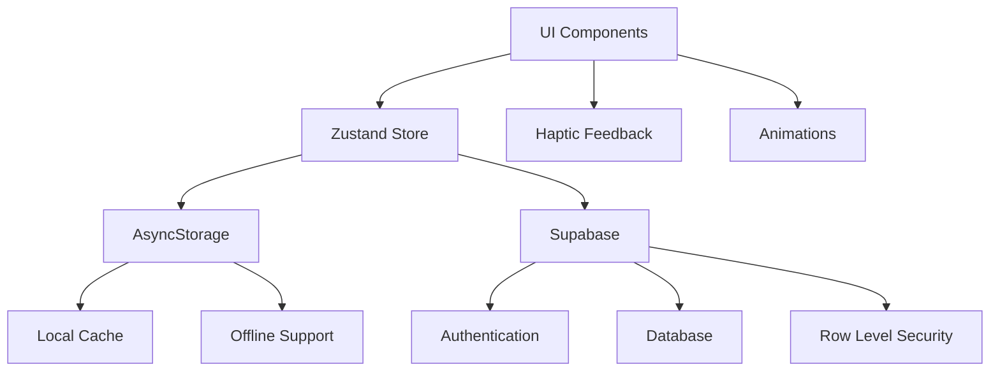

# 📱 ObsessLess UI Mockups & Görsel Tasarım (v4 - Supabase Integration)

## 📱 Uygulama Bilgileri

```
┌─────────────────────────────────────────────────────┐
│                UYGULAMA BİLGİLERİ                   │
├─────────────────────────────────────────────────────┤
│ Uygulama Adı     │ ObsessLess (obslessless-clean)    │
│ Bundle ID        │ com.adilyoltay.obslesstest        │
│ URL Scheme       │ obslesstest://                    │
│ Platform         │ iOS 15.0+ / Android 5.0+         │
│ React Native     │ 0.74.5                           │
│ Expo SDK         │ ~51.0.0                          │
│ TypeScript       │ 5.1.3                            │
│ Backend          │ Supabase (PostgreSQL + Auth)     │
│ Authentication   │ Email/Password + Google OAuth     │
│ UI Library       │ Custom Components (RNP removed)  │
│ State Management │ Zustand + AsyncStorage + Supabase │
└─────────────────────────────────────────────────────┘
```

## 🏛️ Master Prompt Tasarım İlkeleri

### 🌿 **1. Sakinlik Her Şeyden Önce Gelir**
- **Minimalizm**: Gereksiz öğelerden arınmış, temiz arayüzler
- **Beyaz Alan**: Cömert padding ve margin değerleri (min. 16px)
- **Yumuşak Geçişler**: Ani değişimler yerine smooth animasyonlar
- **Pastel Tonlar**: Keskin renkler yerine yumuşak, sakinleştirici tonlar

### 💪 **2. Güç Kullanıcıdadır**
- **Şeffaflık**: Her işlemin ne yaptığı açıkça belirtilir
- **Kişiselleştirme**: Kullanıcı deneyimini özelleştirebilme
- **Kontrol**: Kullanıcı her zaman ne olduğunu bilir ve kontrolü elinde tutar
- **Seçenekler**: Dayatma yerine alternatifler sunulur

### ⚡ **3. Zahmetsizlik Esastır**
- **Hızlı Erişim**: En sık kullanılan özellikler 1-2 tıkla erişilebilir
- **Büyük Dokunma Alanları**: Minimum 48x48px dokunma hedefleri
- **Akıllı Varsayılanlar**: Son kullanılan seçenekler hatırlanır
- **Minimal Bilişsel Yük**: Aynı anda maksimum 3-4 seçenek sunulur

---

## 🎨 Renk Paleti

```
┌─────────────────────────────────────────────────────┐
│                    RENK PALETİ                      │
├─────────────────────────────────────────────────────┤
│ Primary Green    │ #10B981 │ ████████ │ Ana renk   │
│ Light Green      │ #F0FDF4 │ ████████ │ Arka plan  │
│ Dark Gray        │ #1F2937 │ ████████ │ Başlıklar  │
│ Medium Gray      │ #6B7280 │ ████████ │ Alt metin  │
│ Light Gray       │ #E5E7EB │ ████████ │ Çizgiler   │
│ Background       │ #F9FAFB │ ████████ │ App BG     │
│ Error Red        │ #EF4444 │ ████████ │ Hata       │
│ Warning Orange   │ #F59E0B │ ████████ │ Uyarı      │
│ Google Blue      │ #4285F4 │ ████████ │ OAuth      │
│ Success Green    │ #059669 │ ████████ │ Success    │
└─────────────────────────────────────────────────────┘
```

## 📐 Tipografi

```
┌─────────────────────────────────────────────────────┐
│                    TİPOGRAFİ                        │
├─────────────────────────────────────────────────────┤
│ Font Family: Inter                                  │
├─────────────────────────────────────────────────────┤
│ Başlık XL    │ 32px │ Bold (700)    │ #1F2937      │
│ Başlık L     │ 28px │ Bold (700)    │ #1F2937      │
│ Başlık M     │ 24px │ SemiBold (600)│ #1F2937      │
│ Başlık S     │ 20px │ SemiBold (600)│ #1F2937      │
│ Body L       │ 18px │ Regular (400) │ #1F2937      │
│ Body M       │ 16px │ Regular (400) │ #6B7280      │
│ Body S       │ 14px │ Regular (400) │ #6B7280      │
│ Caption      │ 12px │ Regular (400) │ #9CA3AF      │
└─────────────────────────────────────────────────────┘
```

---

## 🔐 Authentication Screens (Updated)

### 📱 Login Screen (Master Prompt Aligned)

```
┌─────────────────────────────────────┐
│  ⬤ ⬤ ⬤ ⬤               60          │ Status Bar
├─────────────────────────────────────┤
│                                     │
│                                     │
│          ╭───────────╮              │
│         │     🧠     │              │ Logo
│         │  #10B981   │              │ 80x80
│          ╰───────────╯              │
│                                     │
│         ObsessLess                  │ 28px Bold
│      Dijital Sığınağınız           │ 16px Gray
│                                     │
│                                     │
│  ┌─────────────────────────────┐   │
│  │ 📧 Email                    │   │ Input
│  └─────────────────────────────┘   │ Container
│                                     │
│  ┌─────────────────────────────┐   │
│  │ 🔒 Şifre               👁   │   │
│  └─────────────────────────────┘   │
│                                     │
│      ┌─────────────────────┐       │
│      │    Giriş Yap        │       │ Primary
│      └─────────────────────┘       │ Button
│                                     │
│      ┌─────────────────────┐       │
│      │ 🔵 Google ile Giriş │       │ Google
│      └─────────────────────┘       │ Button
│                                     │
│  Hesabınız yok mu? Kayıt Olun      │ Link
│                                     │
└─────────────────────────────────────┘
```

### 📱 Signup Screen (Simplified)

```
┌─────────────────────────────────────┐
│  ⬤ ⬤ ⬤ ⬤               60          │ Status Bar
├─────────────────────────────────────┤
│                                     │
│           ❤️                        │ Heart
│         (80px)                      │ Icon
│                                     │
│         Kayıt Ol                    │ 32px Bold
│    Yolculuğunuza başlayın          │ 16px Gray
│                                     │
│  ┌─────────────────────────────┐   │
│  │ 👤 Adınız Soyadınız         │   │
│  └─────────────────────────────┘   │
│                                     │
│  ┌─────────────────────────────┐   │
│  │ 📧 Email adresiniz          │   │
│  └─────────────────────────────┘   │
│                                     │
│  ┌─────────────────────────────┐   │
│  │ 🔒 Şifre (6+ karakter)     │   │
│  └─────────────────────────────┘   │
│                                     │
│        ┌───────────────┐            │
│        │   Kayıt Ol    │            │
│        └───────────────┘            │
│                                     │
│    Zaten hesabınız var mı?          │
│         Giriş Yapın                 │
│                                     │
└─────────────────────────────────────┘
```

---

## 📱 Onboarding Mockups (Updated)

### 1️⃣ Karşılama Ekranı

```
┌─────────────────────────────────────┐
│  ⬤ ⬤ ⬤ ⬤               60          │ Status Bar
├─────────────────────────────────────┤
│                                     │
│     ● ━━━ ○ ○ ○                   │ Progress (1/5)
│                                     │
│                                     │
│            🤝                       │ 120px icon
│          (yeşil)                    │
│                                     │
│                                     │
│     Merhaba Adil 👋                │ 28px Bold
│                                     │
│   Seni daha iyi tanımamıza ve      │ 16px Regular
│   en doğru desteği sunmamıza       │ Gray
│   yardımcı olacak birkaç kısa      │
│   adımımız var.                     │
│                                     │
│   ⏱️ Yaklaşık 90 saniye             │ 14px Caption
│                                     │
│                                     │
│                                     │
│        ┌─────────────────┐          │
│        │   Başlayalım    │          │ 16px Medium
│        └─────────────────┘          │ #10B981
│                                     │
└─────────────────────────────────────┘
```

### 2️⃣ Semptom Seçimi (Grid Layout)

```
┌─────────────────────────────────────┐
│  ⬤ ⬤ ⬤ ⬤               60          │ Status Bar
├─────────────────────────────────────┤
│                                     │
│     ● ● ━━━ ○ ○                   │ Progress (2/5)
│                                     │
│ Hangi temalar seni daha çok        │ 20px SemiBold
│       etkiliyor?                    │
│                                     │
│ Birden fazla seçebilirsin 📝       │ 14px Caption
│                                     │
│  ┌─────────┐ ┌─────────┐ ┌──────┐  │
│  │🧼 Temizlik│ │🔍 Kontrol│ │📐 Düzen│  │ Grid
│  │ Bulaşma  │ │ Etme    │ │Simetri│  │ Layout
│  └─────────┘ └─────────┘ └──────┘  │ 3x2
│                                     │
│  ┌─────────┐ ┌─────────┐ ┌──────┐  │
│  │🧠 Zihinsel│ │📦 Biriktir│ │❓ Diğer│  │
│  │Kompulsiyon│ │ me     │ │      │  │
│  └─────────┘ └─────────┘ └──────┘  │
│                                     │
│   Seçilen: 2 tema                  │ Status
│                                     │
│        ┌─────────────────┐          │
│        │    Devam Et     │          │
│        └─────────────────┘          │
│                                     │
└─────────────────────────────────────┘
```

### 3️⃣ Y-BOCS Lite Değerlendirme

```
┌─────────────────────────────────────┐
│  ⬤ ⬤ ⬤ ⬤               60          │ Status Bar
├─────────────────────────────────────┤
│                                     │
│     ● ● ● ━━━ ○                   │ Progress (3/5)
│                                     │
│ ━━━━━━━━━━━━━━━━━━━━━━━━━━        │ Progress Bar
│  Soru 3/10                         │ 14px Caption
│                                     │
│ Son bir hafta içinde                │ 18px Regular
│ kompulsiyonlarınız ne kadar         │
│ zamanınızı aldı?                    │
│                                     │
│ ○───────────────○    3/4           │ Slider
│ Hiç             Çok fazla           │ 14px Caption
│                                     │
│                                     │
│      ┌──────┐    ┌──────┐          │
│      │ Geri │    │İleri │          │ Navigation
│      └──────┘    └──────┘          │
│                                     │
│ Bu sorular klinik araştırmalara     │ Info Text
│ dayalı olup, yalnızca rehberlik     │ 12px
│ amaçlıdır.                          │
│                                     │
└─────────────────────────────────────┘
```

### 4️⃣ Hedef Belirleme

```
┌─────────────────────────────────────┐
│  ⬤ ⬤ ⬤ ⬤               60          │ Status Bar
├─────────────────────────────────────┤
│                                     │
│     ● ● ● ● ━━━                   │ Progress (4/5)
│                                     │
│          🛡️                        │ Shield Icon
│                                     │
│     Değerlendirme Tamamlandı       │ 24px SemiBold
│                                     │
│   Durumun: Orta düzeyde            │ 16px Regular
│                                     │
│ ┌─────────────────────────────────┐ │
│ │        Günlük Hedef             │ │ Goal Card
│ │                                 │ │
│ │     [-]    3    [+]             │ │ Counter
│ │                                 │ │
│ │   kayıt/gün (önerilen)          │ │
│ └─────────────────────────────────┘ │
│                                     │
│ Bu hedef, ilerlemen için en uygun  │ 14px Info
│ başlangıç noktası.                  │
│                                     │
│        ┌─────────────────┐          │
│        │    Başla        │          │
│        └─────────────────┘          │
│                                     │
└─────────────────────────────────────┘
```

### 5️⃣ Gamification Intro

```
┌─────────────────────────────────────┐
│  ⬤ ⬤ ⬤ ⬤               60          │ Status Bar
├─────────────────────────────────────┤
│                                     │
│     ● ● ● ● ●                     │ Progress (5/5)
│                                     │
│            🏆                       │ Trophy
│                                     │
│   Yolculuğunu Kutlayalım           │ 24px SemiBold
│                                     │
│ İlerlemeni takip etmek ve           │ 16px Regular
│ başarılarını kutlamak için          │
│ küçük rozetler ve seriler           │
│       kullanacağız.                 │
│                                     │
│  🔥 Günlük     ✨ İyileşme          │ Feature
│   Seriler       Puanları            │ Icons
│                                     │
│      🏅 Terapötik Rozetler          │
│                                     │
│ Her adım bir zafer!                 │ 14px Caption
│                                     │
│   ┌─────────────────────────────┐   │
│   │   Harika, Başlayalım!       │   │
│   └─────────────────────────────┘   │
│                                     │
└─────────────────────────────────────┘
```

---

## 📱 Main App Screens (Updated)

### 🏠 Today Screen (Gamification-Focused)

```
┌─────────────────────────────────────┐
│  ⬤ ⬤ ⬤ ⬤               60          │ Status Bar
├─────────────────────────────────────┤
│ Bugün                    ⚙️         │ Header
│                                     │
│ ┌─────────────────────────────────┐ │
│ │    🔥 4 Günlük Seri             │ │ Streak
│ │  ●●●●○○○ Öğrenci Seviyesi      │ │ Card
│ └─────────────────────────────────┘ │
│                                     │
│ ┌─────────────────────────────────┐ │
│ │  ✨ 1,247 İyileşme Puanı        │ │ Points
│ │ ●●●●●●●●○○ %85 Seviye 2       │ │ Card
│ └─────────────────────────────────┘ │
│                                     │
│ ┌─────────────────────────────────┐ │
│ │    🎯 Bugünkü Hedef             │ │ Goal
│ │  ●●○ 2/3 Kayıt Tamamlandı      │ │ Card
│ └─────────────────────────────────┘ │
│                                     │
│ 📊 Bu Hafta                         │ Section
│ ┌─────────────────────────────────┐ │
│ │ Kompulsiyonlar           │ 12   │ │ │ Week
│ │ ERP Oturumları           │  3   │ │ │ Stats
│ │ İyileşme Puanları        │ 180  │ │ │
│ └─────────────────────────────────┘ │ │
│                                     │ │
│ 💪 Son Aktivite                     │ │
│ "El yıkama direnci - 7/10"         │ │ Last
│ 2 saat önce                         │ │ Activity
│                                     │ │
└─────────────────────────────────────┘ │
```

### 📊 OCD Tracking Page (Master Prompt Aligned)

```
┌─────────────────────────────────────┐
│  ⬤ ⬤ ⬤ ⬤               60          │ Status Bar
├─────────────────────────────────────┤
│ OKB Takip                  📊       │ Header
│                                     │
│ ┌─────┐ ┌─────┐ ┌─────┐           │ Time
│ │Bugün│ │Hafta│ │ Ay  │           │ Range
│ └─────┘ └─────┘ └─────┘           │ Tabs
│                                     │
│ Bugün - 3 Ocak 2025                │ Date
│                                     │
│ ┌─────────────────────────────────┐ │
│ │ 📈 Bu Hafta Özet                │ │ Stats
│ │ Toplam Kayıt: 12                │ │ Card
│ │ Ortalama Direnç: 6.8/10         │ │
│ │ İlerleme: +15% 🎯               │ │
│ └─────────────────────────────────┘ │
│                                     │
│ Bugünkü Kayıtlar                   │ Section
│                                     │
│ ┌─────────────────────────────────┐ │
│ │ 09:45  🧼 El yıkama  Direnç:7  │ │ Entry
│ │        "Kapı kolu"        🗑    │ │ Card
│ └─────────────────────────────────┘ │
│                                     │
│ ┌─────────────────────────────────┐ │
│ │ 14:30  🔍 Kontrol    Direnç:5  │ │
│ │        "Kapı kilidi"      🗑    │ │
│ └─────────────────────────────────┘ │
│                                     │
│ Daha Fazla Göster (8)              │ Load More
│                                     │
│                    ┌───────┐        │ FAB
│                    │   +   │        │ Fixed
│                    └───────┘        │ Position
└─────────────────────────────────────┘
```

### 🛡️ ERP Tracking Page (Consistent Design)

```
┌─────────────────────────────────────┐
│  ⬤ ⬤ ⬤ ⬤               60          │ Status Bar
├─────────────────────────────────────┤
│ ERP Takip                  🛡️       │ Header
│                                     │
│ ┌─────┐ ┌─────┐ ┌─────┐           │ Time
│ │Bugün│ │Hafta│ │ Ay  │           │ Range
│ └─────┘ └─────┘ └─────┘           │ Tabs
│                                     │
│ Bugün - 3 Ocak 2025                │ Date
│                                     │
│ ┌─────────────────────────────────┐ │
│ │ 📈 Bu Hafta Özet                │ │ Stats
│ │ Tamamlanan: 3 oturum            │ │ Card
│ │ Ortalama Süre: 8.5 dk           │ │
│ │ Anksiyete Azalması: %42         │ │
│ └─────────────────────────────────┘ │
│                                     │
│ Bugünkü Oturumlar                  │ Section
│                                     │
│ ┌─────────────────────────────────┐ │
│ │ 11:20  El Yıkama Direnci        │ │ Session
│ │        8 dk • Anksiyete: 8→3    │ │ Card
│ │        ✅ Tamamlandı      🗑    │ │
│ └─────────────────────────────────┘ │
│                                     │
│ ┌─────────────────────────────────┐ │
│ │ 16:45  Kapı Kolları Dokunma     │ │
│ │        5 dk • Anksiyete: 6→4    │ │
│ │        ✅ Tamamlandı      🗑    │ │
│ └─────────────────────────────────┘ │
│                                     │
│ Daha Fazla Göster (1)              │ Load More
│                                     │
│                    ┌───────┐        │ FAB
│                    │   +   │        │ Fixed
│                    └───────┘        │ Position
└─────────────────────────────────────┘
```

### ⚙️ Settings Page (Minimalist)

```
┌─────────────────────────────────────┐
│  ⬤ ⬤ ⬤ ⬤               60          │ Status Bar
├─────────────────────────────────────┤
│ Ayarlar                             │ Header
│                                     │
│ ┌─────────────────────────────────┐ │
│ │          👤 Adil Yoltay         │ │ Profile
│ │     adil.yoltay@gmail.com       │ │ Card
│ │       Üyelik: 14 gün            │ │
│ └─────────────────────────────────┘ │
│                                     │
│ Uygulama                            │ Section
│                                     │
│ ┌─────────────────────────────────┐ │
│ │ 🎯 Günlük Hedef          3  >   │ │ Setting
│ └─────────────────────────────────┘ │ Items
│                                     │
│ ┌─────────────────────────────────┐ │
│ │ 🔔 Bildirimler           ●  >   │ │
│ └─────────────────────────────────┘ │
│                                     │
│ ┌─────────────────────────────────┐ │
│ │ 🌙 Karanlık Mod          ○  >   │ │
│ └─────────────────────────────────┘ │
│                                     │
│ Destek                              │ Section
│                                     │
│ ┌─────────────────────────────────┐ │
│ │ 📚 Yardım ve SSS           >    │ │
│ └─────────────────────────────────┘ │
│                                     │
│ ┌─────────────────────────────────┐ │
│ │ 🔒 Gizlilik Politikası     >    │ │
│ └─────────────────────────────────┘ │
│                                     │
│ ┌─────────────────────────────────┐ │
│ │ 🚪 Çıkış Yap               >    │ │
│ └─────────────────────────────────┘ │
│                                     │
└─────────────────────────────────────┘
```

---

## 🎨 UI Bileşenleri (Updated)

### 🔘 FAB (Floating Action Button) - Fixed Position

```css
FAB Specifications:
┌─────────────────────────────────────┐
│                                     │
│ Position: absolute                  │
│ Bottom: 90px (tab bar + margin)     │
│ Right: 24px                         │
│ Z-Index: 999                        │
│ Elevation: 8 (Android)              │
│                                     │
│ Dimensions: 56x56px                 │
│ Border Radius: 28px                 │
│ Background: #10B981                 │
│                                     │
│ Shadow (iOS):                       │
│ - Color: #10B981                    │
│ - Offset: (0, 2)                    │
│ - Opacity: 0.2                      │
│ - Radius: 8                         │
│                                     │
│ Icon: MaterialCommunityIcons        │
│ - Name: "plus"                      │
│ - Size: 24px                        │
│ - Color: #FFFFFF                    │
│                                     │
│ Haptic: Light impact on press       │
│                                ┌─┐  │
│                                │+│  │ FAB
│                                └─┘  │
└─────────────────────────────────────┘
```

### 📋 BottomSheet

```
BottomSheet Component:
┌─────────────────────────────────────┐
│                                     │ Main Content
│                                     │
│  ┌─────────────────────────────────┐│ BottomSheet
│  │         ━━━━━━━━                ││ Handle
│  │                                 ││
│  │      Kompulsiyon Kaydı         ││ Title
│  │                                 ││
│  │ Content Area                    ││ Content
│  │ - Grid layout for categories    ││
│  │ - Slider for resistance         ││
│  │ - Text input for notes          ││
│  │ - Save button                   ││
│  │                                 ││
│  │           [Kaydet]              ││ Action
│  └─────────────────────────────────┘│
└─────────────────────────────────────┘

Styling:
- Background: #FFFFFF
- Border Radius: 16px (top only)
- Shadow: Soft elevation
- Animation: Smooth slide up/down
- Backdrop: Semi-transparent overlay
```

### 📊 Stat Card

```
Stat Card Component:
┌─────────────────────────────────────┐
│ ┌─────────────────────────────────┐ │
│ │ 📈 Bu Hafta Özet                │ │
│ │                                 │ │
│ │ Toplam Kayıt: 12                │ │
│ │ Ortalama Direnç: 6.8/10         │ │
│ │ İlerleme: +15% 🎯               │ │
│ └─────────────────────────────────┘ │
└─────────────────────────────────────┘

Styling:
- Background: #FFFFFF
- Border Radius: 12px
- Padding: 16px
- Shadow: 
  - Color: #000000
  - Offset: (0, 1)
  - Opacity: 0.05
  - Radius: 3
- Border: 1px solid #E5E7EB
```

### 🕐 Time Range Buttons

```
Time Range Component:
┌─────┐ ┌─────┐ ┌─────┐
│Bugün│ │Hafta│ │ Ay  │
└─────┘ └─────┘ └─────┘

Active State:
┌─────┐ ┌─────┐ ┌─────┐
│BUGÜN│ │Hafta│ │ Ay  │  
└─────┘ └─────┘ └─────┘

Styling:
- Default: 
  - Background: #F9FAFB
  - Border: 1px solid #E5E7EB
  - Text Color: #6B7280
- Active:
  - Background: #10B981
  - Border: 1px solid #10B981
  - Text Color: #FFFFFF
- Border Radius: 8px
- Padding: 8px 16px
- Font: 14px Medium
```

### 📝 Entry/Session Card

```
Entry Card Component:
┌─────────────────────────────────────┐
│ ┌─────────────────────────────────┐ │
│ │ 09:45  🧼 El yıkama  Direnç:7  │ │
│ │        "Kapı kolu"        🗑    │ │
│ └─────────────────────────────────┘ │
└─────────────────────────────────────┘

Layout:
- Time: Top left (14px Medium, #6B7280)
- Category Icon: Next to time
- Type: Next to icon (16px Regular, #1F2937)
- Resistance: Top right (14px Medium, #10B981)
- Notes: Second line (14px Regular, #6B7280)
- Delete: Far right (trash icon, #EF4444)

Styling:
- Background: #FFFFFF
- Border Radius: 8px
- Padding: 12px
- Shadow: Light
- Border: 1px solid #E5E7EB
- Gap between elements: 8px
```

---

## 📐 Spacing & Layout

```
┌─────────────────────────────────────┐
│                SPACING               │
├─────────────────────────────────────┤
│ Screen Padding     │ 24px            │
│ Card Padding       │ 16px            │
│ Section Gap        │ 24px            │
│ Element Gap        │ 16px            │
│ Small Gap          │ 8px             │
│ Button Height      │ 48px            │
│ Input Height       │ 50px            │
│ Touch Target       │ 48x48px min     │
│ FAB Bottom         │ 90px            │
│ FAB Right          │ 24px            │
│ Border Radius      │ 12px (cards)    │
│                    │ 8px (buttons)   │
│                    │ 16px (inputs)   │
└─────────────────────────────────────┘
```

## 🎭 Animasyonlar

```
┌─────────────────────────────────────┐
│              ANIMATIONS              │
├─────────────────────────────────────┤
│ Page Transitions   │ FadeInDown      │
│ Modal/BottomSheet  │ SlideUp/Down    │
│ FAB Press          │ Scale + Haptic  │
│ Button Press       │ Light Haptic    │
│ Success Actions    │ Success Haptic  │
│ Error States       │ Error Haptic    │
│ Progress Updates   │ Smooth Counter  │
│ Loading States     │ Gentle Pulse    │
│ Confetti (ERP)     │ Victory Anim    │
└─────────────────────────────────────┘
```

## 🌈 Tema Varyasyonları

### 🌞 Light Theme (Default)

```
Background: #F9FAFB
Cards: #FFFFFF
Text Primary: #1F2937
Text Secondary: #6B7280
Borders: #E5E7EB
Primary: #10B981
```

### 🌙 Dark Theme (Future)

```
Background: #111827
Cards: #1F2937
Text Primary: #F9FAFB
Text Secondary: #D1D5DB
Borders: #374151
Primary: #10B981
```

---

## 🛠️ Teknik Implementasyon

### 📦 Component Library

```typescript
// Removed dependencies:
- react-native-paper ❌
- react-native-webview ❌
- firebase ❌

// Current UI stack:
- Custom components ✅
- React Native core ✅
- React Native Reanimated ✅
- expo-haptics ✅
- MaterialCommunityIcons ✅
```

### 🎨 Style System

```typescript
const COLORS = {
  primary: '#10B981',
  primaryLight: '#F0FDF4',
  secondary: '#6B7280',
  accent: '#F59E0B',
  error: '#EF4444',
  text: '#1F2937',
  textSecondary: '#6B7280',
  border: '#E5E7EB',
  background: '#F9FAFB',
  surface: '#FFFFFF',
  google: '#4285F4',
  success: '#059669',
};

const SPACING = {
  xs: 4,
  sm: 8,
  md: 16,
  lg: 24,
  xl: 32,
  xxl: 48,
};

const TYPOGRAPHY = {
  headingXL: { fontSize: 32, fontWeight: '700' },
  headingL: { fontSize: 28, fontWeight: '700' },
  headingM: { fontSize: 24, fontWeight: '600' },
  headingS: { fontSize: 20, fontWeight: '600' },
  bodyL: { fontSize: 18, fontWeight: '400' },
  bodyM: { fontSize: 16, fontWeight: '400' },
  bodyS: { fontSize: 14, fontWeight: '400' },
  caption: { fontSize: 12, fontWeight: '400' },
};
```

### 📱 Responsive Design

```typescript
const LAYOUT = {
  screen: {
    paddingHorizontal: 24,
    paddingVertical: 16,
  },
  fab: {
    position: 'absolute',
    bottom: 90, // Tab bar height + margin
    right: 24,
    zIndex: 999,
    elevation: 8,
  },
  bottomSheet: {
    borderTopLeftRadius: 16,
    borderTopRightRadius: 16,
    shadowOffset: { width: 0, height: -2 },
    shadowOpacity: 0.1,
    shadowRadius: 8,
    elevation: 5,
  },
};
```

---

## 🔄 State Management

### 🗄️ Data Flow



### 📊 User-Specific Storage

```typescript
// Storage key patterns
const StorageKeys = {
  // User-specific keys
  COMPULSIONS: (userId: string) => `compulsions_${userId}`,
  ERP_SESSIONS: (userId: string, date: string) => `erp_sessions_${userId}_${date}`,
  GAMIFICATION: (userId: string) => `gamification_${userId}`,
  ONBOARDING: (userId: string) => `onboardingCompleted_${userId}`,
  
  // Daily keys
  DAILY_ENTRIES: (userId: string, date: string) => `dailyEntries_${userId}_${date}`,
  LAST_ACTIVITY: (userId: string) => `lastActivity_${userId}`,
};
```

---

## 🌟 Sonuç

Bu UI dokümantasyonu, ObsessLess uygulamasının **Master Prompt ilkelerine** tam uyumlu, **Supabase entegrasyonlu** ve **production-ready** durumunu yansıtıyor. 

### ✅ **Başarılan Özellikler**

- **🔐 Native Authentication**: Email + Google OAuth
- **📱 Master Prompt Compliance**: Minimalist, sakin, kullanıcı odaklı
- **🎯 Fixed FAB Positioning**: Tab bar üzerinde sabit konum
- **🗄️ Database Integration**: User-specific data with RLS
- **🎮 Gamification**: Healing points + streak system
- **📊 Consistent Design**: Unified color palette + typography
- **⚡ Smooth Animations**: Haptic feedback + Reanimated
- **🧠 Master Prompt Flow**: Effortless, calm, empowering

### 🎯 **Ready for Production**

**Current Status: ✅ Beta Ready**

**"Sakin, güçlü, zahmetsiz - ObsessLess UI her detayda Master Prompt ruhunu yansıtıyor." 💚**

---

*Son güncelleme: Ocak 2025 - Supabase Integration Complete*