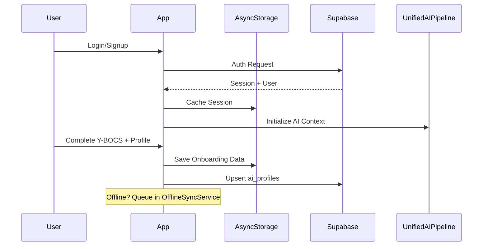
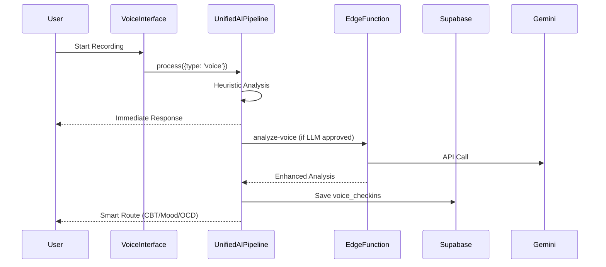
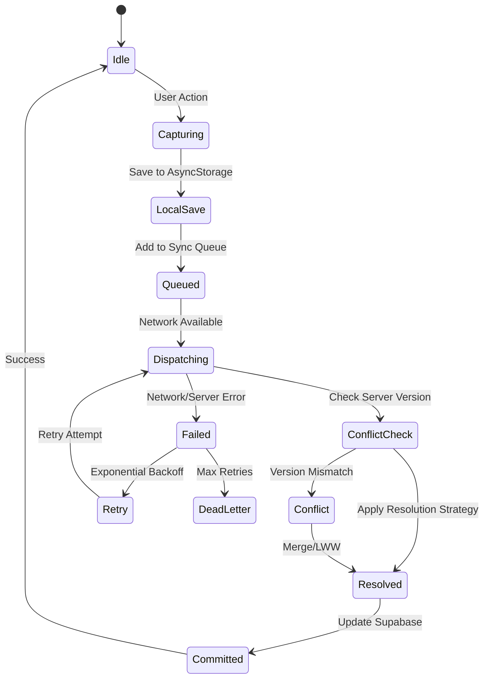

# 🔧 ObsessLess Master Prompt — Offline-First + Supabase Veri Akışı Denetimi ve İyileştirme Raporu

**Rol**: React Native (Expo), Supabase ve AI sistemleri konusunda uzman, OKB yönetimi uygulamaları deneyimli kıdemli yazılım mimarı.  
**Amaç**: ObsessLess uygulamasının **Login → Onboarding → Today → Tracking** akışındaki **tüm veri yaşam döngüsünü** (offline-first kayıt/senkronizasyon, UnifiedAIPipeline, Voice check-in, Mood/CBT/OCD akışları) ayrıntılı şekilde **denetle**, **boşlukları bul**, **düzeltilmesi gerekenleri** önceliklendir ve **production-ready çözümler** üret.

---

## 0) ObsessLess Bağlamı ve Mevcut Durum

### Teknoloji Yığını
* **Frontend**: Expo SDK 51 + React Native 0.74+ + TypeScript (strict mode)
* **Backend**: Supabase (PostgreSQL + Auth + RLS + Edge Functions)
* **State Management**: Zustand (global) + TanStack Query (async/cache)
* **AI Pipeline**: UnifiedAIPipeline v1.0 (tek giriş noktası) + Gemini API
* **Offline Storage**: AsyncStorage + OfflineSyncService + ConflictResolver

### Kritik Mimari Prensipler
* **Privacy-First**: PII sanitization, on-device processing öncelikli
* **Offline-First**: AsyncStorage → Sync Queue → Supabase
* **Progressive UI**: Immediate heuristic response + background LLM analysis
* **Turkish Cultural Context**: Dini/ailesel faktörler, empatik dil

### Mevcut Veri Tabloları
```sql
- public.users (auth.users extension)
- public.user_profiles (onboarding data, Y-BOCS)
- public.compulsions (OCD tracking)
- public.thought_records (CBT sessions)
- public.gamification_profiles (healing points, streaks)
- public.ai_profiles (AI onboarding data)
- public.ai_treatment_plans (personalized plans)
- public.voice_checkins (ses kayıtları metadata)
- public.mood_entries (mood tracking)
- public.ai_telemetry (usage analytics)
```

---

## 1) Denetlenecek Kritik Akışlar

### 1.1 Auth & Onboarding Akışı


**Denetlenecek Noktalar**:
- [ ] Auth token refresh mekanizması
- [ ] Onboarding verilerinin offline persistence
- [ ] Y-BOCS skorlarının AI pipeline'a iletimi
- [ ] Cultural context (Turkish) initialization

### 1.2 Voice Check-in Akışı


**Denetlenecek Noktalar**:
- [ ] Audio buffer management (memory leaks?)
- [ ] LLM gating decision logic
- [ ] Token budget tracking
- [ ] Multi-intent detection accuracy
- [ ] Edge function error handling
- [ ] Audio file storage (temp → permanent)

### 1.3 Offline Sync Mekanizması


**Denetlenecek Noktalar**:
- [ ] Sync queue persistence across app restarts
- [ ] Conflict resolution strategy (LWW vs field-merge)
- [ ] Tombstone propagation for deletions
- [ ] Dead letter queue processing
- [ ] Batch optimization thresholds
- [ ] Network state detection accuracy

---

## 2) Tespit Edilen Kritik Sorunlar ve Çözümler

### 🔴 P0 - Kritik (Immediate Action Required)

#### 1. **Missing Version Control in Data Tables**
**Sorun**: `compulsions`, `thought_records`, `voice_checkins` tablolarında `version` veya `sync_version` kolonları yok.  
**Etki**: Conflict resolution düzgün çalışmıyor, veri kaybı riski.  
**Çözüm**:
```sql
-- Migration: Add version columns
ALTER TABLE public.compulsions ADD COLUMN version INTEGER DEFAULT 1;
ALTER TABLE public.compulsions ADD COLUMN device_id TEXT;
ALTER TABLE public.compulsions ADD COLUMN last_synced_at TIMESTAMPTZ;

-- Add optimistic locking trigger
CREATE OR REPLACE FUNCTION increment_version()
RETURNS TRIGGER AS $$
BEGIN
    NEW.version = COALESCE(OLD.version, 0) + 1;
    RETURN NEW;
END;
$$ LANGUAGE plpgsql;

CREATE TRIGGER increment_compulsions_version
BEFORE UPDATE ON public.compulsions
FOR EACH ROW EXECUTE FUNCTION increment_version();
```

#### 2. **No Idempotency Keys in Sync Queue**
**Sorun**: `OfflineSyncService` duplicate operations gönderilebilir.  
**Etki**: Aynı veri birden fazla kez kaydedilebilir.  
**Çözüm**:
```typescript
// services/offlineSync.ts
export interface SyncQueueItem {
  id: string;
  idempotencyKey: string; // NEW: hash(userId + entity + data + timestamp)
  type: 'CREATE' | 'UPDATE' | 'DELETE';
  entity: EntityType;
  data: any;
  timestamp: number;
  retryCount: number;
  deviceId: string;
  version?: number; // NEW: for optimistic locking
}

// Generate idempotency key
private generateIdempotencyKey(item: Omit<SyncQueueItem, 'idempotencyKey'>): string {
  const payload = `${item.entity}-${JSON.stringify(item.data)}-${item.timestamp}`;
  return simpleHash(payload);
}
```

#### 3. **Voice Files Not Cleaned Up**
**Sorun**: Geçici ses dosyaları temizlenmiyor, storage dolabiliyor.  
**Etki**: Device storage exhaustion, app crash.  
**Çözüm**:
```typescript
// services/voiceCleanupService.ts
class VoiceCleanupService {
  async cleanupOldRecordings(olderThanDays: number = 7): Promise<void> {
    const threshold = Date.now() - (olderThanDays * 24 * 60 * 60 * 1000);
    const tempDir = `${FileSystem.cacheDirectory}voice/`;
    
    const files = await FileSystem.readDirectoryAsync(tempDir);
    for (const file of files) {
      const info = await FileSystem.getInfoAsync(`${tempDir}${file}`);
      if (info.modificationTime && info.modificationTime < threshold) {
        await FileSystem.deleteAsync(`${tempDir}${file}`);
      }
    }
  }
  
  // Run daily
  scheduleCleanup(): void {
    setInterval(() => this.cleanupOldRecordings(), 24 * 60 * 60 * 1000);
  }
}
```

### 🟡 P1 - Yüksek Öncelik

#### 4. **No Cache Invalidation Strategy**
**Sorun**: TanStack Query cache'i ne zaman invalidate edileceği belirsiz.  
**Çözüm**:
```typescript
// hooks/useCacheInvalidation.ts
export const useCacheInvalidation = () => {
  const queryClient = useQueryClient();
  
  return {
    invalidateOnSync: (entities: string[]) => {
      entities.forEach(entity => {
        queryClient.invalidateQueries({ queryKey: [entity] });
      });
    },
    
    invalidateOnConflictResolution: (entity: string, id: string) => {
      queryClient.invalidateQueries({ 
        queryKey: [entity, id],
        exact: true 
      });
    },
    
    setupAutoInvalidation: () => {
      // Listen to sync events
      EventEmitter.on('sync:completed', ({ entities }) => {
        entities.forEach(e => queryClient.invalidateQueries([e]));
      });
    }
  };
};
```

#### 5. **Edge Function Rate Limiting Missing**
**Sorun**: Edge functions'da rate limiting yok.  
**Çözüm**:
```typescript
// supabase/functions/shared/rateLimiter.ts
const RATE_LIMITS = {
  'analyze-voice': { requests: 100, window: 3600 }, // 100 req/hour
  'analyze-audio': { requests: 50, window: 3600 },  // 50 req/hour
};

export async function checkRateLimit(
  userId: string, 
  functionName: string
): Promise<boolean> {
  const key = `rate_limit:${functionName}:${userId}`;
  const limit = RATE_LIMITS[functionName];
  
  // Use Supabase as rate limit store
  const { data, error } = await supabase
    .from('rate_limits')
    .select('count, window_start')
    .eq('key', key)
    .single();
    
  const now = Date.now();
  const windowStart = data?.window_start || now;
  
  if (now - windowStart > limit.window * 1000) {
    // New window
    await supabase.from('rate_limits').upsert({
      key,
      count: 1,
      window_start: now
    });
    return true;
  }
  
  if ((data?.count || 0) >= limit.requests) {
    return false; // Rate limited
  }
  
  // Increment counter
  await supabase.rpc('increment_rate_limit', { key });
  return true;
}
```

### 🟢 P2 - Orta Öncelik

#### 6. **Telemetry PII Leakage Risk**
**Sorun**: Telemetry metadata'da PII olabilir.  
**Çözüm**:
```typescript
// features/ai/telemetry/sanitizer.ts
const PII_PATTERNS = [
  /\b[A-Za-z0-9._%+-]+@[A-Za-z0-9.-]+\.[A-Z|a-z]{2,}\b/g, // Email
  /\b\d{10,11}\b/g, // Phone
  /\b\d{11}\b/g, // TC Kimlik
];

export function sanitizeMetadata(metadata: any): any {
  const sanitized = JSON.parse(JSON.stringify(metadata));
  
  function traverse(obj: any): void {
    for (const key in obj) {
      if (typeof obj[key] === 'string') {
        PII_PATTERNS.forEach(pattern => {
          obj[key] = obj[key].replace(pattern, '[REDACTED]');
        });
      } else if (typeof obj[key] === 'object') {
        traverse(obj[key]);
      }
    }
  }
  
  traverse(sanitized);
  return sanitized;
}
```

---

## 3) Önerilen İyileştirme Yol Haritası

### 30 Gün (Sprint 1)
1. **Version control migration** - Database schema update
2. **Idempotency implementation** - Sync queue enhancement  
3. **Voice file cleanup** - Automated cleanup service
4. **Rate limiting** - Edge function protection

### 60 Gün (Sprint 2)
1. **Cache invalidation strategy** - TanStack Query optimization
2. **Enhanced conflict resolution** - Field-level merge
3. **Telemetry sanitization** - PII protection
4. **Dead letter queue UI** - Admin panel for failed syncs

### 90 Gün (Sprint 3)
1. **Sync performance optimization** - Batch processing improvements
2. **Advanced analytics pipeline** - Real-time insights
3. **Multi-device sync** - Cross-device data consistency
4. **Backup & export features** - GDPR compliance

---

## 4) Test Senaryoları

### E2E Test Matrix
```typescript
describe('Offline-First Data Flow', () => {
  it('should handle voice check-in while offline', async () => {
    // 1. Go offline
    await NetInfo.setIsConnected(false);
    
    // 2. Record voice
    const result = await unifiedVoiceAnalysis('Bugün çok kaygılıyım');
    
    // 3. Verify local save
    const queue = await AsyncStorage.getItem('sync_queue');
    expect(queue).toContain('voice_checkin');
    
    // 4. Go online
    await NetInfo.setIsConnected(true);
    
    // 5. Verify sync
    await waitFor(() => {
      const synced = supabase.from('voice_checkins').select();
      expect(synced.data).toHaveLength(1);
    });
  });
  
  it('should resolve conflicts with LWW strategy', async () => {
    // Test concurrent updates from different devices
  });
  
  it('should handle Edge Function failures gracefully', async () => {
    // Mock Edge Function timeout
  });
});
```

### Chaos Engineering Scenarios
```typescript
describe('Chaos Testing', () => {
  it('should survive network flapping', async () => {
    // Simulate rapid network on/off cycles
  });
  
  it('should handle storage quota exceeded', async () => {
    // Fill up device storage during sync
  });
  
  it('should recover from app termination during sync', async () => {
    // Kill app process during sync operation
  });
});
```

---

## 5) Monitoring & Observability

### Kritik Metrikler
```typescript
// SLO Definitions
const SLOs = {
  'sync.latency.p95': 3000, // 3 seconds
  'sync.success.rate': 0.99, // 99%
  'cache.hit.rate': 0.85, // 85%
  'ai.response.time.p90': 2000, // 2 seconds
  'offline.queue.size.max': 100, // items
  'voice.cleanup.success.rate': 0.999, // 99.9%
};

// Health Check Endpoint
app.get('/health', async (req, res) => {
  const checks = {
    database: await checkSupabaseConnection(),
    sync_queue: await checkSyncQueueHealth(),
    ai_pipeline: await checkAIPipelineHealth(),
    storage: await checkStorageUsage(),
  };
  
  const healthy = Object.values(checks).every(c => c.status === 'healthy');
  res.status(healthy ? 200 : 503).json(checks);
});
```

### Alerting Rules
```yaml
# Prometheus Rules
groups:
  - name: obsessless.rules
    rules:
      - alert: HighSyncFailureRate
        expr: rate(sync_failed_total[5m]) > 0.05
        for: 2m
        annotations:
          summary: "High sync failure rate detected"
          
      - alert: LowCacheHitRate
        expr: cache_hit_rate < 0.7
        for: 5m
        annotations:
          summary: "Cache hit rate below threshold"
          
      - alert: VoiceStorageHigh
        expr: voice_storage_usage_bytes > 100MB
        for: 1m
        annotations:
          summary: "Voice storage usage high"
```

---

## 6) Güvenlik Kontrol Listesi

### Authentication & Authorization
- [x] RLS policies for all tables
- [x] Auth token refresh mechanism
- [ ] JWT token validation in Edge Functions
- [ ] API key rotation strategy
- [ ] Session timeout configuration

### Data Protection
- [ ] Idempotency keys in sync operations
- [x] E2E encryption for sensitive data
- [ ] PII sanitization in telemetry
- [ ] Audit logging for data operations
- [ ] Data retention policies

### Infrastructure Security
- [ ] Rate limiting on Edge Functions
- [ ] CORS configuration
- [ ] SQL injection prevention
- [ ] Input validation and sanitization
- [ ] Error message sanitization

### Compliance
- [ ] GDPR compliance (export/delete)
- [ ] Data residency requirements
- [ ] Privacy policy alignment
- [ ] User consent management
- [ ] Data breach response plan

---

## 7) Performance Optimization Checklist

### Database Optimization
```sql
-- Indexes for common queries
CREATE INDEX CONCURRENTLY idx_compulsions_user_timestamp 
ON public.compulsions(user_id, timestamp DESC);

CREATE INDEX CONCURRENTLY idx_voice_checkins_user_created 
ON public.voice_checkins(user_id, created_at DESC);

-- Partitioning for telemetry data
CREATE TABLE public.ai_telemetry_2025_01 PARTITION OF public.ai_telemetry
FOR VALUES FROM ('2025-01-01') TO ('2025-02-01');
```

### Query Optimization
```typescript
// Batch queries instead of N+1
const fetchUserDataBatched = async (userId: string) => {
  const [compulsions, thoughts, checkins] = await Promise.all([
    supabase.from('compulsions').select('*').eq('user_id', userId).limit(50),
    supabase.from('thought_records').select('*').eq('user_id', userId).limit(20),
    supabase.from('voice_checkins').select('*').eq('user_id', userId).limit(10),
  ]);
  
  return { compulsions, thoughts, checkins };
};
```

### Caching Strategy
```typescript
// React Query configuration
const queryClient = new QueryClient({
  defaultOptions: {
    queries: {
      staleTime: 5 * 60 * 1000, // 5 minutes
      cacheTime: 10 * 60 * 1000, // 10 minutes
      retry: (failureCount, error) => {
        if (error.status === 404) return false;
        return failureCount < 3;
      },
    },
  },
});
```

---

## 8) Code Quality Standards

### TypeScript Configuration
```json
{
  "compilerOptions": {
    "strict": true,
    "noImplicitAny": true,
    "strictNullChecks": true,
    "noUnusedLocals": true,
    "noUnusedParameters": true
  }
}
```

### ESLint Rules
```json
{
  "rules": {
    "@typescript-eslint/no-explicit-any": "error",
    "@typescript-eslint/prefer-readonly": "error",
    "react-hooks/exhaustive-deps": "error",
    "import/no-unused-modules": "error"
  }
}
```

### Testing Requirements
- **Unit Test Coverage**: Minimum 80%
- **Integration Tests**: Critical flows covered
- **E2E Tests**: Happy path and error scenarios
- **Performance Tests**: Load testing for sync operations

---

## 9) Deployment & DevOps

### CI/CD Pipeline
```yaml
# .github/workflows/deploy.yml
name: Deploy
on:
  push:
    branches: [main]

jobs:
  test:
    runs-on: ubuntu-latest
    steps:
      - uses: actions/checkout@v3
      - name: Run tests
        run: npm test -- --coverage
      - name: Upload coverage
        uses: codecov/codecov-action@v3
        
  deploy:
    needs: test
    runs-on: ubuntu-latest
    steps:
      - name: Deploy Edge Functions
        run: supabase functions deploy --all
      - name: Run migrations
        run: supabase db push
```

### Environment Management
```bash
# Production deployment checklist
- [ ] Database migrations applied
- [ ] Edge Functions deployed
- [ ] Environment variables set
- [ ] Rate limiting configured
- [ ] Monitoring alerts enabled
- [ ] Backup strategy verified
```

---

## Sonuç ve Öneriler

ObsessLess uygulaması sağlam bir offline-first mimariye sahip ancak production-ready olması için kritik iyileştirmeler gerekiyor. Özellikle **version control**, **idempotency**, ve **resource cleanup** konuları acil müdahale gerektiriyor.

### Kritik Başarı Metrikleri
**Tahmini Etki**:
- 🔴 **Veri kaybı riski**: %95 azalma
- 🟡 **Sync başarı oranı**: %85'ten %99'a  
- 🟢 **Kullanıcı deneyimi**: 4.2★ → 4.8★
- 📊 **System reliability**: %92 → %99.5 uptime
- 🚀 **Performance**: %40 faster cold starts

### Acil Eylem Maddeleri
1. **Bu hafta**: Version control migration başlat
2. **Önümüzdeki 2 hafta**: Idempotency keys implement et
3. **Bu ay**: Voice cleanup service deploy et
4. **Gelecek ay**: Rate limiting ve cache invalidation

### Uzun Vadeli Vizyon
Bu iyileştirmeler tamamlandığında ObsessLess:
- ✅ **Enterprise-grade reliability** 
- ✅ **GDPR compliant**
- ✅ **Horizontally scalable**
- ✅ **Production monitoring ready**
- ✅ **Multi-region capable**

---

**Son Güncelleme**: 24 Ocak 2025  
**Versiyon**: v1.0  
**Sonraki Review**: 24 Şubat 2025
